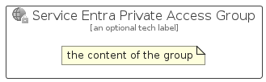

# ServiceEntraPrivateAccess


```text
azure-19/Item/Identity/ServiceEntraPrivateAccess
```

```text
include('azure-19/Item/Identity/ServiceEntraPrivateAccess')
```


| Illustration | ServiceEntraPrivateAccess | ServiceEntraPrivateAccessCard | ServiceEntraPrivateAccessGroup |
| :---: | :---: | :---: | :---: |
|  |  |  |  |


## Sprites
The item provides the following sriptes:

- `<$ServiceEntraPrivateAccessXs>`
- `<$ServiceEntraPrivateAccessSm>`
- `<$ServiceEntraPrivateAccessMd>`
- `<$ServiceEntraPrivateAccessLg>`


## ServiceEntraPrivateAccess

### Load remotely
```plantuml
@startuml
' configures the library
!global $LIB_BASE_LOCATION="https://raw.githubusercontent.com/tmorin/plantuml-libs/master/distribution"

' loads the library's bootstrap
!include $LIB_BASE_LOCATION/bootstrap.puml

' loads the package bootstrap
include('azure-19/bootstrap')

' loads the Item which embeds the element ServiceEntraPrivateAccess
include('azure-19/Item/Identity/ServiceEntraPrivateAccess')

' renders the element
ServiceEntraPrivateAccess('ServiceEntraPrivateAccess', 'Service Entra Private Access', 'an optional tech label', 'an optional description')
@enduml
```

### Load locally
```plantuml
@startuml
' configures the library
!global $INCLUSION_MODE="local"
!global $LIB_BASE_LOCATION="../../.."

' loads the library's bootstrap
!include $LIB_BASE_LOCATION/bootstrap.puml

' loads the package bootstrap
include('azure-19/bootstrap')

' loads the Item which embeds the element ServiceEntraPrivateAccess
include('azure-19/Item/Identity/ServiceEntraPrivateAccess')

' renders the element
ServiceEntraPrivateAccess('ServiceEntraPrivateAccess', 'Service Entra Private Access', 'an optional tech label', 'an optional description')
@enduml
```

## ServiceEntraPrivateAccessCard

### Load remotely
```plantuml
@startuml
' configures the library
!global $LIB_BASE_LOCATION="https://raw.githubusercontent.com/tmorin/plantuml-libs/master/distribution"

' loads the library's bootstrap
!include $LIB_BASE_LOCATION/bootstrap.puml

' loads the package bootstrap
include('azure-19/bootstrap')

' loads the Item which embeds the element ServiceEntraPrivateAccessCard
include('azure-19/Item/Identity/ServiceEntraPrivateAccess')

' renders the element
ServiceEntraPrivateAccessCard('ServiceEntraPrivateAccessCard', 'Service Entra Private Access Card', 'an optional description')
@enduml
```

### Load locally
```plantuml
@startuml
' configures the library
!global $INCLUSION_MODE="local"
!global $LIB_BASE_LOCATION="../../.."

' loads the library's bootstrap
!include $LIB_BASE_LOCATION/bootstrap.puml

' loads the package bootstrap
include('azure-19/bootstrap')

' loads the Item which embeds the element ServiceEntraPrivateAccessCard
include('azure-19/Item/Identity/ServiceEntraPrivateAccess')

' renders the element
ServiceEntraPrivateAccessCard('ServiceEntraPrivateAccessCard', 'Service Entra Private Access Card', 'an optional description')
@enduml
```

## ServiceEntraPrivateAccessGroup

### Load remotely
```plantuml
@startuml
' configures the library
!global $LIB_BASE_LOCATION="https://raw.githubusercontent.com/tmorin/plantuml-libs/master/distribution"

' loads the library's bootstrap
!include $LIB_BASE_LOCATION/bootstrap.puml

' loads the package bootstrap
include('azure-19/bootstrap')

' loads the Item which embeds the element ServiceEntraPrivateAccessGroup
include('azure-19/Item/Identity/ServiceEntraPrivateAccess')

' renders the element
ServiceEntraPrivateAccessGroup('ServiceEntraPrivateAccessGroup', 'Service Entra Private Access Group', 'an optional tech label') {
    note as note
        the content of the group
    end note
}
@enduml
```

### Load locally
```plantuml
@startuml
' configures the library
!global $INCLUSION_MODE="local"
!global $LIB_BASE_LOCATION="../../.."

' loads the library's bootstrap
!include $LIB_BASE_LOCATION/bootstrap.puml

' loads the package bootstrap
include('azure-19/bootstrap')

' loads the Item which embeds the element ServiceEntraPrivateAccessGroup
include('azure-19/Item/Identity/ServiceEntraPrivateAccess')

' renders the element
ServiceEntraPrivateAccessGroup('ServiceEntraPrivateAccessGroup', 'Service Entra Private Access Group', 'an optional tech label') {
    note as note
        the content of the group
    end note
}
@enduml
```

