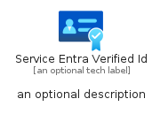
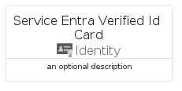
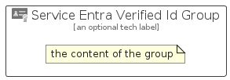

# ServiceEntraVerifiedId


```text
azure-19/Item/Identity/ServiceEntraVerifiedId
```

```text
include('azure-19/Item/Identity/ServiceEntraVerifiedId')
```


| Illustration | ServiceEntraVerifiedId | ServiceEntraVerifiedIdCard | ServiceEntraVerifiedIdGroup |
| :---: | :---: | :---: | :---: |
|  |  |  |  |


## Sprites
The item provides the following sriptes:

- `<$ServiceEntraVerifiedIdXs>`
- `<$ServiceEntraVerifiedIdSm>`
- `<$ServiceEntraVerifiedIdMd>`
- `<$ServiceEntraVerifiedIdLg>`


## ServiceEntraVerifiedId

### Load remotely
```plantuml
@startuml
' configures the library
!global $LIB_BASE_LOCATION="https://raw.githubusercontent.com/tmorin/plantuml-libs/master/distribution"

' loads the library's bootstrap
!include $LIB_BASE_LOCATION/bootstrap.puml

' loads the package bootstrap
include('azure-19/bootstrap')

' loads the Item which embeds the element ServiceEntraVerifiedId
include('azure-19/Item/Identity/ServiceEntraVerifiedId')

' renders the element
ServiceEntraVerifiedId('ServiceEntraVerifiedId', 'Service Entra Verified Id', 'an optional tech label', 'an optional description')
@enduml
```

### Load locally
```plantuml
@startuml
' configures the library
!global $INCLUSION_MODE="local"
!global $LIB_BASE_LOCATION="../../.."

' loads the library's bootstrap
!include $LIB_BASE_LOCATION/bootstrap.puml

' loads the package bootstrap
include('azure-19/bootstrap')

' loads the Item which embeds the element ServiceEntraVerifiedId
include('azure-19/Item/Identity/ServiceEntraVerifiedId')

' renders the element
ServiceEntraVerifiedId('ServiceEntraVerifiedId', 'Service Entra Verified Id', 'an optional tech label', 'an optional description')
@enduml
```

## ServiceEntraVerifiedIdCard

### Load remotely
```plantuml
@startuml
' configures the library
!global $LIB_BASE_LOCATION="https://raw.githubusercontent.com/tmorin/plantuml-libs/master/distribution"

' loads the library's bootstrap
!include $LIB_BASE_LOCATION/bootstrap.puml

' loads the package bootstrap
include('azure-19/bootstrap')

' loads the Item which embeds the element ServiceEntraVerifiedIdCard
include('azure-19/Item/Identity/ServiceEntraVerifiedId')

' renders the element
ServiceEntraVerifiedIdCard('ServiceEntraVerifiedIdCard', 'Service Entra Verified Id Card', 'an optional description')
@enduml
```

### Load locally
```plantuml
@startuml
' configures the library
!global $INCLUSION_MODE="local"
!global $LIB_BASE_LOCATION="../../.."

' loads the library's bootstrap
!include $LIB_BASE_LOCATION/bootstrap.puml

' loads the package bootstrap
include('azure-19/bootstrap')

' loads the Item which embeds the element ServiceEntraVerifiedIdCard
include('azure-19/Item/Identity/ServiceEntraVerifiedId')

' renders the element
ServiceEntraVerifiedIdCard('ServiceEntraVerifiedIdCard', 'Service Entra Verified Id Card', 'an optional description')
@enduml
```

## ServiceEntraVerifiedIdGroup

### Load remotely
```plantuml
@startuml
' configures the library
!global $LIB_BASE_LOCATION="https://raw.githubusercontent.com/tmorin/plantuml-libs/master/distribution"

' loads the library's bootstrap
!include $LIB_BASE_LOCATION/bootstrap.puml

' loads the package bootstrap
include('azure-19/bootstrap')

' loads the Item which embeds the element ServiceEntraVerifiedIdGroup
include('azure-19/Item/Identity/ServiceEntraVerifiedId')

' renders the element
ServiceEntraVerifiedIdGroup('ServiceEntraVerifiedIdGroup', 'Service Entra Verified Id Group', 'an optional tech label') {
    note as note
        the content of the group
    end note
}
@enduml
```

### Load locally
```plantuml
@startuml
' configures the library
!global $INCLUSION_MODE="local"
!global $LIB_BASE_LOCATION="../../.."

' loads the library's bootstrap
!include $LIB_BASE_LOCATION/bootstrap.puml

' loads the package bootstrap
include('azure-19/bootstrap')

' loads the Item which embeds the element ServiceEntraVerifiedIdGroup
include('azure-19/Item/Identity/ServiceEntraVerifiedId')

' renders the element
ServiceEntraVerifiedIdGroup('ServiceEntraVerifiedIdGroup', 'Service Entra Verified Id Group', 'an optional tech label') {
    note as note
        the content of the group
    end note
}
@enduml
```

