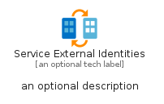

# ServiceExternalIdentities


```text
azure-19/Item/Identity/ServiceExternalIdentities
```

```text
include('azure-19/Item/Identity/ServiceExternalIdentities')
```


| Illustration | ServiceExternalIdentities | ServiceExternalIdentitiesCard | ServiceExternalIdentitiesGroup |
| :---: | :---: | :---: | :---: |
|  |  |  |  |


## Sprites
The item provides the following sriptes:

- `<$ServiceExternalIdentitiesXs>`
- `<$ServiceExternalIdentitiesSm>`
- `<$ServiceExternalIdentitiesMd>`
- `<$ServiceExternalIdentitiesLg>`


## ServiceExternalIdentities

### Load remotely
```plantuml
@startuml
' configures the library
!global $LIB_BASE_LOCATION="https://raw.githubusercontent.com/tmorin/plantuml-libs/master/distribution"

' loads the library's bootstrap
!include $LIB_BASE_LOCATION/bootstrap.puml

' loads the package bootstrap
include('azure-19/bootstrap')

' loads the Item which embeds the element ServiceExternalIdentities
include('azure-19/Item/Identity/ServiceExternalIdentities')

' renders the element
ServiceExternalIdentities('ServiceExternalIdentities', 'Service External Identities', 'an optional tech label', 'an optional description')
@enduml
```

### Load locally
```plantuml
@startuml
' configures the library
!global $INCLUSION_MODE="local"
!global $LIB_BASE_LOCATION="../../.."

' loads the library's bootstrap
!include $LIB_BASE_LOCATION/bootstrap.puml

' loads the package bootstrap
include('azure-19/bootstrap')

' loads the Item which embeds the element ServiceExternalIdentities
include('azure-19/Item/Identity/ServiceExternalIdentities')

' renders the element
ServiceExternalIdentities('ServiceExternalIdentities', 'Service External Identities', 'an optional tech label', 'an optional description')
@enduml
```

## ServiceExternalIdentitiesCard

### Load remotely
```plantuml
@startuml
' configures the library
!global $LIB_BASE_LOCATION="https://raw.githubusercontent.com/tmorin/plantuml-libs/master/distribution"

' loads the library's bootstrap
!include $LIB_BASE_LOCATION/bootstrap.puml

' loads the package bootstrap
include('azure-19/bootstrap')

' loads the Item which embeds the element ServiceExternalIdentitiesCard
include('azure-19/Item/Identity/ServiceExternalIdentities')

' renders the element
ServiceExternalIdentitiesCard('ServiceExternalIdentitiesCard', 'Service External Identities Card', 'an optional description')
@enduml
```

### Load locally
```plantuml
@startuml
' configures the library
!global $INCLUSION_MODE="local"
!global $LIB_BASE_LOCATION="../../.."

' loads the library's bootstrap
!include $LIB_BASE_LOCATION/bootstrap.puml

' loads the package bootstrap
include('azure-19/bootstrap')

' loads the Item which embeds the element ServiceExternalIdentitiesCard
include('azure-19/Item/Identity/ServiceExternalIdentities')

' renders the element
ServiceExternalIdentitiesCard('ServiceExternalIdentitiesCard', 'Service External Identities Card', 'an optional description')
@enduml
```

## ServiceExternalIdentitiesGroup

### Load remotely
```plantuml
@startuml
' configures the library
!global $LIB_BASE_LOCATION="https://raw.githubusercontent.com/tmorin/plantuml-libs/master/distribution"

' loads the library's bootstrap
!include $LIB_BASE_LOCATION/bootstrap.puml

' loads the package bootstrap
include('azure-19/bootstrap')

' loads the Item which embeds the element ServiceExternalIdentitiesGroup
include('azure-19/Item/Identity/ServiceExternalIdentities')

' renders the element
ServiceExternalIdentitiesGroup('ServiceExternalIdentitiesGroup', 'Service External Identities Group', 'an optional tech label') {
    note as note
        the content of the group
    end note
}
@enduml
```

### Load locally
```plantuml
@startuml
' configures the library
!global $INCLUSION_MODE="local"
!global $LIB_BASE_LOCATION="../../.."

' loads the library's bootstrap
!include $LIB_BASE_LOCATION/bootstrap.puml

' loads the package bootstrap
include('azure-19/bootstrap')

' loads the Item which embeds the element ServiceExternalIdentitiesGroup
include('azure-19/Item/Identity/ServiceExternalIdentities')

' renders the element
ServiceExternalIdentitiesGroup('ServiceExternalIdentitiesGroup', 'Service External Identities Group', 'an optional tech label') {
    note as note
        the content of the group
    end note
}
@enduml
```

