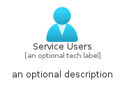
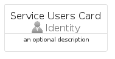
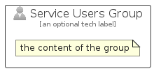

# ServiceUsers


```text
azure-19/Item/Identity/ServiceUsers
```

```text
include('azure-19/Item/Identity/ServiceUsers')
```


| Illustration | ServiceUsers | ServiceUsersCard | ServiceUsersGroup |
| :---: | :---: | :---: | :---: |
|  |  |  |  |


## Sprites
The item provides the following sriptes:

- `<$ServiceUsersXs>`
- `<$ServiceUsersSm>`
- `<$ServiceUsersMd>`
- `<$ServiceUsersLg>`


## ServiceUsers

### Load remotely
```plantuml
@startuml
' configures the library
!global $LIB_BASE_LOCATION="https://raw.githubusercontent.com/tmorin/plantuml-libs/master/distribution"

' loads the library's bootstrap
!include $LIB_BASE_LOCATION/bootstrap.puml

' loads the package bootstrap
include('azure-19/bootstrap')

' loads the Item which embeds the element ServiceUsers
include('azure-19/Item/Identity/ServiceUsers')

' renders the element
ServiceUsers('ServiceUsers', 'Service Users', 'an optional tech label', 'an optional description')
@enduml
```

### Load locally
```plantuml
@startuml
' configures the library
!global $INCLUSION_MODE="local"
!global $LIB_BASE_LOCATION="../../.."

' loads the library's bootstrap
!include $LIB_BASE_LOCATION/bootstrap.puml

' loads the package bootstrap
include('azure-19/bootstrap')

' loads the Item which embeds the element ServiceUsers
include('azure-19/Item/Identity/ServiceUsers')

' renders the element
ServiceUsers('ServiceUsers', 'Service Users', 'an optional tech label', 'an optional description')
@enduml
```

## ServiceUsersCard

### Load remotely
```plantuml
@startuml
' configures the library
!global $LIB_BASE_LOCATION="https://raw.githubusercontent.com/tmorin/plantuml-libs/master/distribution"

' loads the library's bootstrap
!include $LIB_BASE_LOCATION/bootstrap.puml

' loads the package bootstrap
include('azure-19/bootstrap')

' loads the Item which embeds the element ServiceUsersCard
include('azure-19/Item/Identity/ServiceUsers')

' renders the element
ServiceUsersCard('ServiceUsersCard', 'Service Users Card', 'an optional description')
@enduml
```

### Load locally
```plantuml
@startuml
' configures the library
!global $INCLUSION_MODE="local"
!global $LIB_BASE_LOCATION="../../.."

' loads the library's bootstrap
!include $LIB_BASE_LOCATION/bootstrap.puml

' loads the package bootstrap
include('azure-19/bootstrap')

' loads the Item which embeds the element ServiceUsersCard
include('azure-19/Item/Identity/ServiceUsers')

' renders the element
ServiceUsersCard('ServiceUsersCard', 'Service Users Card', 'an optional description')
@enduml
```

## ServiceUsersGroup

### Load remotely
```plantuml
@startuml
' configures the library
!global $LIB_BASE_LOCATION="https://raw.githubusercontent.com/tmorin/plantuml-libs/master/distribution"

' loads the library's bootstrap
!include $LIB_BASE_LOCATION/bootstrap.puml

' loads the package bootstrap
include('azure-19/bootstrap')

' loads the Item which embeds the element ServiceUsersGroup
include('azure-19/Item/Identity/ServiceUsers')

' renders the element
ServiceUsersGroup('ServiceUsersGroup', 'Service Users Group', 'an optional tech label') {
    note as note
        the content of the group
    end note
}
@enduml
```

### Load locally
```plantuml
@startuml
' configures the library
!global $INCLUSION_MODE="local"
!global $LIB_BASE_LOCATION="../../.."

' loads the library's bootstrap
!include $LIB_BASE_LOCATION/bootstrap.puml

' loads the package bootstrap
include('azure-19/bootstrap')

' loads the Item which embeds the element ServiceUsersGroup
include('azure-19/Item/Identity/ServiceUsers')

' renders the element
ServiceUsersGroup('ServiceUsersGroup', 'Service Users Group', 'an optional tech label') {
    note as note
        the content of the group
    end note
}
@enduml
```

