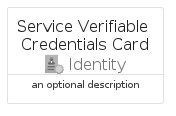
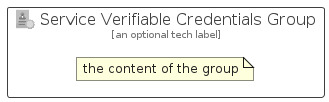

# ServiceVerifiableCredentials


```text
azure-19/Item/Identity/ServiceVerifiableCredentials
```

```text
include('azure-19/Item/Identity/ServiceVerifiableCredentials')
```


| Illustration | ServiceVerifiableCredentials | ServiceVerifiableCredentialsCard | ServiceVerifiableCredentialsGroup |
| :---: | :---: | :---: | :---: |
|  |  |  |  |


## Sprites
The item provides the following sriptes:

- `<$ServiceVerifiableCredentialsXs>`
- `<$ServiceVerifiableCredentialsSm>`
- `<$ServiceVerifiableCredentialsMd>`
- `<$ServiceVerifiableCredentialsLg>`


## ServiceVerifiableCredentials

### Load remotely
```plantuml
@startuml
' configures the library
!global $LIB_BASE_LOCATION="https://raw.githubusercontent.com/tmorin/plantuml-libs/master/distribution"

' loads the library's bootstrap
!include $LIB_BASE_LOCATION/bootstrap.puml

' loads the package bootstrap
include('azure-19/bootstrap')

' loads the Item which embeds the element ServiceVerifiableCredentials
include('azure-19/Item/Identity/ServiceVerifiableCredentials')

' renders the element
ServiceVerifiableCredentials('ServiceVerifiableCredentials', 'Service Verifiable Credentials', 'an optional tech label', 'an optional description')
@enduml
```

### Load locally
```plantuml
@startuml
' configures the library
!global $INCLUSION_MODE="local"
!global $LIB_BASE_LOCATION="../../.."

' loads the library's bootstrap
!include $LIB_BASE_LOCATION/bootstrap.puml

' loads the package bootstrap
include('azure-19/bootstrap')

' loads the Item which embeds the element ServiceVerifiableCredentials
include('azure-19/Item/Identity/ServiceVerifiableCredentials')

' renders the element
ServiceVerifiableCredentials('ServiceVerifiableCredentials', 'Service Verifiable Credentials', 'an optional tech label', 'an optional description')
@enduml
```

## ServiceVerifiableCredentialsCard

### Load remotely
```plantuml
@startuml
' configures the library
!global $LIB_BASE_LOCATION="https://raw.githubusercontent.com/tmorin/plantuml-libs/master/distribution"

' loads the library's bootstrap
!include $LIB_BASE_LOCATION/bootstrap.puml

' loads the package bootstrap
include('azure-19/bootstrap')

' loads the Item which embeds the element ServiceVerifiableCredentialsCard
include('azure-19/Item/Identity/ServiceVerifiableCredentials')

' renders the element
ServiceVerifiableCredentialsCard('ServiceVerifiableCredentialsCard', 'Service Verifiable Credentials Card', 'an optional description')
@enduml
```

### Load locally
```plantuml
@startuml
' configures the library
!global $INCLUSION_MODE="local"
!global $LIB_BASE_LOCATION="../../.."

' loads the library's bootstrap
!include $LIB_BASE_LOCATION/bootstrap.puml

' loads the package bootstrap
include('azure-19/bootstrap')

' loads the Item which embeds the element ServiceVerifiableCredentialsCard
include('azure-19/Item/Identity/ServiceVerifiableCredentials')

' renders the element
ServiceVerifiableCredentialsCard('ServiceVerifiableCredentialsCard', 'Service Verifiable Credentials Card', 'an optional description')
@enduml
```

## ServiceVerifiableCredentialsGroup

### Load remotely
```plantuml
@startuml
' configures the library
!global $LIB_BASE_LOCATION="https://raw.githubusercontent.com/tmorin/plantuml-libs/master/distribution"

' loads the library's bootstrap
!include $LIB_BASE_LOCATION/bootstrap.puml

' loads the package bootstrap
include('azure-19/bootstrap')

' loads the Item which embeds the element ServiceVerifiableCredentialsGroup
include('azure-19/Item/Identity/ServiceVerifiableCredentials')

' renders the element
ServiceVerifiableCredentialsGroup('ServiceVerifiableCredentialsGroup', 'Service Verifiable Credentials Group', 'an optional tech label') {
    note as note
        the content of the group
    end note
}
@enduml
```

### Load locally
```plantuml
@startuml
' configures the library
!global $INCLUSION_MODE="local"
!global $LIB_BASE_LOCATION="../../.."

' loads the library's bootstrap
!include $LIB_BASE_LOCATION/bootstrap.puml

' loads the package bootstrap
include('azure-19/bootstrap')

' loads the Item which embeds the element ServiceVerifiableCredentialsGroup
include('azure-19/Item/Identity/ServiceVerifiableCredentials')

' renders the element
ServiceVerifiableCredentialsGroup('ServiceVerifiableCredentialsGroup', 'Service Verifiable Credentials Group', 'an optional tech label') {
    note as note
        the content of the group
    end note
}
@enduml
```

