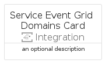
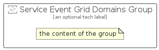

# ServiceEventGridDomains


```text
azure-19/Item/Integration/ServiceEventGridDomains
```

```text
include('azure-19/Item/Integration/ServiceEventGridDomains')
```


| Illustration | ServiceEventGridDomains | ServiceEventGridDomainsCard | ServiceEventGridDomainsGroup |
| :---: | :---: | :---: | :---: |
|  |  |  |  |


## Sprites
The item provides the following sriptes:

- `<$ServiceEventGridDomainsXs>`
- `<$ServiceEventGridDomainsSm>`
- `<$ServiceEventGridDomainsMd>`
- `<$ServiceEventGridDomainsLg>`


## ServiceEventGridDomains

### Load remotely
```plantuml
@startuml
' configures the library
!global $LIB_BASE_LOCATION="https://raw.githubusercontent.com/tmorin/plantuml-libs/master/distribution"

' loads the library's bootstrap
!include $LIB_BASE_LOCATION/bootstrap.puml

' loads the package bootstrap
include('azure-19/bootstrap')

' loads the Item which embeds the element ServiceEventGridDomains
include('azure-19/Item/Integration/ServiceEventGridDomains')

' renders the element
ServiceEventGridDomains('ServiceEventGridDomains', 'Service Event Grid Domains', 'an optional tech label', 'an optional description')
@enduml
```

### Load locally
```plantuml
@startuml
' configures the library
!global $INCLUSION_MODE="local"
!global $LIB_BASE_LOCATION="../../.."

' loads the library's bootstrap
!include $LIB_BASE_LOCATION/bootstrap.puml

' loads the package bootstrap
include('azure-19/bootstrap')

' loads the Item which embeds the element ServiceEventGridDomains
include('azure-19/Item/Integration/ServiceEventGridDomains')

' renders the element
ServiceEventGridDomains('ServiceEventGridDomains', 'Service Event Grid Domains', 'an optional tech label', 'an optional description')
@enduml
```

## ServiceEventGridDomainsCard

### Load remotely
```plantuml
@startuml
' configures the library
!global $LIB_BASE_LOCATION="https://raw.githubusercontent.com/tmorin/plantuml-libs/master/distribution"

' loads the library's bootstrap
!include $LIB_BASE_LOCATION/bootstrap.puml

' loads the package bootstrap
include('azure-19/bootstrap')

' loads the Item which embeds the element ServiceEventGridDomainsCard
include('azure-19/Item/Integration/ServiceEventGridDomains')

' renders the element
ServiceEventGridDomainsCard('ServiceEventGridDomainsCard', 'Service Event Grid Domains Card', 'an optional description')
@enduml
```

### Load locally
```plantuml
@startuml
' configures the library
!global $INCLUSION_MODE="local"
!global $LIB_BASE_LOCATION="../../.."

' loads the library's bootstrap
!include $LIB_BASE_LOCATION/bootstrap.puml

' loads the package bootstrap
include('azure-19/bootstrap')

' loads the Item which embeds the element ServiceEventGridDomainsCard
include('azure-19/Item/Integration/ServiceEventGridDomains')

' renders the element
ServiceEventGridDomainsCard('ServiceEventGridDomainsCard', 'Service Event Grid Domains Card', 'an optional description')
@enduml
```

## ServiceEventGridDomainsGroup

### Load remotely
```plantuml
@startuml
' configures the library
!global $LIB_BASE_LOCATION="https://raw.githubusercontent.com/tmorin/plantuml-libs/master/distribution"

' loads the library's bootstrap
!include $LIB_BASE_LOCATION/bootstrap.puml

' loads the package bootstrap
include('azure-19/bootstrap')

' loads the Item which embeds the element ServiceEventGridDomainsGroup
include('azure-19/Item/Integration/ServiceEventGridDomains')

' renders the element
ServiceEventGridDomainsGroup('ServiceEventGridDomainsGroup', 'Service Event Grid Domains Group', 'an optional tech label') {
    note as note
        the content of the group
    end note
}
@enduml
```

### Load locally
```plantuml
@startuml
' configures the library
!global $INCLUSION_MODE="local"
!global $LIB_BASE_LOCATION="../../.."

' loads the library's bootstrap
!include $LIB_BASE_LOCATION/bootstrap.puml

' loads the package bootstrap
include('azure-19/bootstrap')

' loads the Item which embeds the element ServiceEventGridDomainsGroup
include('azure-19/Item/Integration/ServiceEventGridDomains')

' renders the element
ServiceEventGridDomainsGroup('ServiceEventGridDomainsGroup', 'Service Event Grid Domains Group', 'an optional tech label') {
    note as note
        the content of the group
    end note
}
@enduml
```

