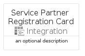

# ServicePartnerRegistration


```text
azure-19/Item/Integration/ServicePartnerRegistration
```

```text
include('azure-19/Item/Integration/ServicePartnerRegistration')
```


| Illustration | ServicePartnerRegistration | ServicePartnerRegistrationCard | ServicePartnerRegistrationGroup |
| :---: | :---: | :---: | :---: |
|  |  |  |  |


## Sprites
The item provides the following sriptes:

- `<$ServicePartnerRegistrationXs>`
- `<$ServicePartnerRegistrationSm>`
- `<$ServicePartnerRegistrationMd>`
- `<$ServicePartnerRegistrationLg>`


## ServicePartnerRegistration

### Load remotely
```plantuml
@startuml
' configures the library
!global $LIB_BASE_LOCATION="https://raw.githubusercontent.com/tmorin/plantuml-libs/master/distribution"

' loads the library's bootstrap
!include $LIB_BASE_LOCATION/bootstrap.puml

' loads the package bootstrap
include('azure-19/bootstrap')

' loads the Item which embeds the element ServicePartnerRegistration
include('azure-19/Item/Integration/ServicePartnerRegistration')

' renders the element
ServicePartnerRegistration('ServicePartnerRegistration', 'Service Partner Registration', 'an optional tech label', 'an optional description')
@enduml
```

### Load locally
```plantuml
@startuml
' configures the library
!global $INCLUSION_MODE="local"
!global $LIB_BASE_LOCATION="../../.."

' loads the library's bootstrap
!include $LIB_BASE_LOCATION/bootstrap.puml

' loads the package bootstrap
include('azure-19/bootstrap')

' loads the Item which embeds the element ServicePartnerRegistration
include('azure-19/Item/Integration/ServicePartnerRegistration')

' renders the element
ServicePartnerRegistration('ServicePartnerRegistration', 'Service Partner Registration', 'an optional tech label', 'an optional description')
@enduml
```

## ServicePartnerRegistrationCard

### Load remotely
```plantuml
@startuml
' configures the library
!global $LIB_BASE_LOCATION="https://raw.githubusercontent.com/tmorin/plantuml-libs/master/distribution"

' loads the library's bootstrap
!include $LIB_BASE_LOCATION/bootstrap.puml

' loads the package bootstrap
include('azure-19/bootstrap')

' loads the Item which embeds the element ServicePartnerRegistrationCard
include('azure-19/Item/Integration/ServicePartnerRegistration')

' renders the element
ServicePartnerRegistrationCard('ServicePartnerRegistrationCard', 'Service Partner Registration Card', 'an optional description')
@enduml
```

### Load locally
```plantuml
@startuml
' configures the library
!global $INCLUSION_MODE="local"
!global $LIB_BASE_LOCATION="../../.."

' loads the library's bootstrap
!include $LIB_BASE_LOCATION/bootstrap.puml

' loads the package bootstrap
include('azure-19/bootstrap')

' loads the Item which embeds the element ServicePartnerRegistrationCard
include('azure-19/Item/Integration/ServicePartnerRegistration')

' renders the element
ServicePartnerRegistrationCard('ServicePartnerRegistrationCard', 'Service Partner Registration Card', 'an optional description')
@enduml
```

## ServicePartnerRegistrationGroup

### Load remotely
```plantuml
@startuml
' configures the library
!global $LIB_BASE_LOCATION="https://raw.githubusercontent.com/tmorin/plantuml-libs/master/distribution"

' loads the library's bootstrap
!include $LIB_BASE_LOCATION/bootstrap.puml

' loads the package bootstrap
include('azure-19/bootstrap')

' loads the Item which embeds the element ServicePartnerRegistrationGroup
include('azure-19/Item/Integration/ServicePartnerRegistration')

' renders the element
ServicePartnerRegistrationGroup('ServicePartnerRegistrationGroup', 'Service Partner Registration Group', 'an optional tech label') {
    note as note
        the content of the group
    end note
}
@enduml
```

### Load locally
```plantuml
@startuml
' configures the library
!global $INCLUSION_MODE="local"
!global $LIB_BASE_LOCATION="../../.."

' loads the library's bootstrap
!include $LIB_BASE_LOCATION/bootstrap.puml

' loads the package bootstrap
include('azure-19/bootstrap')

' loads the Item which embeds the element ServicePartnerRegistrationGroup
include('azure-19/Item/Integration/ServicePartnerRegistration')

' renders the element
ServicePartnerRegistrationGroup('ServicePartnerRegistrationGroup', 'Service Partner Registration Group', 'an optional tech label') {
    note as note
        the content of the group
    end note
}
@enduml
```

