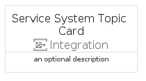

# ServiceSystemTopic


```text
azure-19/Item/Integration/ServiceSystemTopic
```

```text
include('azure-19/Item/Integration/ServiceSystemTopic')
```


| Illustration | ServiceSystemTopic | ServiceSystemTopicCard | ServiceSystemTopicGroup |
| :---: | :---: | :---: | :---: |
|  |  |  |  |


## Sprites
The item provides the following sriptes:

- `<$ServiceSystemTopicXs>`
- `<$ServiceSystemTopicSm>`
- `<$ServiceSystemTopicMd>`
- `<$ServiceSystemTopicLg>`


## ServiceSystemTopic

### Load remotely
```plantuml
@startuml
' configures the library
!global $LIB_BASE_LOCATION="https://raw.githubusercontent.com/tmorin/plantuml-libs/master/distribution"

' loads the library's bootstrap
!include $LIB_BASE_LOCATION/bootstrap.puml

' loads the package bootstrap
include('azure-19/bootstrap')

' loads the Item which embeds the element ServiceSystemTopic
include('azure-19/Item/Integration/ServiceSystemTopic')

' renders the element
ServiceSystemTopic('ServiceSystemTopic', 'Service System Topic', 'an optional tech label', 'an optional description')
@enduml
```

### Load locally
```plantuml
@startuml
' configures the library
!global $INCLUSION_MODE="local"
!global $LIB_BASE_LOCATION="../../.."

' loads the library's bootstrap
!include $LIB_BASE_LOCATION/bootstrap.puml

' loads the package bootstrap
include('azure-19/bootstrap')

' loads the Item which embeds the element ServiceSystemTopic
include('azure-19/Item/Integration/ServiceSystemTopic')

' renders the element
ServiceSystemTopic('ServiceSystemTopic', 'Service System Topic', 'an optional tech label', 'an optional description')
@enduml
```

## ServiceSystemTopicCard

### Load remotely
```plantuml
@startuml
' configures the library
!global $LIB_BASE_LOCATION="https://raw.githubusercontent.com/tmorin/plantuml-libs/master/distribution"

' loads the library's bootstrap
!include $LIB_BASE_LOCATION/bootstrap.puml

' loads the package bootstrap
include('azure-19/bootstrap')

' loads the Item which embeds the element ServiceSystemTopicCard
include('azure-19/Item/Integration/ServiceSystemTopic')

' renders the element
ServiceSystemTopicCard('ServiceSystemTopicCard', 'Service System Topic Card', 'an optional description')
@enduml
```

### Load locally
```plantuml
@startuml
' configures the library
!global $INCLUSION_MODE="local"
!global $LIB_BASE_LOCATION="../../.."

' loads the library's bootstrap
!include $LIB_BASE_LOCATION/bootstrap.puml

' loads the package bootstrap
include('azure-19/bootstrap')

' loads the Item which embeds the element ServiceSystemTopicCard
include('azure-19/Item/Integration/ServiceSystemTopic')

' renders the element
ServiceSystemTopicCard('ServiceSystemTopicCard', 'Service System Topic Card', 'an optional description')
@enduml
```

## ServiceSystemTopicGroup

### Load remotely
```plantuml
@startuml
' configures the library
!global $LIB_BASE_LOCATION="https://raw.githubusercontent.com/tmorin/plantuml-libs/master/distribution"

' loads the library's bootstrap
!include $LIB_BASE_LOCATION/bootstrap.puml

' loads the package bootstrap
include('azure-19/bootstrap')

' loads the Item which embeds the element ServiceSystemTopicGroup
include('azure-19/Item/Integration/ServiceSystemTopic')

' renders the element
ServiceSystemTopicGroup('ServiceSystemTopicGroup', 'Service System Topic Group', 'an optional tech label') {
    note as note
        the content of the group
    end note
}
@enduml
```

### Load locally
```plantuml
@startuml
' configures the library
!global $INCLUSION_MODE="local"
!global $LIB_BASE_LOCATION="../../.."

' loads the library's bootstrap
!include $LIB_BASE_LOCATION/bootstrap.puml

' loads the package bootstrap
include('azure-19/bootstrap')

' loads the Item which embeds the element ServiceSystemTopicGroup
include('azure-19/Item/Integration/ServiceSystemTopic')

' renders the element
ServiceSystemTopicGroup('ServiceSystemTopicGroup', 'Service System Topic Group', 'an optional tech label') {
    note as note
        the content of the group
    end note
}
@enduml
```

