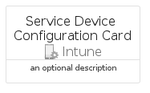

# ServiceDeviceConfiguration


```text
azure-19/Item/Intune/ServiceDeviceConfiguration
```

```text
include('azure-19/Item/Intune/ServiceDeviceConfiguration')
```


| Illustration | ServiceDeviceConfiguration | ServiceDeviceConfigurationCard | ServiceDeviceConfigurationGroup |
| :---: | :---: | :---: | :---: |
|  |  |  |  |


## Sprites
The item provides the following sriptes:

- `<$ServiceDeviceConfigurationXs>`
- `<$ServiceDeviceConfigurationSm>`
- `<$ServiceDeviceConfigurationMd>`
- `<$ServiceDeviceConfigurationLg>`


## ServiceDeviceConfiguration

### Load remotely
```plantuml
@startuml
' configures the library
!global $LIB_BASE_LOCATION="https://raw.githubusercontent.com/tmorin/plantuml-libs/master/distribution"

' loads the library's bootstrap
!include $LIB_BASE_LOCATION/bootstrap.puml

' loads the package bootstrap
include('azure-19/bootstrap')

' loads the Item which embeds the element ServiceDeviceConfiguration
include('azure-19/Item/Intune/ServiceDeviceConfiguration')

' renders the element
ServiceDeviceConfiguration('ServiceDeviceConfiguration', 'Service Device Configuration', 'an optional tech label', 'an optional description')
@enduml
```

### Load locally
```plantuml
@startuml
' configures the library
!global $INCLUSION_MODE="local"
!global $LIB_BASE_LOCATION="../../.."

' loads the library's bootstrap
!include $LIB_BASE_LOCATION/bootstrap.puml

' loads the package bootstrap
include('azure-19/bootstrap')

' loads the Item which embeds the element ServiceDeviceConfiguration
include('azure-19/Item/Intune/ServiceDeviceConfiguration')

' renders the element
ServiceDeviceConfiguration('ServiceDeviceConfiguration', 'Service Device Configuration', 'an optional tech label', 'an optional description')
@enduml
```

## ServiceDeviceConfigurationCard

### Load remotely
```plantuml
@startuml
' configures the library
!global $LIB_BASE_LOCATION="https://raw.githubusercontent.com/tmorin/plantuml-libs/master/distribution"

' loads the library's bootstrap
!include $LIB_BASE_LOCATION/bootstrap.puml

' loads the package bootstrap
include('azure-19/bootstrap')

' loads the Item which embeds the element ServiceDeviceConfigurationCard
include('azure-19/Item/Intune/ServiceDeviceConfiguration')

' renders the element
ServiceDeviceConfigurationCard('ServiceDeviceConfigurationCard', 'Service Device Configuration Card', 'an optional description')
@enduml
```

### Load locally
```plantuml
@startuml
' configures the library
!global $INCLUSION_MODE="local"
!global $LIB_BASE_LOCATION="../../.."

' loads the library's bootstrap
!include $LIB_BASE_LOCATION/bootstrap.puml

' loads the package bootstrap
include('azure-19/bootstrap')

' loads the Item which embeds the element ServiceDeviceConfigurationCard
include('azure-19/Item/Intune/ServiceDeviceConfiguration')

' renders the element
ServiceDeviceConfigurationCard('ServiceDeviceConfigurationCard', 'Service Device Configuration Card', 'an optional description')
@enduml
```

## ServiceDeviceConfigurationGroup

### Load remotely
```plantuml
@startuml
' configures the library
!global $LIB_BASE_LOCATION="https://raw.githubusercontent.com/tmorin/plantuml-libs/master/distribution"

' loads the library's bootstrap
!include $LIB_BASE_LOCATION/bootstrap.puml

' loads the package bootstrap
include('azure-19/bootstrap')

' loads the Item which embeds the element ServiceDeviceConfigurationGroup
include('azure-19/Item/Intune/ServiceDeviceConfiguration')

' renders the element
ServiceDeviceConfigurationGroup('ServiceDeviceConfigurationGroup', 'Service Device Configuration Group', 'an optional tech label') {
    note as note
        the content of the group
    end note
}
@enduml
```

### Load locally
```plantuml
@startuml
' configures the library
!global $INCLUSION_MODE="local"
!global $LIB_BASE_LOCATION="../../.."

' loads the library's bootstrap
!include $LIB_BASE_LOCATION/bootstrap.puml

' loads the package bootstrap
include('azure-19/bootstrap')

' loads the Item which embeds the element ServiceDeviceConfigurationGroup
include('azure-19/Item/Intune/ServiceDeviceConfiguration')

' renders the element
ServiceDeviceConfigurationGroup('ServiceDeviceConfigurationGroup', 'Service Device Configuration Group', 'an optional tech label') {
    note as note
        the content of the group
    end note
}
@enduml
```

