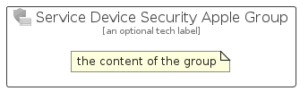

# ServiceDeviceSecurityApple


```text
azure-19/Item/Intune/ServiceDeviceSecurityApple
```

```text
include('azure-19/Item/Intune/ServiceDeviceSecurityApple')
```


| Illustration | ServiceDeviceSecurityApple | ServiceDeviceSecurityAppleCard | ServiceDeviceSecurityAppleGroup |
| :---: | :---: | :---: | :---: |
|  |  |  |  |


## Sprites
The item provides the following sriptes:

- `<$ServiceDeviceSecurityAppleXs>`
- `<$ServiceDeviceSecurityAppleSm>`
- `<$ServiceDeviceSecurityAppleMd>`
- `<$ServiceDeviceSecurityAppleLg>`


## ServiceDeviceSecurityApple

### Load remotely
```plantuml
@startuml
' configures the library
!global $LIB_BASE_LOCATION="https://raw.githubusercontent.com/tmorin/plantuml-libs/master/distribution"

' loads the library's bootstrap
!include $LIB_BASE_LOCATION/bootstrap.puml

' loads the package bootstrap
include('azure-19/bootstrap')

' loads the Item which embeds the element ServiceDeviceSecurityApple
include('azure-19/Item/Intune/ServiceDeviceSecurityApple')

' renders the element
ServiceDeviceSecurityApple('ServiceDeviceSecurityApple', 'Service Device Security Apple', 'an optional tech label', 'an optional description')
@enduml
```

### Load locally
```plantuml
@startuml
' configures the library
!global $INCLUSION_MODE="local"
!global $LIB_BASE_LOCATION="../../.."

' loads the library's bootstrap
!include $LIB_BASE_LOCATION/bootstrap.puml

' loads the package bootstrap
include('azure-19/bootstrap')

' loads the Item which embeds the element ServiceDeviceSecurityApple
include('azure-19/Item/Intune/ServiceDeviceSecurityApple')

' renders the element
ServiceDeviceSecurityApple('ServiceDeviceSecurityApple', 'Service Device Security Apple', 'an optional tech label', 'an optional description')
@enduml
```

## ServiceDeviceSecurityAppleCard

### Load remotely
```plantuml
@startuml
' configures the library
!global $LIB_BASE_LOCATION="https://raw.githubusercontent.com/tmorin/plantuml-libs/master/distribution"

' loads the library's bootstrap
!include $LIB_BASE_LOCATION/bootstrap.puml

' loads the package bootstrap
include('azure-19/bootstrap')

' loads the Item which embeds the element ServiceDeviceSecurityAppleCard
include('azure-19/Item/Intune/ServiceDeviceSecurityApple')

' renders the element
ServiceDeviceSecurityAppleCard('ServiceDeviceSecurityAppleCard', 'Service Device Security Apple Card', 'an optional description')
@enduml
```

### Load locally
```plantuml
@startuml
' configures the library
!global $INCLUSION_MODE="local"
!global $LIB_BASE_LOCATION="../../.."

' loads the library's bootstrap
!include $LIB_BASE_LOCATION/bootstrap.puml

' loads the package bootstrap
include('azure-19/bootstrap')

' loads the Item which embeds the element ServiceDeviceSecurityAppleCard
include('azure-19/Item/Intune/ServiceDeviceSecurityApple')

' renders the element
ServiceDeviceSecurityAppleCard('ServiceDeviceSecurityAppleCard', 'Service Device Security Apple Card', 'an optional description')
@enduml
```

## ServiceDeviceSecurityAppleGroup

### Load remotely
```plantuml
@startuml
' configures the library
!global $LIB_BASE_LOCATION="https://raw.githubusercontent.com/tmorin/plantuml-libs/master/distribution"

' loads the library's bootstrap
!include $LIB_BASE_LOCATION/bootstrap.puml

' loads the package bootstrap
include('azure-19/bootstrap')

' loads the Item which embeds the element ServiceDeviceSecurityAppleGroup
include('azure-19/Item/Intune/ServiceDeviceSecurityApple')

' renders the element
ServiceDeviceSecurityAppleGroup('ServiceDeviceSecurityAppleGroup', 'Service Device Security Apple Group', 'an optional tech label') {
    note as note
        the content of the group
    end note
}
@enduml
```

### Load locally
```plantuml
@startuml
' configures the library
!global $INCLUSION_MODE="local"
!global $LIB_BASE_LOCATION="../../.."

' loads the library's bootstrap
!include $LIB_BASE_LOCATION/bootstrap.puml

' loads the package bootstrap
include('azure-19/bootstrap')

' loads the Item which embeds the element ServiceDeviceSecurityAppleGroup
include('azure-19/Item/Intune/ServiceDeviceSecurityApple')

' renders the element
ServiceDeviceSecurityAppleGroup('ServiceDeviceSecurityAppleGroup', 'Service Device Security Apple Group', 'an optional tech label') {
    note as note
        the content of the group
    end note
}
@enduml
```

