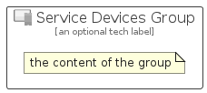

# ServiceDevices


```text
azure-19/Item/Intune/ServiceDevices
```

```text
include('azure-19/Item/Intune/ServiceDevices')
```


| Illustration | ServiceDevices | ServiceDevicesCard | ServiceDevicesGroup |
| :---: | :---: | :---: | :---: |
|  |  |  |  |


## Sprites
The item provides the following sriptes:

- `<$ServiceDevicesXs>`
- `<$ServiceDevicesSm>`
- `<$ServiceDevicesMd>`
- `<$ServiceDevicesLg>`


## ServiceDevices

### Load remotely
```plantuml
@startuml
' configures the library
!global $LIB_BASE_LOCATION="https://raw.githubusercontent.com/tmorin/plantuml-libs/master/distribution"

' loads the library's bootstrap
!include $LIB_BASE_LOCATION/bootstrap.puml

' loads the package bootstrap
include('azure-19/bootstrap')

' loads the Item which embeds the element ServiceDevices
include('azure-19/Item/Intune/ServiceDevices')

' renders the element
ServiceDevices('ServiceDevices', 'Service Devices', 'an optional tech label', 'an optional description')
@enduml
```

### Load locally
```plantuml
@startuml
' configures the library
!global $INCLUSION_MODE="local"
!global $LIB_BASE_LOCATION="../../.."

' loads the library's bootstrap
!include $LIB_BASE_LOCATION/bootstrap.puml

' loads the package bootstrap
include('azure-19/bootstrap')

' loads the Item which embeds the element ServiceDevices
include('azure-19/Item/Intune/ServiceDevices')

' renders the element
ServiceDevices('ServiceDevices', 'Service Devices', 'an optional tech label', 'an optional description')
@enduml
```

## ServiceDevicesCard

### Load remotely
```plantuml
@startuml
' configures the library
!global $LIB_BASE_LOCATION="https://raw.githubusercontent.com/tmorin/plantuml-libs/master/distribution"

' loads the library's bootstrap
!include $LIB_BASE_LOCATION/bootstrap.puml

' loads the package bootstrap
include('azure-19/bootstrap')

' loads the Item which embeds the element ServiceDevicesCard
include('azure-19/Item/Intune/ServiceDevices')

' renders the element
ServiceDevicesCard('ServiceDevicesCard', 'Service Devices Card', 'an optional description')
@enduml
```

### Load locally
```plantuml
@startuml
' configures the library
!global $INCLUSION_MODE="local"
!global $LIB_BASE_LOCATION="../../.."

' loads the library's bootstrap
!include $LIB_BASE_LOCATION/bootstrap.puml

' loads the package bootstrap
include('azure-19/bootstrap')

' loads the Item which embeds the element ServiceDevicesCard
include('azure-19/Item/Intune/ServiceDevices')

' renders the element
ServiceDevicesCard('ServiceDevicesCard', 'Service Devices Card', 'an optional description')
@enduml
```

## ServiceDevicesGroup

### Load remotely
```plantuml
@startuml
' configures the library
!global $LIB_BASE_LOCATION="https://raw.githubusercontent.com/tmorin/plantuml-libs/master/distribution"

' loads the library's bootstrap
!include $LIB_BASE_LOCATION/bootstrap.puml

' loads the package bootstrap
include('azure-19/bootstrap')

' loads the Item which embeds the element ServiceDevicesGroup
include('azure-19/Item/Intune/ServiceDevices')

' renders the element
ServiceDevicesGroup('ServiceDevicesGroup', 'Service Devices Group', 'an optional tech label') {
    note as note
        the content of the group
    end note
}
@enduml
```

### Load locally
```plantuml
@startuml
' configures the library
!global $INCLUSION_MODE="local"
!global $LIB_BASE_LOCATION="../../.."

' loads the library's bootstrap
!include $LIB_BASE_LOCATION/bootstrap.puml

' loads the package bootstrap
include('azure-19/bootstrap')

' loads the Item which embeds the element ServiceDevicesGroup
include('azure-19/Item/Intune/ServiceDevices')

' renders the element
ServiceDevicesGroup('ServiceDevicesGroup', 'Service Devices Group', 'an optional tech label') {
    note as note
        the content of the group
    end note
}
@enduml
```

