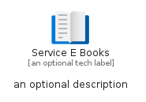

# ServiceEBooks


```text
azure-19/Item/Intune/ServiceEBooks
```

```text
include('azure-19/Item/Intune/ServiceEBooks')
```


| Illustration | ServiceEBooks | ServiceEBooksCard | ServiceEBooksGroup |
| :---: | :---: | :---: | :---: |
|  |  |  |  |


## Sprites
The item provides the following sriptes:

- `<$ServiceEBooksXs>`
- `<$ServiceEBooksSm>`
- `<$ServiceEBooksMd>`
- `<$ServiceEBooksLg>`


## ServiceEBooks

### Load remotely
```plantuml
@startuml
' configures the library
!global $LIB_BASE_LOCATION="https://raw.githubusercontent.com/tmorin/plantuml-libs/master/distribution"

' loads the library's bootstrap
!include $LIB_BASE_LOCATION/bootstrap.puml

' loads the package bootstrap
include('azure-19/bootstrap')

' loads the Item which embeds the element ServiceEBooks
include('azure-19/Item/Intune/ServiceEBooks')

' renders the element
ServiceEBooks('ServiceEBooks', 'Service E Books', 'an optional tech label', 'an optional description')
@enduml
```

### Load locally
```plantuml
@startuml
' configures the library
!global $INCLUSION_MODE="local"
!global $LIB_BASE_LOCATION="../../.."

' loads the library's bootstrap
!include $LIB_BASE_LOCATION/bootstrap.puml

' loads the package bootstrap
include('azure-19/bootstrap')

' loads the Item which embeds the element ServiceEBooks
include('azure-19/Item/Intune/ServiceEBooks')

' renders the element
ServiceEBooks('ServiceEBooks', 'Service E Books', 'an optional tech label', 'an optional description')
@enduml
```

## ServiceEBooksCard

### Load remotely
```plantuml
@startuml
' configures the library
!global $LIB_BASE_LOCATION="https://raw.githubusercontent.com/tmorin/plantuml-libs/master/distribution"

' loads the library's bootstrap
!include $LIB_BASE_LOCATION/bootstrap.puml

' loads the package bootstrap
include('azure-19/bootstrap')

' loads the Item which embeds the element ServiceEBooksCard
include('azure-19/Item/Intune/ServiceEBooks')

' renders the element
ServiceEBooksCard('ServiceEBooksCard', 'Service E Books Card', 'an optional description')
@enduml
```

### Load locally
```plantuml
@startuml
' configures the library
!global $INCLUSION_MODE="local"
!global $LIB_BASE_LOCATION="../../.."

' loads the library's bootstrap
!include $LIB_BASE_LOCATION/bootstrap.puml

' loads the package bootstrap
include('azure-19/bootstrap')

' loads the Item which embeds the element ServiceEBooksCard
include('azure-19/Item/Intune/ServiceEBooks')

' renders the element
ServiceEBooksCard('ServiceEBooksCard', 'Service E Books Card', 'an optional description')
@enduml
```

## ServiceEBooksGroup

### Load remotely
```plantuml
@startuml
' configures the library
!global $LIB_BASE_LOCATION="https://raw.githubusercontent.com/tmorin/plantuml-libs/master/distribution"

' loads the library's bootstrap
!include $LIB_BASE_LOCATION/bootstrap.puml

' loads the package bootstrap
include('azure-19/bootstrap')

' loads the Item which embeds the element ServiceEBooksGroup
include('azure-19/Item/Intune/ServiceEBooks')

' renders the element
ServiceEBooksGroup('ServiceEBooksGroup', 'Service E Books Group', 'an optional tech label') {
    note as note
        the content of the group
    end note
}
@enduml
```

### Load locally
```plantuml
@startuml
' configures the library
!global $INCLUSION_MODE="local"
!global $LIB_BASE_LOCATION="../../.."

' loads the library's bootstrap
!include $LIB_BASE_LOCATION/bootstrap.puml

' loads the package bootstrap
include('azure-19/bootstrap')

' loads the Item which embeds the element ServiceEBooksGroup
include('azure-19/Item/Intune/ServiceEBooks')

' renders the element
ServiceEBooksGroup('ServiceEBooksGroup', 'Service E Books Group', 'an optional tech label') {
    note as note
        the content of the group
    end note
}
@enduml
```

