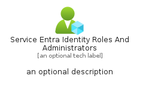
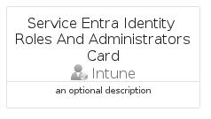

# ServiceEntraIdentityRolesAndAdministrators


```text
azure-19/Item/Intune/ServiceEntraIdentityRolesAndAdministrators
```

```text
include('azure-19/Item/Intune/ServiceEntraIdentityRolesAndAdministrators')
```


| Illustration | ServiceEntraIdentityRolesAndAdministrators | ServiceEntraIdentityRolesAndAdministratorsCard | ServiceEntraIdentityRolesAndAdministratorsGroup |
| :---: | :---: | :---: | :---: |
|  |  |  |  |


## Sprites
The item provides the following sriptes:

- `<$ServiceEntraIdentityRolesAndAdministratorsXs>`
- `<$ServiceEntraIdentityRolesAndAdministratorsSm>`
- `<$ServiceEntraIdentityRolesAndAdministratorsMd>`
- `<$ServiceEntraIdentityRolesAndAdministratorsLg>`


## ServiceEntraIdentityRolesAndAdministrators

### Load remotely
```plantuml
@startuml
' configures the library
!global $LIB_BASE_LOCATION="https://raw.githubusercontent.com/tmorin/plantuml-libs/master/distribution"

' loads the library's bootstrap
!include $LIB_BASE_LOCATION/bootstrap.puml

' loads the package bootstrap
include('azure-19/bootstrap')

' loads the Item which embeds the element ServiceEntraIdentityRolesAndAdministrators
include('azure-19/Item/Intune/ServiceEntraIdentityRolesAndAdministrators')

' renders the element
ServiceEntraIdentityRolesAndAdministrators('ServiceEntraIdentityRolesAndAdministrators', 'Service Entra Identity Roles And Administrators', 'an optional tech label', 'an optional description')
@enduml
```

### Load locally
```plantuml
@startuml
' configures the library
!global $INCLUSION_MODE="local"
!global $LIB_BASE_LOCATION="../../.."

' loads the library's bootstrap
!include $LIB_BASE_LOCATION/bootstrap.puml

' loads the package bootstrap
include('azure-19/bootstrap')

' loads the Item which embeds the element ServiceEntraIdentityRolesAndAdministrators
include('azure-19/Item/Intune/ServiceEntraIdentityRolesAndAdministrators')

' renders the element
ServiceEntraIdentityRolesAndAdministrators('ServiceEntraIdentityRolesAndAdministrators', 'Service Entra Identity Roles And Administrators', 'an optional tech label', 'an optional description')
@enduml
```

## ServiceEntraIdentityRolesAndAdministratorsCard

### Load remotely
```plantuml
@startuml
' configures the library
!global $LIB_BASE_LOCATION="https://raw.githubusercontent.com/tmorin/plantuml-libs/master/distribution"

' loads the library's bootstrap
!include $LIB_BASE_LOCATION/bootstrap.puml

' loads the package bootstrap
include('azure-19/bootstrap')

' loads the Item which embeds the element ServiceEntraIdentityRolesAndAdministratorsCard
include('azure-19/Item/Intune/ServiceEntraIdentityRolesAndAdministrators')

' renders the element
ServiceEntraIdentityRolesAndAdministratorsCard('ServiceEntraIdentityRolesAndAdministratorsCard', 'Service Entra Identity Roles And Administrators Card', 'an optional description')
@enduml
```

### Load locally
```plantuml
@startuml
' configures the library
!global $INCLUSION_MODE="local"
!global $LIB_BASE_LOCATION="../../.."

' loads the library's bootstrap
!include $LIB_BASE_LOCATION/bootstrap.puml

' loads the package bootstrap
include('azure-19/bootstrap')

' loads the Item which embeds the element ServiceEntraIdentityRolesAndAdministratorsCard
include('azure-19/Item/Intune/ServiceEntraIdentityRolesAndAdministrators')

' renders the element
ServiceEntraIdentityRolesAndAdministratorsCard('ServiceEntraIdentityRolesAndAdministratorsCard', 'Service Entra Identity Roles And Administrators Card', 'an optional description')
@enduml
```

## ServiceEntraIdentityRolesAndAdministratorsGroup

### Load remotely
```plantuml
@startuml
' configures the library
!global $LIB_BASE_LOCATION="https://raw.githubusercontent.com/tmorin/plantuml-libs/master/distribution"

' loads the library's bootstrap
!include $LIB_BASE_LOCATION/bootstrap.puml

' loads the package bootstrap
include('azure-19/bootstrap')

' loads the Item which embeds the element ServiceEntraIdentityRolesAndAdministratorsGroup
include('azure-19/Item/Intune/ServiceEntraIdentityRolesAndAdministrators')

' renders the element
ServiceEntraIdentityRolesAndAdministratorsGroup('ServiceEntraIdentityRolesAndAdministratorsGroup', 'Service Entra Identity Roles And Administrators Group', 'an optional tech label') {
    note as note
        the content of the group
    end note
}
@enduml
```

### Load locally
```plantuml
@startuml
' configures the library
!global $INCLUSION_MODE="local"
!global $LIB_BASE_LOCATION="../../.."

' loads the library's bootstrap
!include $LIB_BASE_LOCATION/bootstrap.puml

' loads the package bootstrap
include('azure-19/bootstrap')

' loads the Item which embeds the element ServiceEntraIdentityRolesAndAdministratorsGroup
include('azure-19/Item/Intune/ServiceEntraIdentityRolesAndAdministrators')

' renders the element
ServiceEntraIdentityRolesAndAdministratorsGroup('ServiceEntraIdentityRolesAndAdministratorsGroup', 'Service Entra Identity Roles And Administrators Group', 'an optional tech label') {
    note as note
        the content of the group
    end note
}
@enduml
```

