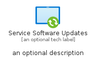
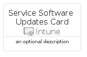

# ServiceSoftwareUpdates


```text
azure-19/Item/Intune/ServiceSoftwareUpdates
```

```text
include('azure-19/Item/Intune/ServiceSoftwareUpdates')
```


| Illustration | ServiceSoftwareUpdates | ServiceSoftwareUpdatesCard | ServiceSoftwareUpdatesGroup |
| :---: | :---: | :---: | :---: |
|  |  |  |  |


## Sprites
The item provides the following sriptes:

- `<$ServiceSoftwareUpdatesXs>`
- `<$ServiceSoftwareUpdatesSm>`
- `<$ServiceSoftwareUpdatesMd>`
- `<$ServiceSoftwareUpdatesLg>`


## ServiceSoftwareUpdates

### Load remotely
```plantuml
@startuml
' configures the library
!global $LIB_BASE_LOCATION="https://raw.githubusercontent.com/tmorin/plantuml-libs/master/distribution"

' loads the library's bootstrap
!include $LIB_BASE_LOCATION/bootstrap.puml

' loads the package bootstrap
include('azure-19/bootstrap')

' loads the Item which embeds the element ServiceSoftwareUpdates
include('azure-19/Item/Intune/ServiceSoftwareUpdates')

' renders the element
ServiceSoftwareUpdates('ServiceSoftwareUpdates', 'Service Software Updates', 'an optional tech label', 'an optional description')
@enduml
```

### Load locally
```plantuml
@startuml
' configures the library
!global $INCLUSION_MODE="local"
!global $LIB_BASE_LOCATION="../../.."

' loads the library's bootstrap
!include $LIB_BASE_LOCATION/bootstrap.puml

' loads the package bootstrap
include('azure-19/bootstrap')

' loads the Item which embeds the element ServiceSoftwareUpdates
include('azure-19/Item/Intune/ServiceSoftwareUpdates')

' renders the element
ServiceSoftwareUpdates('ServiceSoftwareUpdates', 'Service Software Updates', 'an optional tech label', 'an optional description')
@enduml
```

## ServiceSoftwareUpdatesCard

### Load remotely
```plantuml
@startuml
' configures the library
!global $LIB_BASE_LOCATION="https://raw.githubusercontent.com/tmorin/plantuml-libs/master/distribution"

' loads the library's bootstrap
!include $LIB_BASE_LOCATION/bootstrap.puml

' loads the package bootstrap
include('azure-19/bootstrap')

' loads the Item which embeds the element ServiceSoftwareUpdatesCard
include('azure-19/Item/Intune/ServiceSoftwareUpdates')

' renders the element
ServiceSoftwareUpdatesCard('ServiceSoftwareUpdatesCard', 'Service Software Updates Card', 'an optional description')
@enduml
```

### Load locally
```plantuml
@startuml
' configures the library
!global $INCLUSION_MODE="local"
!global $LIB_BASE_LOCATION="../../.."

' loads the library's bootstrap
!include $LIB_BASE_LOCATION/bootstrap.puml

' loads the package bootstrap
include('azure-19/bootstrap')

' loads the Item which embeds the element ServiceSoftwareUpdatesCard
include('azure-19/Item/Intune/ServiceSoftwareUpdates')

' renders the element
ServiceSoftwareUpdatesCard('ServiceSoftwareUpdatesCard', 'Service Software Updates Card', 'an optional description')
@enduml
```

## ServiceSoftwareUpdatesGroup

### Load remotely
```plantuml
@startuml
' configures the library
!global $LIB_BASE_LOCATION="https://raw.githubusercontent.com/tmorin/plantuml-libs/master/distribution"

' loads the library's bootstrap
!include $LIB_BASE_LOCATION/bootstrap.puml

' loads the package bootstrap
include('azure-19/bootstrap')

' loads the Item which embeds the element ServiceSoftwareUpdatesGroup
include('azure-19/Item/Intune/ServiceSoftwareUpdates')

' renders the element
ServiceSoftwareUpdatesGroup('ServiceSoftwareUpdatesGroup', 'Service Software Updates Group', 'an optional tech label') {
    note as note
        the content of the group
    end note
}
@enduml
```

### Load locally
```plantuml
@startuml
' configures the library
!global $INCLUSION_MODE="local"
!global $LIB_BASE_LOCATION="../../.."

' loads the library's bootstrap
!include $LIB_BASE_LOCATION/bootstrap.puml

' loads the package bootstrap
include('azure-19/bootstrap')

' loads the Item which embeds the element ServiceSoftwareUpdatesGroup
include('azure-19/Item/Intune/ServiceSoftwareUpdates')

' renders the element
ServiceSoftwareUpdatesGroup('ServiceSoftwareUpdatesGroup', 'Service Software Updates Group', 'an optional tech label') {
    note as note
        the content of the group
    end note
}
@enduml
```

