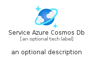
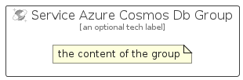

# ServiceAzureCosmosDb


```text
azure-19/Item/Iot/ServiceAzureCosmosDb
```

```text
include('azure-19/Item/Iot/ServiceAzureCosmosDb')
```


| Illustration | ServiceAzureCosmosDb | ServiceAzureCosmosDbCard | ServiceAzureCosmosDbGroup |
| :---: | :---: | :---: | :---: |
|  |  |  |  |


## Sprites
The item provides the following sriptes:

- `<$ServiceAzureCosmosDbXs>`
- `<$ServiceAzureCosmosDbSm>`
- `<$ServiceAzureCosmosDbMd>`
- `<$ServiceAzureCosmosDbLg>`


## ServiceAzureCosmosDb

### Load remotely
```plantuml
@startuml
' configures the library
!global $LIB_BASE_LOCATION="https://raw.githubusercontent.com/tmorin/plantuml-libs/master/distribution"

' loads the library's bootstrap
!include $LIB_BASE_LOCATION/bootstrap.puml

' loads the package bootstrap
include('azure-19/bootstrap')

' loads the Item which embeds the element ServiceAzureCosmosDb
include('azure-19/Item/Iot/ServiceAzureCosmosDb')

' renders the element
ServiceAzureCosmosDb('ServiceAzureCosmosDb', 'Service Azure Cosmos Db', 'an optional tech label', 'an optional description')
@enduml
```

### Load locally
```plantuml
@startuml
' configures the library
!global $INCLUSION_MODE="local"
!global $LIB_BASE_LOCATION="../../.."

' loads the library's bootstrap
!include $LIB_BASE_LOCATION/bootstrap.puml

' loads the package bootstrap
include('azure-19/bootstrap')

' loads the Item which embeds the element ServiceAzureCosmosDb
include('azure-19/Item/Iot/ServiceAzureCosmosDb')

' renders the element
ServiceAzureCosmosDb('ServiceAzureCosmosDb', 'Service Azure Cosmos Db', 'an optional tech label', 'an optional description')
@enduml
```

## ServiceAzureCosmosDbCard

### Load remotely
```plantuml
@startuml
' configures the library
!global $LIB_BASE_LOCATION="https://raw.githubusercontent.com/tmorin/plantuml-libs/master/distribution"

' loads the library's bootstrap
!include $LIB_BASE_LOCATION/bootstrap.puml

' loads the package bootstrap
include('azure-19/bootstrap')

' loads the Item which embeds the element ServiceAzureCosmosDbCard
include('azure-19/Item/Iot/ServiceAzureCosmosDb')

' renders the element
ServiceAzureCosmosDbCard('ServiceAzureCosmosDbCard', 'Service Azure Cosmos Db Card', 'an optional description')
@enduml
```

### Load locally
```plantuml
@startuml
' configures the library
!global $INCLUSION_MODE="local"
!global $LIB_BASE_LOCATION="../../.."

' loads the library's bootstrap
!include $LIB_BASE_LOCATION/bootstrap.puml

' loads the package bootstrap
include('azure-19/bootstrap')

' loads the Item which embeds the element ServiceAzureCosmosDbCard
include('azure-19/Item/Iot/ServiceAzureCosmosDb')

' renders the element
ServiceAzureCosmosDbCard('ServiceAzureCosmosDbCard', 'Service Azure Cosmos Db Card', 'an optional description')
@enduml
```

## ServiceAzureCosmosDbGroup

### Load remotely
```plantuml
@startuml
' configures the library
!global $LIB_BASE_LOCATION="https://raw.githubusercontent.com/tmorin/plantuml-libs/master/distribution"

' loads the library's bootstrap
!include $LIB_BASE_LOCATION/bootstrap.puml

' loads the package bootstrap
include('azure-19/bootstrap')

' loads the Item which embeds the element ServiceAzureCosmosDbGroup
include('azure-19/Item/Iot/ServiceAzureCosmosDb')

' renders the element
ServiceAzureCosmosDbGroup('ServiceAzureCosmosDbGroup', 'Service Azure Cosmos Db Group', 'an optional tech label') {
    note as note
        the content of the group
    end note
}
@enduml
```

### Load locally
```plantuml
@startuml
' configures the library
!global $INCLUSION_MODE="local"
!global $LIB_BASE_LOCATION="../../.."

' loads the library's bootstrap
!include $LIB_BASE_LOCATION/bootstrap.puml

' loads the package bootstrap
include('azure-19/bootstrap')

' loads the Item which embeds the element ServiceAzureCosmosDbGroup
include('azure-19/Item/Iot/ServiceAzureCosmosDb')

' renders the element
ServiceAzureCosmosDbGroup('ServiceAzureCosmosDbGroup', 'Service Azure Cosmos Db Group', 'an optional tech label') {
    note as note
        the content of the group
    end note
}
@enduml
```

