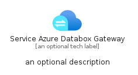
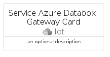

# ServiceAzureDataboxGateway


```text
azure-19/Item/Iot/ServiceAzureDataboxGateway
```

```text
include('azure-19/Item/Iot/ServiceAzureDataboxGateway')
```


| Illustration | ServiceAzureDataboxGateway | ServiceAzureDataboxGatewayCard | ServiceAzureDataboxGatewayGroup |
| :---: | :---: | :---: | :---: |
|  |  |  |  |


## Sprites
The item provides the following sriptes:

- `<$ServiceAzureDataboxGatewayXs>`
- `<$ServiceAzureDataboxGatewaySm>`
- `<$ServiceAzureDataboxGatewayMd>`
- `<$ServiceAzureDataboxGatewayLg>`


## ServiceAzureDataboxGateway

### Load remotely
```plantuml
@startuml
' configures the library
!global $LIB_BASE_LOCATION="https://raw.githubusercontent.com/tmorin/plantuml-libs/master/distribution"

' loads the library's bootstrap
!include $LIB_BASE_LOCATION/bootstrap.puml

' loads the package bootstrap
include('azure-19/bootstrap')

' loads the Item which embeds the element ServiceAzureDataboxGateway
include('azure-19/Item/Iot/ServiceAzureDataboxGateway')

' renders the element
ServiceAzureDataboxGateway('ServiceAzureDataboxGateway', 'Service Azure Databox Gateway', 'an optional tech label', 'an optional description')
@enduml
```

### Load locally
```plantuml
@startuml
' configures the library
!global $INCLUSION_MODE="local"
!global $LIB_BASE_LOCATION="../../.."

' loads the library's bootstrap
!include $LIB_BASE_LOCATION/bootstrap.puml

' loads the package bootstrap
include('azure-19/bootstrap')

' loads the Item which embeds the element ServiceAzureDataboxGateway
include('azure-19/Item/Iot/ServiceAzureDataboxGateway')

' renders the element
ServiceAzureDataboxGateway('ServiceAzureDataboxGateway', 'Service Azure Databox Gateway', 'an optional tech label', 'an optional description')
@enduml
```

## ServiceAzureDataboxGatewayCard

### Load remotely
```plantuml
@startuml
' configures the library
!global $LIB_BASE_LOCATION="https://raw.githubusercontent.com/tmorin/plantuml-libs/master/distribution"

' loads the library's bootstrap
!include $LIB_BASE_LOCATION/bootstrap.puml

' loads the package bootstrap
include('azure-19/bootstrap')

' loads the Item which embeds the element ServiceAzureDataboxGatewayCard
include('azure-19/Item/Iot/ServiceAzureDataboxGateway')

' renders the element
ServiceAzureDataboxGatewayCard('ServiceAzureDataboxGatewayCard', 'Service Azure Databox Gateway Card', 'an optional description')
@enduml
```

### Load locally
```plantuml
@startuml
' configures the library
!global $INCLUSION_MODE="local"
!global $LIB_BASE_LOCATION="../../.."

' loads the library's bootstrap
!include $LIB_BASE_LOCATION/bootstrap.puml

' loads the package bootstrap
include('azure-19/bootstrap')

' loads the Item which embeds the element ServiceAzureDataboxGatewayCard
include('azure-19/Item/Iot/ServiceAzureDataboxGateway')

' renders the element
ServiceAzureDataboxGatewayCard('ServiceAzureDataboxGatewayCard', 'Service Azure Databox Gateway Card', 'an optional description')
@enduml
```

## ServiceAzureDataboxGatewayGroup

### Load remotely
```plantuml
@startuml
' configures the library
!global $LIB_BASE_LOCATION="https://raw.githubusercontent.com/tmorin/plantuml-libs/master/distribution"

' loads the library's bootstrap
!include $LIB_BASE_LOCATION/bootstrap.puml

' loads the package bootstrap
include('azure-19/bootstrap')

' loads the Item which embeds the element ServiceAzureDataboxGatewayGroup
include('azure-19/Item/Iot/ServiceAzureDataboxGateway')

' renders the element
ServiceAzureDataboxGatewayGroup('ServiceAzureDataboxGatewayGroup', 'Service Azure Databox Gateway Group', 'an optional tech label') {
    note as note
        the content of the group
    end note
}
@enduml
```

### Load locally
```plantuml
@startuml
' configures the library
!global $INCLUSION_MODE="local"
!global $LIB_BASE_LOCATION="../../.."

' loads the library's bootstrap
!include $LIB_BASE_LOCATION/bootstrap.puml

' loads the package bootstrap
include('azure-19/bootstrap')

' loads the Item which embeds the element ServiceAzureDataboxGatewayGroup
include('azure-19/Item/Iot/ServiceAzureDataboxGateway')

' renders the element
ServiceAzureDataboxGatewayGroup('ServiceAzureDataboxGatewayGroup', 'Service Azure Databox Gateway Group', 'an optional tech label') {
    note as note
        the content of the group
    end note
}
@enduml
```

