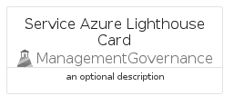
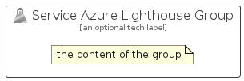

# ServiceAzureLighthouse


```text
azure-19/Item/ManagementGovernance/ServiceAzureLighthouse
```

```text
include('azure-19/Item/ManagementGovernance/ServiceAzureLighthouse')
```


| Illustration | ServiceAzureLighthouse | ServiceAzureLighthouseCard | ServiceAzureLighthouseGroup |
| :---: | :---: | :---: | :---: |
|  |  |  |  |


## Sprites
The item provides the following sriptes:

- `<$ServiceAzureLighthouseXs>`
- `<$ServiceAzureLighthouseSm>`
- `<$ServiceAzureLighthouseMd>`
- `<$ServiceAzureLighthouseLg>`


## ServiceAzureLighthouse

### Load remotely
```plantuml
@startuml
' configures the library
!global $LIB_BASE_LOCATION="https://raw.githubusercontent.com/tmorin/plantuml-libs/master/distribution"

' loads the library's bootstrap
!include $LIB_BASE_LOCATION/bootstrap.puml

' loads the package bootstrap
include('azure-19/bootstrap')

' loads the Item which embeds the element ServiceAzureLighthouse
include('azure-19/Item/ManagementGovernance/ServiceAzureLighthouse')

' renders the element
ServiceAzureLighthouse('ServiceAzureLighthouse', 'Service Azure Lighthouse', 'an optional tech label', 'an optional description')
@enduml
```

### Load locally
```plantuml
@startuml
' configures the library
!global $INCLUSION_MODE="local"
!global $LIB_BASE_LOCATION="../../.."

' loads the library's bootstrap
!include $LIB_BASE_LOCATION/bootstrap.puml

' loads the package bootstrap
include('azure-19/bootstrap')

' loads the Item which embeds the element ServiceAzureLighthouse
include('azure-19/Item/ManagementGovernance/ServiceAzureLighthouse')

' renders the element
ServiceAzureLighthouse('ServiceAzureLighthouse', 'Service Azure Lighthouse', 'an optional tech label', 'an optional description')
@enduml
```

## ServiceAzureLighthouseCard

### Load remotely
```plantuml
@startuml
' configures the library
!global $LIB_BASE_LOCATION="https://raw.githubusercontent.com/tmorin/plantuml-libs/master/distribution"

' loads the library's bootstrap
!include $LIB_BASE_LOCATION/bootstrap.puml

' loads the package bootstrap
include('azure-19/bootstrap')

' loads the Item which embeds the element ServiceAzureLighthouseCard
include('azure-19/Item/ManagementGovernance/ServiceAzureLighthouse')

' renders the element
ServiceAzureLighthouseCard('ServiceAzureLighthouseCard', 'Service Azure Lighthouse Card', 'an optional description')
@enduml
```

### Load locally
```plantuml
@startuml
' configures the library
!global $INCLUSION_MODE="local"
!global $LIB_BASE_LOCATION="../../.."

' loads the library's bootstrap
!include $LIB_BASE_LOCATION/bootstrap.puml

' loads the package bootstrap
include('azure-19/bootstrap')

' loads the Item which embeds the element ServiceAzureLighthouseCard
include('azure-19/Item/ManagementGovernance/ServiceAzureLighthouse')

' renders the element
ServiceAzureLighthouseCard('ServiceAzureLighthouseCard', 'Service Azure Lighthouse Card', 'an optional description')
@enduml
```

## ServiceAzureLighthouseGroup

### Load remotely
```plantuml
@startuml
' configures the library
!global $LIB_BASE_LOCATION="https://raw.githubusercontent.com/tmorin/plantuml-libs/master/distribution"

' loads the library's bootstrap
!include $LIB_BASE_LOCATION/bootstrap.puml

' loads the package bootstrap
include('azure-19/bootstrap')

' loads the Item which embeds the element ServiceAzureLighthouseGroup
include('azure-19/Item/ManagementGovernance/ServiceAzureLighthouse')

' renders the element
ServiceAzureLighthouseGroup('ServiceAzureLighthouseGroup', 'Service Azure Lighthouse Group', 'an optional tech label') {
    note as note
        the content of the group
    end note
}
@enduml
```

### Load locally
```plantuml
@startuml
' configures the library
!global $INCLUSION_MODE="local"
!global $LIB_BASE_LOCATION="../../.."

' loads the library's bootstrap
!include $LIB_BASE_LOCATION/bootstrap.puml

' loads the package bootstrap
include('azure-19/bootstrap')

' loads the Item which embeds the element ServiceAzureLighthouseGroup
include('azure-19/Item/ManagementGovernance/ServiceAzureLighthouse')

' renders the element
ServiceAzureLighthouseGroup('ServiceAzureLighthouseGroup', 'Service Azure Lighthouse Group', 'an optional tech label') {
    note as note
        the content of the group
    end note
}
@enduml
```

