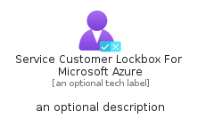
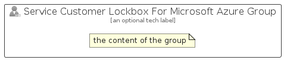

# ServiceCustomerLockboxForMicrosoftAzure


```text
azure-19/Item/ManagementGovernance/ServiceCustomerLockboxForMicrosoftAzure
```

```text
include('azure-19/Item/ManagementGovernance/ServiceCustomerLockboxForMicrosoftAzure')
```


| Illustration | ServiceCustomerLockboxForMicrosoftAzure | ServiceCustomerLockboxForMicrosoftAzureCard | ServiceCustomerLockboxForMicrosoftAzureGroup |
| :---: | :---: | :---: | :---: |
|  |  |  |  |


## Sprites
The item provides the following sriptes:

- `<$ServiceCustomerLockboxForMicrosoftAzureXs>`
- `<$ServiceCustomerLockboxForMicrosoftAzureSm>`
- `<$ServiceCustomerLockboxForMicrosoftAzureMd>`
- `<$ServiceCustomerLockboxForMicrosoftAzureLg>`


## ServiceCustomerLockboxForMicrosoftAzure

### Load remotely
```plantuml
@startuml
' configures the library
!global $LIB_BASE_LOCATION="https://raw.githubusercontent.com/tmorin/plantuml-libs/master/distribution"

' loads the library's bootstrap
!include $LIB_BASE_LOCATION/bootstrap.puml

' loads the package bootstrap
include('azure-19/bootstrap')

' loads the Item which embeds the element ServiceCustomerLockboxForMicrosoftAzure
include('azure-19/Item/ManagementGovernance/ServiceCustomerLockboxForMicrosoftAzure')

' renders the element
ServiceCustomerLockboxForMicrosoftAzure('ServiceCustomerLockboxForMicrosoftAzure', 'Service Customer Lockbox For Microsoft Azure', 'an optional tech label', 'an optional description')
@enduml
```

### Load locally
```plantuml
@startuml
' configures the library
!global $INCLUSION_MODE="local"
!global $LIB_BASE_LOCATION="../../.."

' loads the library's bootstrap
!include $LIB_BASE_LOCATION/bootstrap.puml

' loads the package bootstrap
include('azure-19/bootstrap')

' loads the Item which embeds the element ServiceCustomerLockboxForMicrosoftAzure
include('azure-19/Item/ManagementGovernance/ServiceCustomerLockboxForMicrosoftAzure')

' renders the element
ServiceCustomerLockboxForMicrosoftAzure('ServiceCustomerLockboxForMicrosoftAzure', 'Service Customer Lockbox For Microsoft Azure', 'an optional tech label', 'an optional description')
@enduml
```

## ServiceCustomerLockboxForMicrosoftAzureCard

### Load remotely
```plantuml
@startuml
' configures the library
!global $LIB_BASE_LOCATION="https://raw.githubusercontent.com/tmorin/plantuml-libs/master/distribution"

' loads the library's bootstrap
!include $LIB_BASE_LOCATION/bootstrap.puml

' loads the package bootstrap
include('azure-19/bootstrap')

' loads the Item which embeds the element ServiceCustomerLockboxForMicrosoftAzureCard
include('azure-19/Item/ManagementGovernance/ServiceCustomerLockboxForMicrosoftAzure')

' renders the element
ServiceCustomerLockboxForMicrosoftAzureCard('ServiceCustomerLockboxForMicrosoftAzureCard', 'Service Customer Lockbox For Microsoft Azure Card', 'an optional description')
@enduml
```

### Load locally
```plantuml
@startuml
' configures the library
!global $INCLUSION_MODE="local"
!global $LIB_BASE_LOCATION="../../.."

' loads the library's bootstrap
!include $LIB_BASE_LOCATION/bootstrap.puml

' loads the package bootstrap
include('azure-19/bootstrap')

' loads the Item which embeds the element ServiceCustomerLockboxForMicrosoftAzureCard
include('azure-19/Item/ManagementGovernance/ServiceCustomerLockboxForMicrosoftAzure')

' renders the element
ServiceCustomerLockboxForMicrosoftAzureCard('ServiceCustomerLockboxForMicrosoftAzureCard', 'Service Customer Lockbox For Microsoft Azure Card', 'an optional description')
@enduml
```

## ServiceCustomerLockboxForMicrosoftAzureGroup

### Load remotely
```plantuml
@startuml
' configures the library
!global $LIB_BASE_LOCATION="https://raw.githubusercontent.com/tmorin/plantuml-libs/master/distribution"

' loads the library's bootstrap
!include $LIB_BASE_LOCATION/bootstrap.puml

' loads the package bootstrap
include('azure-19/bootstrap')

' loads the Item which embeds the element ServiceCustomerLockboxForMicrosoftAzureGroup
include('azure-19/Item/ManagementGovernance/ServiceCustomerLockboxForMicrosoftAzure')

' renders the element
ServiceCustomerLockboxForMicrosoftAzureGroup('ServiceCustomerLockboxForMicrosoftAzureGroup', 'Service Customer Lockbox For Microsoft Azure Group', 'an optional tech label') {
    note as note
        the content of the group
    end note
}
@enduml
```

### Load locally
```plantuml
@startuml
' configures the library
!global $INCLUSION_MODE="local"
!global $LIB_BASE_LOCATION="../../.."

' loads the library's bootstrap
!include $LIB_BASE_LOCATION/bootstrap.puml

' loads the package bootstrap
include('azure-19/bootstrap')

' loads the Item which embeds the element ServiceCustomerLockboxForMicrosoftAzureGroup
include('azure-19/Item/ManagementGovernance/ServiceCustomerLockboxForMicrosoftAzure')

' renders the element
ServiceCustomerLockboxForMicrosoftAzureGroup('ServiceCustomerLockboxForMicrosoftAzureGroup', 'Service Customer Lockbox For Microsoft Azure Group', 'an optional tech label') {
    note as note
        the content of the group
    end note
}
@enduml
```

