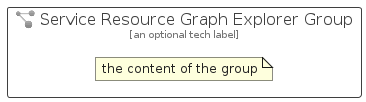

# ServiceResourceGraphExplorer


```text
azure-19/Item/ManagementGovernance/ServiceResourceGraphExplorer
```

```text
include('azure-19/Item/ManagementGovernance/ServiceResourceGraphExplorer')
```


| Illustration | ServiceResourceGraphExplorer | ServiceResourceGraphExplorerCard | ServiceResourceGraphExplorerGroup |
| :---: | :---: | :---: | :---: |
|  |  |  |  |


## Sprites
The item provides the following sriptes:

- `<$ServiceResourceGraphExplorerXs>`
- `<$ServiceResourceGraphExplorerSm>`
- `<$ServiceResourceGraphExplorerMd>`
- `<$ServiceResourceGraphExplorerLg>`


## ServiceResourceGraphExplorer

### Load remotely
```plantuml
@startuml
' configures the library
!global $LIB_BASE_LOCATION="https://raw.githubusercontent.com/tmorin/plantuml-libs/master/distribution"

' loads the library's bootstrap
!include $LIB_BASE_LOCATION/bootstrap.puml

' loads the package bootstrap
include('azure-19/bootstrap')

' loads the Item which embeds the element ServiceResourceGraphExplorer
include('azure-19/Item/ManagementGovernance/ServiceResourceGraphExplorer')

' renders the element
ServiceResourceGraphExplorer('ServiceResourceGraphExplorer', 'Service Resource Graph Explorer', 'an optional tech label', 'an optional description')
@enduml
```

### Load locally
```plantuml
@startuml
' configures the library
!global $INCLUSION_MODE="local"
!global $LIB_BASE_LOCATION="../../.."

' loads the library's bootstrap
!include $LIB_BASE_LOCATION/bootstrap.puml

' loads the package bootstrap
include('azure-19/bootstrap')

' loads the Item which embeds the element ServiceResourceGraphExplorer
include('azure-19/Item/ManagementGovernance/ServiceResourceGraphExplorer')

' renders the element
ServiceResourceGraphExplorer('ServiceResourceGraphExplorer', 'Service Resource Graph Explorer', 'an optional tech label', 'an optional description')
@enduml
```

## ServiceResourceGraphExplorerCard

### Load remotely
```plantuml
@startuml
' configures the library
!global $LIB_BASE_LOCATION="https://raw.githubusercontent.com/tmorin/plantuml-libs/master/distribution"

' loads the library's bootstrap
!include $LIB_BASE_LOCATION/bootstrap.puml

' loads the package bootstrap
include('azure-19/bootstrap')

' loads the Item which embeds the element ServiceResourceGraphExplorerCard
include('azure-19/Item/ManagementGovernance/ServiceResourceGraphExplorer')

' renders the element
ServiceResourceGraphExplorerCard('ServiceResourceGraphExplorerCard', 'Service Resource Graph Explorer Card', 'an optional description')
@enduml
```

### Load locally
```plantuml
@startuml
' configures the library
!global $INCLUSION_MODE="local"
!global $LIB_BASE_LOCATION="../../.."

' loads the library's bootstrap
!include $LIB_BASE_LOCATION/bootstrap.puml

' loads the package bootstrap
include('azure-19/bootstrap')

' loads the Item which embeds the element ServiceResourceGraphExplorerCard
include('azure-19/Item/ManagementGovernance/ServiceResourceGraphExplorer')

' renders the element
ServiceResourceGraphExplorerCard('ServiceResourceGraphExplorerCard', 'Service Resource Graph Explorer Card', 'an optional description')
@enduml
```

## ServiceResourceGraphExplorerGroup

### Load remotely
```plantuml
@startuml
' configures the library
!global $LIB_BASE_LOCATION="https://raw.githubusercontent.com/tmorin/plantuml-libs/master/distribution"

' loads the library's bootstrap
!include $LIB_BASE_LOCATION/bootstrap.puml

' loads the package bootstrap
include('azure-19/bootstrap')

' loads the Item which embeds the element ServiceResourceGraphExplorerGroup
include('azure-19/Item/ManagementGovernance/ServiceResourceGraphExplorer')

' renders the element
ServiceResourceGraphExplorerGroup('ServiceResourceGraphExplorerGroup', 'Service Resource Graph Explorer Group', 'an optional tech label') {
    note as note
        the content of the group
    end note
}
@enduml
```

### Load locally
```plantuml
@startuml
' configures the library
!global $INCLUSION_MODE="local"
!global $LIB_BASE_LOCATION="../../.."

' loads the library's bootstrap
!include $LIB_BASE_LOCATION/bootstrap.puml

' loads the package bootstrap
include('azure-19/bootstrap')

' loads the Item which embeds the element ServiceResourceGraphExplorerGroup
include('azure-19/Item/ManagementGovernance/ServiceResourceGraphExplorer')

' renders the element
ServiceResourceGraphExplorerGroup('ServiceResourceGraphExplorerGroup', 'Service Resource Graph Explorer Group', 'an optional tech label') {
    note as note
        the content of the group
    end note
}
@enduml
```

