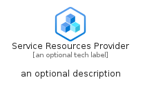
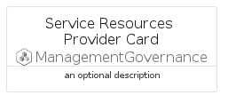

# ServiceResourcesProvider


```text
azure-19/Item/ManagementGovernance/ServiceResourcesProvider
```

```text
include('azure-19/Item/ManagementGovernance/ServiceResourcesProvider')
```


| Illustration | ServiceResourcesProvider | ServiceResourcesProviderCard | ServiceResourcesProviderGroup |
| :---: | :---: | :---: | :---: |
|  |  |  |  |


## Sprites
The item provides the following sriptes:

- `<$ServiceResourcesProviderXs>`
- `<$ServiceResourcesProviderSm>`
- `<$ServiceResourcesProviderMd>`
- `<$ServiceResourcesProviderLg>`


## ServiceResourcesProvider

### Load remotely
```plantuml
@startuml
' configures the library
!global $LIB_BASE_LOCATION="https://raw.githubusercontent.com/tmorin/plantuml-libs/master/distribution"

' loads the library's bootstrap
!include $LIB_BASE_LOCATION/bootstrap.puml

' loads the package bootstrap
include('azure-19/bootstrap')

' loads the Item which embeds the element ServiceResourcesProvider
include('azure-19/Item/ManagementGovernance/ServiceResourcesProvider')

' renders the element
ServiceResourcesProvider('ServiceResourcesProvider', 'Service Resources Provider', 'an optional tech label', 'an optional description')
@enduml
```

### Load locally
```plantuml
@startuml
' configures the library
!global $INCLUSION_MODE="local"
!global $LIB_BASE_LOCATION="../../.."

' loads the library's bootstrap
!include $LIB_BASE_LOCATION/bootstrap.puml

' loads the package bootstrap
include('azure-19/bootstrap')

' loads the Item which embeds the element ServiceResourcesProvider
include('azure-19/Item/ManagementGovernance/ServiceResourcesProvider')

' renders the element
ServiceResourcesProvider('ServiceResourcesProvider', 'Service Resources Provider', 'an optional tech label', 'an optional description')
@enduml
```

## ServiceResourcesProviderCard

### Load remotely
```plantuml
@startuml
' configures the library
!global $LIB_BASE_LOCATION="https://raw.githubusercontent.com/tmorin/plantuml-libs/master/distribution"

' loads the library's bootstrap
!include $LIB_BASE_LOCATION/bootstrap.puml

' loads the package bootstrap
include('azure-19/bootstrap')

' loads the Item which embeds the element ServiceResourcesProviderCard
include('azure-19/Item/ManagementGovernance/ServiceResourcesProvider')

' renders the element
ServiceResourcesProviderCard('ServiceResourcesProviderCard', 'Service Resources Provider Card', 'an optional description')
@enduml
```

### Load locally
```plantuml
@startuml
' configures the library
!global $INCLUSION_MODE="local"
!global $LIB_BASE_LOCATION="../../.."

' loads the library's bootstrap
!include $LIB_BASE_LOCATION/bootstrap.puml

' loads the package bootstrap
include('azure-19/bootstrap')

' loads the Item which embeds the element ServiceResourcesProviderCard
include('azure-19/Item/ManagementGovernance/ServiceResourcesProvider')

' renders the element
ServiceResourcesProviderCard('ServiceResourcesProviderCard', 'Service Resources Provider Card', 'an optional description')
@enduml
```

## ServiceResourcesProviderGroup

### Load remotely
```plantuml
@startuml
' configures the library
!global $LIB_BASE_LOCATION="https://raw.githubusercontent.com/tmorin/plantuml-libs/master/distribution"

' loads the library's bootstrap
!include $LIB_BASE_LOCATION/bootstrap.puml

' loads the package bootstrap
include('azure-19/bootstrap')

' loads the Item which embeds the element ServiceResourcesProviderGroup
include('azure-19/Item/ManagementGovernance/ServiceResourcesProvider')

' renders the element
ServiceResourcesProviderGroup('ServiceResourcesProviderGroup', 'Service Resources Provider Group', 'an optional tech label') {
    note as note
        the content of the group
    end note
}
@enduml
```

### Load locally
```plantuml
@startuml
' configures the library
!global $INCLUSION_MODE="local"
!global $LIB_BASE_LOCATION="../../.."

' loads the library's bootstrap
!include $LIB_BASE_LOCATION/bootstrap.puml

' loads the package bootstrap
include('azure-19/bootstrap')

' loads the Item which embeds the element ServiceResourcesProviderGroup
include('azure-19/Item/ManagementGovernance/ServiceResourcesProvider')

' renders the element
ServiceResourcesProviderGroup('ServiceResourcesProviderGroup', 'Service Resources Provider Group', 'an optional tech label') {
    note as note
        the content of the group
    end note
}
@enduml
```

