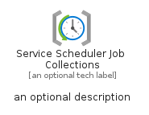

# ServiceSchedulerJobCollections


```text
azure-19/Item/ManagementGovernance/ServiceSchedulerJobCollections
```

```text
include('azure-19/Item/ManagementGovernance/ServiceSchedulerJobCollections')
```


| Illustration | ServiceSchedulerJobCollections | ServiceSchedulerJobCollectionsCard | ServiceSchedulerJobCollectionsGroup |
| :---: | :---: | :---: | :---: |
|  |  |  |  |


## Sprites
The item provides the following sriptes:

- `<$ServiceSchedulerJobCollectionsXs>`
- `<$ServiceSchedulerJobCollectionsSm>`
- `<$ServiceSchedulerJobCollectionsMd>`
- `<$ServiceSchedulerJobCollectionsLg>`


## ServiceSchedulerJobCollections

### Load remotely
```plantuml
@startuml
' configures the library
!global $LIB_BASE_LOCATION="https://raw.githubusercontent.com/tmorin/plantuml-libs/master/distribution"

' loads the library's bootstrap
!include $LIB_BASE_LOCATION/bootstrap.puml

' loads the package bootstrap
include('azure-19/bootstrap')

' loads the Item which embeds the element ServiceSchedulerJobCollections
include('azure-19/Item/ManagementGovernance/ServiceSchedulerJobCollections')

' renders the element
ServiceSchedulerJobCollections('ServiceSchedulerJobCollections', 'Service Scheduler Job Collections', 'an optional tech label', 'an optional description')
@enduml
```

### Load locally
```plantuml
@startuml
' configures the library
!global $INCLUSION_MODE="local"
!global $LIB_BASE_LOCATION="../../.."

' loads the library's bootstrap
!include $LIB_BASE_LOCATION/bootstrap.puml

' loads the package bootstrap
include('azure-19/bootstrap')

' loads the Item which embeds the element ServiceSchedulerJobCollections
include('azure-19/Item/ManagementGovernance/ServiceSchedulerJobCollections')

' renders the element
ServiceSchedulerJobCollections('ServiceSchedulerJobCollections', 'Service Scheduler Job Collections', 'an optional tech label', 'an optional description')
@enduml
```

## ServiceSchedulerJobCollectionsCard

### Load remotely
```plantuml
@startuml
' configures the library
!global $LIB_BASE_LOCATION="https://raw.githubusercontent.com/tmorin/plantuml-libs/master/distribution"

' loads the library's bootstrap
!include $LIB_BASE_LOCATION/bootstrap.puml

' loads the package bootstrap
include('azure-19/bootstrap')

' loads the Item which embeds the element ServiceSchedulerJobCollectionsCard
include('azure-19/Item/ManagementGovernance/ServiceSchedulerJobCollections')

' renders the element
ServiceSchedulerJobCollectionsCard('ServiceSchedulerJobCollectionsCard', 'Service Scheduler Job Collections Card', 'an optional description')
@enduml
```

### Load locally
```plantuml
@startuml
' configures the library
!global $INCLUSION_MODE="local"
!global $LIB_BASE_LOCATION="../../.."

' loads the library's bootstrap
!include $LIB_BASE_LOCATION/bootstrap.puml

' loads the package bootstrap
include('azure-19/bootstrap')

' loads the Item which embeds the element ServiceSchedulerJobCollectionsCard
include('azure-19/Item/ManagementGovernance/ServiceSchedulerJobCollections')

' renders the element
ServiceSchedulerJobCollectionsCard('ServiceSchedulerJobCollectionsCard', 'Service Scheduler Job Collections Card', 'an optional description')
@enduml
```

## ServiceSchedulerJobCollectionsGroup

### Load remotely
```plantuml
@startuml
' configures the library
!global $LIB_BASE_LOCATION="https://raw.githubusercontent.com/tmorin/plantuml-libs/master/distribution"

' loads the library's bootstrap
!include $LIB_BASE_LOCATION/bootstrap.puml

' loads the package bootstrap
include('azure-19/bootstrap')

' loads the Item which embeds the element ServiceSchedulerJobCollectionsGroup
include('azure-19/Item/ManagementGovernance/ServiceSchedulerJobCollections')

' renders the element
ServiceSchedulerJobCollectionsGroup('ServiceSchedulerJobCollectionsGroup', 'Service Scheduler Job Collections Group', 'an optional tech label') {
    note as note
        the content of the group
    end note
}
@enduml
```

### Load locally
```plantuml
@startuml
' configures the library
!global $INCLUSION_MODE="local"
!global $LIB_BASE_LOCATION="../../.."

' loads the library's bootstrap
!include $LIB_BASE_LOCATION/bootstrap.puml

' loads the package bootstrap
include('azure-19/bootstrap')

' loads the Item which embeds the element ServiceSchedulerJobCollectionsGroup
include('azure-19/Item/ManagementGovernance/ServiceSchedulerJobCollections')

' renders the element
ServiceSchedulerJobCollectionsGroup('ServiceSchedulerJobCollectionsGroup', 'Service Scheduler Job Collections Group', 'an optional tech label') {
    note as note
        the content of the group
    end note
}
@enduml
```

