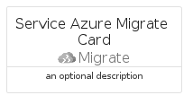
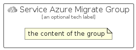

# ServiceAzureMigrate


```text
azure-19/Item/Migrate/ServiceAzureMigrate
```

```text
include('azure-19/Item/Migrate/ServiceAzureMigrate')
```


| Illustration | ServiceAzureMigrate | ServiceAzureMigrateCard | ServiceAzureMigrateGroup |
| :---: | :---: | :---: | :---: |
|  |  |  |  |


## Sprites
The item provides the following sriptes:

- `<$ServiceAzureMigrateXs>`
- `<$ServiceAzureMigrateSm>`
- `<$ServiceAzureMigrateMd>`
- `<$ServiceAzureMigrateLg>`


## ServiceAzureMigrate

### Load remotely
```plantuml
@startuml
' configures the library
!global $LIB_BASE_LOCATION="https://raw.githubusercontent.com/tmorin/plantuml-libs/master/distribution"

' loads the library's bootstrap
!include $LIB_BASE_LOCATION/bootstrap.puml

' loads the package bootstrap
include('azure-19/bootstrap')

' loads the Item which embeds the element ServiceAzureMigrate
include('azure-19/Item/Migrate/ServiceAzureMigrate')

' renders the element
ServiceAzureMigrate('ServiceAzureMigrate', 'Service Azure Migrate', 'an optional tech label', 'an optional description')
@enduml
```

### Load locally
```plantuml
@startuml
' configures the library
!global $INCLUSION_MODE="local"
!global $LIB_BASE_LOCATION="../../.."

' loads the library's bootstrap
!include $LIB_BASE_LOCATION/bootstrap.puml

' loads the package bootstrap
include('azure-19/bootstrap')

' loads the Item which embeds the element ServiceAzureMigrate
include('azure-19/Item/Migrate/ServiceAzureMigrate')

' renders the element
ServiceAzureMigrate('ServiceAzureMigrate', 'Service Azure Migrate', 'an optional tech label', 'an optional description')
@enduml
```

## ServiceAzureMigrateCard

### Load remotely
```plantuml
@startuml
' configures the library
!global $LIB_BASE_LOCATION="https://raw.githubusercontent.com/tmorin/plantuml-libs/master/distribution"

' loads the library's bootstrap
!include $LIB_BASE_LOCATION/bootstrap.puml

' loads the package bootstrap
include('azure-19/bootstrap')

' loads the Item which embeds the element ServiceAzureMigrateCard
include('azure-19/Item/Migrate/ServiceAzureMigrate')

' renders the element
ServiceAzureMigrateCard('ServiceAzureMigrateCard', 'Service Azure Migrate Card', 'an optional description')
@enduml
```

### Load locally
```plantuml
@startuml
' configures the library
!global $INCLUSION_MODE="local"
!global $LIB_BASE_LOCATION="../../.."

' loads the library's bootstrap
!include $LIB_BASE_LOCATION/bootstrap.puml

' loads the package bootstrap
include('azure-19/bootstrap')

' loads the Item which embeds the element ServiceAzureMigrateCard
include('azure-19/Item/Migrate/ServiceAzureMigrate')

' renders the element
ServiceAzureMigrateCard('ServiceAzureMigrateCard', 'Service Azure Migrate Card', 'an optional description')
@enduml
```

## ServiceAzureMigrateGroup

### Load remotely
```plantuml
@startuml
' configures the library
!global $LIB_BASE_LOCATION="https://raw.githubusercontent.com/tmorin/plantuml-libs/master/distribution"

' loads the library's bootstrap
!include $LIB_BASE_LOCATION/bootstrap.puml

' loads the package bootstrap
include('azure-19/bootstrap')

' loads the Item which embeds the element ServiceAzureMigrateGroup
include('azure-19/Item/Migrate/ServiceAzureMigrate')

' renders the element
ServiceAzureMigrateGroup('ServiceAzureMigrateGroup', 'Service Azure Migrate Group', 'an optional tech label') {
    note as note
        the content of the group
    end note
}
@enduml
```

### Load locally
```plantuml
@startuml
' configures the library
!global $INCLUSION_MODE="local"
!global $LIB_BASE_LOCATION="../../.."

' loads the library's bootstrap
!include $LIB_BASE_LOCATION/bootstrap.puml

' loads the package bootstrap
include('azure-19/bootstrap')

' loads the Item which embeds the element ServiceAzureMigrateGroup
include('azure-19/Item/Migrate/ServiceAzureMigrate')

' renders the element
ServiceAzureMigrateGroup('ServiceAzureMigrateGroup', 'Service Azure Migrate Group', 'an optional tech label') {
    note as note
        the content of the group
    end note
}
@enduml
```

