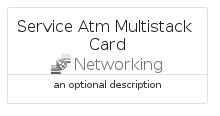

# ServiceAtmMultistack


```text
azure-19/Item/Networking/ServiceAtmMultistack
```

```text
include('azure-19/Item/Networking/ServiceAtmMultistack')
```


| Illustration | ServiceAtmMultistack | ServiceAtmMultistackCard | ServiceAtmMultistackGroup |
| :---: | :---: | :---: | :---: |
|  |  |  |  |


## Sprites
The item provides the following sriptes:

- `<$ServiceAtmMultistackXs>`
- `<$ServiceAtmMultistackSm>`
- `<$ServiceAtmMultistackMd>`
- `<$ServiceAtmMultistackLg>`


## ServiceAtmMultistack

### Load remotely
```plantuml
@startuml
' configures the library
!global $LIB_BASE_LOCATION="https://raw.githubusercontent.com/tmorin/plantuml-libs/master/distribution"

' loads the library's bootstrap
!include $LIB_BASE_LOCATION/bootstrap.puml

' loads the package bootstrap
include('azure-19/bootstrap')

' loads the Item which embeds the element ServiceAtmMultistack
include('azure-19/Item/Networking/ServiceAtmMultistack')

' renders the element
ServiceAtmMultistack('ServiceAtmMultistack', 'Service Atm Multistack', 'an optional tech label', 'an optional description')
@enduml
```

### Load locally
```plantuml
@startuml
' configures the library
!global $INCLUSION_MODE="local"
!global $LIB_BASE_LOCATION="../../.."

' loads the library's bootstrap
!include $LIB_BASE_LOCATION/bootstrap.puml

' loads the package bootstrap
include('azure-19/bootstrap')

' loads the Item which embeds the element ServiceAtmMultistack
include('azure-19/Item/Networking/ServiceAtmMultistack')

' renders the element
ServiceAtmMultistack('ServiceAtmMultistack', 'Service Atm Multistack', 'an optional tech label', 'an optional description')
@enduml
```

## ServiceAtmMultistackCard

### Load remotely
```plantuml
@startuml
' configures the library
!global $LIB_BASE_LOCATION="https://raw.githubusercontent.com/tmorin/plantuml-libs/master/distribution"

' loads the library's bootstrap
!include $LIB_BASE_LOCATION/bootstrap.puml

' loads the package bootstrap
include('azure-19/bootstrap')

' loads the Item which embeds the element ServiceAtmMultistackCard
include('azure-19/Item/Networking/ServiceAtmMultistack')

' renders the element
ServiceAtmMultistackCard('ServiceAtmMultistackCard', 'Service Atm Multistack Card', 'an optional description')
@enduml
```

### Load locally
```plantuml
@startuml
' configures the library
!global $INCLUSION_MODE="local"
!global $LIB_BASE_LOCATION="../../.."

' loads the library's bootstrap
!include $LIB_BASE_LOCATION/bootstrap.puml

' loads the package bootstrap
include('azure-19/bootstrap')

' loads the Item which embeds the element ServiceAtmMultistackCard
include('azure-19/Item/Networking/ServiceAtmMultistack')

' renders the element
ServiceAtmMultistackCard('ServiceAtmMultistackCard', 'Service Atm Multistack Card', 'an optional description')
@enduml
```

## ServiceAtmMultistackGroup

### Load remotely
```plantuml
@startuml
' configures the library
!global $LIB_BASE_LOCATION="https://raw.githubusercontent.com/tmorin/plantuml-libs/master/distribution"

' loads the library's bootstrap
!include $LIB_BASE_LOCATION/bootstrap.puml

' loads the package bootstrap
include('azure-19/bootstrap')

' loads the Item which embeds the element ServiceAtmMultistackGroup
include('azure-19/Item/Networking/ServiceAtmMultistack')

' renders the element
ServiceAtmMultistackGroup('ServiceAtmMultistackGroup', 'Service Atm Multistack Group', 'an optional tech label') {
    note as note
        the content of the group
    end note
}
@enduml
```

### Load locally
```plantuml
@startuml
' configures the library
!global $INCLUSION_MODE="local"
!global $LIB_BASE_LOCATION="../../.."

' loads the library's bootstrap
!include $LIB_BASE_LOCATION/bootstrap.puml

' loads the package bootstrap
include('azure-19/bootstrap')

' loads the Item which embeds the element ServiceAtmMultistackGroup
include('azure-19/Item/Networking/ServiceAtmMultistack')

' renders the element
ServiceAtmMultistackGroup('ServiceAtmMultistackGroup', 'Service Atm Multistack Group', 'an optional tech label') {
    note as note
        the content of the group
    end note
}
@enduml
```

