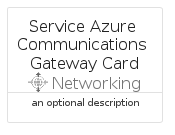
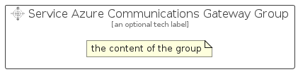

# ServiceAzureCommunicationsGateway


```text
azure-19/Item/Networking/ServiceAzureCommunicationsGateway
```

```text
include('azure-19/Item/Networking/ServiceAzureCommunicationsGateway')
```


| Illustration | ServiceAzureCommunicationsGateway | ServiceAzureCommunicationsGatewayCard | ServiceAzureCommunicationsGatewayGroup |
| :---: | :---: | :---: | :---: |
|  |  |  |  |


## Sprites
The item provides the following sriptes:

- `<$ServiceAzureCommunicationsGatewayXs>`
- `<$ServiceAzureCommunicationsGatewaySm>`
- `<$ServiceAzureCommunicationsGatewayMd>`
- `<$ServiceAzureCommunicationsGatewayLg>`


## ServiceAzureCommunicationsGateway

### Load remotely
```plantuml
@startuml
' configures the library
!global $LIB_BASE_LOCATION="https://raw.githubusercontent.com/tmorin/plantuml-libs/master/distribution"

' loads the library's bootstrap
!include $LIB_BASE_LOCATION/bootstrap.puml

' loads the package bootstrap
include('azure-19/bootstrap')

' loads the Item which embeds the element ServiceAzureCommunicationsGateway
include('azure-19/Item/Networking/ServiceAzureCommunicationsGateway')

' renders the element
ServiceAzureCommunicationsGateway('ServiceAzureCommunicationsGateway', 'Service Azure Communications Gateway', 'an optional tech label', 'an optional description')
@enduml
```

### Load locally
```plantuml
@startuml
' configures the library
!global $INCLUSION_MODE="local"
!global $LIB_BASE_LOCATION="../../.."

' loads the library's bootstrap
!include $LIB_BASE_LOCATION/bootstrap.puml

' loads the package bootstrap
include('azure-19/bootstrap')

' loads the Item which embeds the element ServiceAzureCommunicationsGateway
include('azure-19/Item/Networking/ServiceAzureCommunicationsGateway')

' renders the element
ServiceAzureCommunicationsGateway('ServiceAzureCommunicationsGateway', 'Service Azure Communications Gateway', 'an optional tech label', 'an optional description')
@enduml
```

## ServiceAzureCommunicationsGatewayCard

### Load remotely
```plantuml
@startuml
' configures the library
!global $LIB_BASE_LOCATION="https://raw.githubusercontent.com/tmorin/plantuml-libs/master/distribution"

' loads the library's bootstrap
!include $LIB_BASE_LOCATION/bootstrap.puml

' loads the package bootstrap
include('azure-19/bootstrap')

' loads the Item which embeds the element ServiceAzureCommunicationsGatewayCard
include('azure-19/Item/Networking/ServiceAzureCommunicationsGateway')

' renders the element
ServiceAzureCommunicationsGatewayCard('ServiceAzureCommunicationsGatewayCard', 'Service Azure Communications Gateway Card', 'an optional description')
@enduml
```

### Load locally
```plantuml
@startuml
' configures the library
!global $INCLUSION_MODE="local"
!global $LIB_BASE_LOCATION="../../.."

' loads the library's bootstrap
!include $LIB_BASE_LOCATION/bootstrap.puml

' loads the package bootstrap
include('azure-19/bootstrap')

' loads the Item which embeds the element ServiceAzureCommunicationsGatewayCard
include('azure-19/Item/Networking/ServiceAzureCommunicationsGateway')

' renders the element
ServiceAzureCommunicationsGatewayCard('ServiceAzureCommunicationsGatewayCard', 'Service Azure Communications Gateway Card', 'an optional description')
@enduml
```

## ServiceAzureCommunicationsGatewayGroup

### Load remotely
```plantuml
@startuml
' configures the library
!global $LIB_BASE_LOCATION="https://raw.githubusercontent.com/tmorin/plantuml-libs/master/distribution"

' loads the library's bootstrap
!include $LIB_BASE_LOCATION/bootstrap.puml

' loads the package bootstrap
include('azure-19/bootstrap')

' loads the Item which embeds the element ServiceAzureCommunicationsGatewayGroup
include('azure-19/Item/Networking/ServiceAzureCommunicationsGateway')

' renders the element
ServiceAzureCommunicationsGatewayGroup('ServiceAzureCommunicationsGatewayGroup', 'Service Azure Communications Gateway Group', 'an optional tech label') {
    note as note
        the content of the group
    end note
}
@enduml
```

### Load locally
```plantuml
@startuml
' configures the library
!global $INCLUSION_MODE="local"
!global $LIB_BASE_LOCATION="../../.."

' loads the library's bootstrap
!include $LIB_BASE_LOCATION/bootstrap.puml

' loads the package bootstrap
include('azure-19/bootstrap')

' loads the Item which embeds the element ServiceAzureCommunicationsGatewayGroup
include('azure-19/Item/Networking/ServiceAzureCommunicationsGateway')

' renders the element
ServiceAzureCommunicationsGatewayGroup('ServiceAzureCommunicationsGatewayGroup', 'Service Azure Communications Gateway Group', 'an optional tech label') {
    note as note
        the content of the group
    end note
}
@enduml
```

