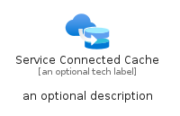

# ServiceConnectedCache


```text
azure-19/Item/Networking/ServiceConnectedCache
```

```text
include('azure-19/Item/Networking/ServiceConnectedCache')
```


| Illustration | ServiceConnectedCache | ServiceConnectedCacheCard | ServiceConnectedCacheGroup |
| :---: | :---: | :---: | :---: |
|  |  |  |  |


## Sprites
The item provides the following sriptes:

- `<$ServiceConnectedCacheXs>`
- `<$ServiceConnectedCacheSm>`
- `<$ServiceConnectedCacheMd>`
- `<$ServiceConnectedCacheLg>`


## ServiceConnectedCache

### Load remotely
```plantuml
@startuml
' configures the library
!global $LIB_BASE_LOCATION="https://raw.githubusercontent.com/tmorin/plantuml-libs/master/distribution"

' loads the library's bootstrap
!include $LIB_BASE_LOCATION/bootstrap.puml

' loads the package bootstrap
include('azure-19/bootstrap')

' loads the Item which embeds the element ServiceConnectedCache
include('azure-19/Item/Networking/ServiceConnectedCache')

' renders the element
ServiceConnectedCache('ServiceConnectedCache', 'Service Connected Cache', 'an optional tech label', 'an optional description')
@enduml
```

### Load locally
```plantuml
@startuml
' configures the library
!global $INCLUSION_MODE="local"
!global $LIB_BASE_LOCATION="../../.."

' loads the library's bootstrap
!include $LIB_BASE_LOCATION/bootstrap.puml

' loads the package bootstrap
include('azure-19/bootstrap')

' loads the Item which embeds the element ServiceConnectedCache
include('azure-19/Item/Networking/ServiceConnectedCache')

' renders the element
ServiceConnectedCache('ServiceConnectedCache', 'Service Connected Cache', 'an optional tech label', 'an optional description')
@enduml
```

## ServiceConnectedCacheCard

### Load remotely
```plantuml
@startuml
' configures the library
!global $LIB_BASE_LOCATION="https://raw.githubusercontent.com/tmorin/plantuml-libs/master/distribution"

' loads the library's bootstrap
!include $LIB_BASE_LOCATION/bootstrap.puml

' loads the package bootstrap
include('azure-19/bootstrap')

' loads the Item which embeds the element ServiceConnectedCacheCard
include('azure-19/Item/Networking/ServiceConnectedCache')

' renders the element
ServiceConnectedCacheCard('ServiceConnectedCacheCard', 'Service Connected Cache Card', 'an optional description')
@enduml
```

### Load locally
```plantuml
@startuml
' configures the library
!global $INCLUSION_MODE="local"
!global $LIB_BASE_LOCATION="../../.."

' loads the library's bootstrap
!include $LIB_BASE_LOCATION/bootstrap.puml

' loads the package bootstrap
include('azure-19/bootstrap')

' loads the Item which embeds the element ServiceConnectedCacheCard
include('azure-19/Item/Networking/ServiceConnectedCache')

' renders the element
ServiceConnectedCacheCard('ServiceConnectedCacheCard', 'Service Connected Cache Card', 'an optional description')
@enduml
```

## ServiceConnectedCacheGroup

### Load remotely
```plantuml
@startuml
' configures the library
!global $LIB_BASE_LOCATION="https://raw.githubusercontent.com/tmorin/plantuml-libs/master/distribution"

' loads the library's bootstrap
!include $LIB_BASE_LOCATION/bootstrap.puml

' loads the package bootstrap
include('azure-19/bootstrap')

' loads the Item which embeds the element ServiceConnectedCacheGroup
include('azure-19/Item/Networking/ServiceConnectedCache')

' renders the element
ServiceConnectedCacheGroup('ServiceConnectedCacheGroup', 'Service Connected Cache Group', 'an optional tech label') {
    note as note
        the content of the group
    end note
}
@enduml
```

### Load locally
```plantuml
@startuml
' configures the library
!global $INCLUSION_MODE="local"
!global $LIB_BASE_LOCATION="../../.."

' loads the library's bootstrap
!include $LIB_BASE_LOCATION/bootstrap.puml

' loads the package bootstrap
include('azure-19/bootstrap')

' loads the Item which embeds the element ServiceConnectedCacheGroup
include('azure-19/Item/Networking/ServiceConnectedCache')

' renders the element
ServiceConnectedCacheGroup('ServiceConnectedCacheGroup', 'Service Connected Cache Group', 'an optional tech label') {
    note as note
        the content of the group
    end note
}
@enduml
```

