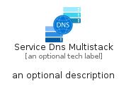
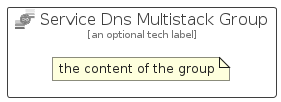

# ServiceDnsMultistack


```text
azure-19/Item/Networking/ServiceDnsMultistack
```

```text
include('azure-19/Item/Networking/ServiceDnsMultistack')
```


| Illustration | ServiceDnsMultistack | ServiceDnsMultistackCard | ServiceDnsMultistackGroup |
| :---: | :---: | :---: | :---: |
|  |  |  |  |


## Sprites
The item provides the following sriptes:

- `<$ServiceDnsMultistackXs>`
- `<$ServiceDnsMultistackSm>`
- `<$ServiceDnsMultistackMd>`
- `<$ServiceDnsMultistackLg>`


## ServiceDnsMultistack

### Load remotely
```plantuml
@startuml
' configures the library
!global $LIB_BASE_LOCATION="https://raw.githubusercontent.com/tmorin/plantuml-libs/master/distribution"

' loads the library's bootstrap
!include $LIB_BASE_LOCATION/bootstrap.puml

' loads the package bootstrap
include('azure-19/bootstrap')

' loads the Item which embeds the element ServiceDnsMultistack
include('azure-19/Item/Networking/ServiceDnsMultistack')

' renders the element
ServiceDnsMultistack('ServiceDnsMultistack', 'Service Dns Multistack', 'an optional tech label', 'an optional description')
@enduml
```

### Load locally
```plantuml
@startuml
' configures the library
!global $INCLUSION_MODE="local"
!global $LIB_BASE_LOCATION="../../.."

' loads the library's bootstrap
!include $LIB_BASE_LOCATION/bootstrap.puml

' loads the package bootstrap
include('azure-19/bootstrap')

' loads the Item which embeds the element ServiceDnsMultistack
include('azure-19/Item/Networking/ServiceDnsMultistack')

' renders the element
ServiceDnsMultistack('ServiceDnsMultistack', 'Service Dns Multistack', 'an optional tech label', 'an optional description')
@enduml
```

## ServiceDnsMultistackCard

### Load remotely
```plantuml
@startuml
' configures the library
!global $LIB_BASE_LOCATION="https://raw.githubusercontent.com/tmorin/plantuml-libs/master/distribution"

' loads the library's bootstrap
!include $LIB_BASE_LOCATION/bootstrap.puml

' loads the package bootstrap
include('azure-19/bootstrap')

' loads the Item which embeds the element ServiceDnsMultistackCard
include('azure-19/Item/Networking/ServiceDnsMultistack')

' renders the element
ServiceDnsMultistackCard('ServiceDnsMultistackCard', 'Service Dns Multistack Card', 'an optional description')
@enduml
```

### Load locally
```plantuml
@startuml
' configures the library
!global $INCLUSION_MODE="local"
!global $LIB_BASE_LOCATION="../../.."

' loads the library's bootstrap
!include $LIB_BASE_LOCATION/bootstrap.puml

' loads the package bootstrap
include('azure-19/bootstrap')

' loads the Item which embeds the element ServiceDnsMultistackCard
include('azure-19/Item/Networking/ServiceDnsMultistack')

' renders the element
ServiceDnsMultistackCard('ServiceDnsMultistackCard', 'Service Dns Multistack Card', 'an optional description')
@enduml
```

## ServiceDnsMultistackGroup

### Load remotely
```plantuml
@startuml
' configures the library
!global $LIB_BASE_LOCATION="https://raw.githubusercontent.com/tmorin/plantuml-libs/master/distribution"

' loads the library's bootstrap
!include $LIB_BASE_LOCATION/bootstrap.puml

' loads the package bootstrap
include('azure-19/bootstrap')

' loads the Item which embeds the element ServiceDnsMultistackGroup
include('azure-19/Item/Networking/ServiceDnsMultistack')

' renders the element
ServiceDnsMultistackGroup('ServiceDnsMultistackGroup', 'Service Dns Multistack Group', 'an optional tech label') {
    note as note
        the content of the group
    end note
}
@enduml
```

### Load locally
```plantuml
@startuml
' configures the library
!global $INCLUSION_MODE="local"
!global $LIB_BASE_LOCATION="../../.."

' loads the library's bootstrap
!include $LIB_BASE_LOCATION/bootstrap.puml

' loads the package bootstrap
include('azure-19/bootstrap')

' loads the Item which embeds the element ServiceDnsMultistackGroup
include('azure-19/Item/Networking/ServiceDnsMultistack')

' renders the element
ServiceDnsMultistackGroup('ServiceDnsMultistackGroup', 'Service Dns Multistack Group', 'an optional tech label') {
    note as note
        the content of the group
    end note
}
@enduml
```

