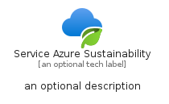
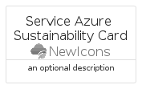
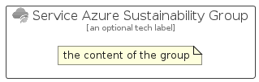

# ServiceAzureSustainability


```text
azure-19/Item/NewIcons/ServiceAzureSustainability
```

```text
include('azure-19/Item/NewIcons/ServiceAzureSustainability')
```


| Illustration | ServiceAzureSustainability | ServiceAzureSustainabilityCard | ServiceAzureSustainabilityGroup |
| :---: | :---: | :---: | :---: |
|  |  |  |  |


## Sprites
The item provides the following sriptes:

- `<$ServiceAzureSustainabilityXs>`
- `<$ServiceAzureSustainabilitySm>`
- `<$ServiceAzureSustainabilityMd>`
- `<$ServiceAzureSustainabilityLg>`


## ServiceAzureSustainability

### Load remotely
```plantuml
@startuml
' configures the library
!global $LIB_BASE_LOCATION="https://raw.githubusercontent.com/tmorin/plantuml-libs/master/distribution"

' loads the library's bootstrap
!include $LIB_BASE_LOCATION/bootstrap.puml

' loads the package bootstrap
include('azure-19/bootstrap')

' loads the Item which embeds the element ServiceAzureSustainability
include('azure-19/Item/NewIcons/ServiceAzureSustainability')

' renders the element
ServiceAzureSustainability('ServiceAzureSustainability', 'Service Azure Sustainability', 'an optional tech label', 'an optional description')
@enduml
```

### Load locally
```plantuml
@startuml
' configures the library
!global $INCLUSION_MODE="local"
!global $LIB_BASE_LOCATION="../../.."

' loads the library's bootstrap
!include $LIB_BASE_LOCATION/bootstrap.puml

' loads the package bootstrap
include('azure-19/bootstrap')

' loads the Item which embeds the element ServiceAzureSustainability
include('azure-19/Item/NewIcons/ServiceAzureSustainability')

' renders the element
ServiceAzureSustainability('ServiceAzureSustainability', 'Service Azure Sustainability', 'an optional tech label', 'an optional description')
@enduml
```

## ServiceAzureSustainabilityCard

### Load remotely
```plantuml
@startuml
' configures the library
!global $LIB_BASE_LOCATION="https://raw.githubusercontent.com/tmorin/plantuml-libs/master/distribution"

' loads the library's bootstrap
!include $LIB_BASE_LOCATION/bootstrap.puml

' loads the package bootstrap
include('azure-19/bootstrap')

' loads the Item which embeds the element ServiceAzureSustainabilityCard
include('azure-19/Item/NewIcons/ServiceAzureSustainability')

' renders the element
ServiceAzureSustainabilityCard('ServiceAzureSustainabilityCard', 'Service Azure Sustainability Card', 'an optional description')
@enduml
```

### Load locally
```plantuml
@startuml
' configures the library
!global $INCLUSION_MODE="local"
!global $LIB_BASE_LOCATION="../../.."

' loads the library's bootstrap
!include $LIB_BASE_LOCATION/bootstrap.puml

' loads the package bootstrap
include('azure-19/bootstrap')

' loads the Item which embeds the element ServiceAzureSustainabilityCard
include('azure-19/Item/NewIcons/ServiceAzureSustainability')

' renders the element
ServiceAzureSustainabilityCard('ServiceAzureSustainabilityCard', 'Service Azure Sustainability Card', 'an optional description')
@enduml
```

## ServiceAzureSustainabilityGroup

### Load remotely
```plantuml
@startuml
' configures the library
!global $LIB_BASE_LOCATION="https://raw.githubusercontent.com/tmorin/plantuml-libs/master/distribution"

' loads the library's bootstrap
!include $LIB_BASE_LOCATION/bootstrap.puml

' loads the package bootstrap
include('azure-19/bootstrap')

' loads the Item which embeds the element ServiceAzureSustainabilityGroup
include('azure-19/Item/NewIcons/ServiceAzureSustainability')

' renders the element
ServiceAzureSustainabilityGroup('ServiceAzureSustainabilityGroup', 'Service Azure Sustainability Group', 'an optional tech label') {
    note as note
        the content of the group
    end note
}
@enduml
```

### Load locally
```plantuml
@startuml
' configures the library
!global $INCLUSION_MODE="local"
!global $LIB_BASE_LOCATION="../../.."

' loads the library's bootstrap
!include $LIB_BASE_LOCATION/bootstrap.puml

' loads the package bootstrap
include('azure-19/bootstrap')

' loads the Item which embeds the element ServiceAzureSustainabilityGroup
include('azure-19/Item/NewIcons/ServiceAzureSustainability')

' renders the element
ServiceAzureSustainabilityGroup('ServiceAzureSustainabilityGroup', 'Service Azure Sustainability Group', 'an optional tech label') {
    note as note
        the content of the group
    end note
}
@enduml
```

