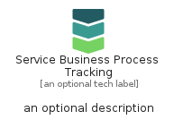

# ServiceBusinessProcessTracking


```text
azure-19/Item/NewIcons/ServiceBusinessProcessTracking
```

```text
include('azure-19/Item/NewIcons/ServiceBusinessProcessTracking')
```


| Illustration | ServiceBusinessProcessTracking | ServiceBusinessProcessTrackingCard | ServiceBusinessProcessTrackingGroup |
| :---: | :---: | :---: | :---: |
|  |  |  |  |


## Sprites
The item provides the following sriptes:

- `<$ServiceBusinessProcessTrackingXs>`
- `<$ServiceBusinessProcessTrackingSm>`
- `<$ServiceBusinessProcessTrackingMd>`
- `<$ServiceBusinessProcessTrackingLg>`


## ServiceBusinessProcessTracking

### Load remotely
```plantuml
@startuml
' configures the library
!global $LIB_BASE_LOCATION="https://raw.githubusercontent.com/tmorin/plantuml-libs/master/distribution"

' loads the library's bootstrap
!include $LIB_BASE_LOCATION/bootstrap.puml

' loads the package bootstrap
include('azure-19/bootstrap')

' loads the Item which embeds the element ServiceBusinessProcessTracking
include('azure-19/Item/NewIcons/ServiceBusinessProcessTracking')

' renders the element
ServiceBusinessProcessTracking('ServiceBusinessProcessTracking', 'Service Business Process Tracking', 'an optional tech label', 'an optional description')
@enduml
```

### Load locally
```plantuml
@startuml
' configures the library
!global $INCLUSION_MODE="local"
!global $LIB_BASE_LOCATION="../../.."

' loads the library's bootstrap
!include $LIB_BASE_LOCATION/bootstrap.puml

' loads the package bootstrap
include('azure-19/bootstrap')

' loads the Item which embeds the element ServiceBusinessProcessTracking
include('azure-19/Item/NewIcons/ServiceBusinessProcessTracking')

' renders the element
ServiceBusinessProcessTracking('ServiceBusinessProcessTracking', 'Service Business Process Tracking', 'an optional tech label', 'an optional description')
@enduml
```

## ServiceBusinessProcessTrackingCard

### Load remotely
```plantuml
@startuml
' configures the library
!global $LIB_BASE_LOCATION="https://raw.githubusercontent.com/tmorin/plantuml-libs/master/distribution"

' loads the library's bootstrap
!include $LIB_BASE_LOCATION/bootstrap.puml

' loads the package bootstrap
include('azure-19/bootstrap')

' loads the Item which embeds the element ServiceBusinessProcessTrackingCard
include('azure-19/Item/NewIcons/ServiceBusinessProcessTracking')

' renders the element
ServiceBusinessProcessTrackingCard('ServiceBusinessProcessTrackingCard', 'Service Business Process Tracking Card', 'an optional description')
@enduml
```

### Load locally
```plantuml
@startuml
' configures the library
!global $INCLUSION_MODE="local"
!global $LIB_BASE_LOCATION="../../.."

' loads the library's bootstrap
!include $LIB_BASE_LOCATION/bootstrap.puml

' loads the package bootstrap
include('azure-19/bootstrap')

' loads the Item which embeds the element ServiceBusinessProcessTrackingCard
include('azure-19/Item/NewIcons/ServiceBusinessProcessTracking')

' renders the element
ServiceBusinessProcessTrackingCard('ServiceBusinessProcessTrackingCard', 'Service Business Process Tracking Card', 'an optional description')
@enduml
```

## ServiceBusinessProcessTrackingGroup

### Load remotely
```plantuml
@startuml
' configures the library
!global $LIB_BASE_LOCATION="https://raw.githubusercontent.com/tmorin/plantuml-libs/master/distribution"

' loads the library's bootstrap
!include $LIB_BASE_LOCATION/bootstrap.puml

' loads the package bootstrap
include('azure-19/bootstrap')

' loads the Item which embeds the element ServiceBusinessProcessTrackingGroup
include('azure-19/Item/NewIcons/ServiceBusinessProcessTracking')

' renders the element
ServiceBusinessProcessTrackingGroup('ServiceBusinessProcessTrackingGroup', 'Service Business Process Tracking Group', 'an optional tech label') {
    note as note
        the content of the group
    end note
}
@enduml
```

### Load locally
```plantuml
@startuml
' configures the library
!global $INCLUSION_MODE="local"
!global $LIB_BASE_LOCATION="../../.."

' loads the library's bootstrap
!include $LIB_BASE_LOCATION/bootstrap.puml

' loads the package bootstrap
include('azure-19/bootstrap')

' loads the Item which embeds the element ServiceBusinessProcessTrackingGroup
include('azure-19/Item/NewIcons/ServiceBusinessProcessTracking')

' renders the element
ServiceBusinessProcessTrackingGroup('ServiceBusinessProcessTrackingGroup', 'Service Business Process Tracking Group', 'an optional tech label') {
    note as note
        the content of the group
    end note
}
@enduml
```

