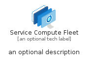

# ServiceComputeFleet


```text
azure-19/Item/NewIcons/ServiceComputeFleet
```

```text
include('azure-19/Item/NewIcons/ServiceComputeFleet')
```


| Illustration | ServiceComputeFleet | ServiceComputeFleetCard | ServiceComputeFleetGroup |
| :---: | :---: | :---: | :---: |
|  |  |  |  |


## Sprites
The item provides the following sriptes:

- `<$ServiceComputeFleetXs>`
- `<$ServiceComputeFleetSm>`
- `<$ServiceComputeFleetMd>`
- `<$ServiceComputeFleetLg>`


## ServiceComputeFleet

### Load remotely
```plantuml
@startuml
' configures the library
!global $LIB_BASE_LOCATION="https://raw.githubusercontent.com/tmorin/plantuml-libs/master/distribution"

' loads the library's bootstrap
!include $LIB_BASE_LOCATION/bootstrap.puml

' loads the package bootstrap
include('azure-19/bootstrap')

' loads the Item which embeds the element ServiceComputeFleet
include('azure-19/Item/NewIcons/ServiceComputeFleet')

' renders the element
ServiceComputeFleet('ServiceComputeFleet', 'Service Compute Fleet', 'an optional tech label', 'an optional description')
@enduml
```

### Load locally
```plantuml
@startuml
' configures the library
!global $INCLUSION_MODE="local"
!global $LIB_BASE_LOCATION="../../.."

' loads the library's bootstrap
!include $LIB_BASE_LOCATION/bootstrap.puml

' loads the package bootstrap
include('azure-19/bootstrap')

' loads the Item which embeds the element ServiceComputeFleet
include('azure-19/Item/NewIcons/ServiceComputeFleet')

' renders the element
ServiceComputeFleet('ServiceComputeFleet', 'Service Compute Fleet', 'an optional tech label', 'an optional description')
@enduml
```

## ServiceComputeFleetCard

### Load remotely
```plantuml
@startuml
' configures the library
!global $LIB_BASE_LOCATION="https://raw.githubusercontent.com/tmorin/plantuml-libs/master/distribution"

' loads the library's bootstrap
!include $LIB_BASE_LOCATION/bootstrap.puml

' loads the package bootstrap
include('azure-19/bootstrap')

' loads the Item which embeds the element ServiceComputeFleetCard
include('azure-19/Item/NewIcons/ServiceComputeFleet')

' renders the element
ServiceComputeFleetCard('ServiceComputeFleetCard', 'Service Compute Fleet Card', 'an optional description')
@enduml
```

### Load locally
```plantuml
@startuml
' configures the library
!global $INCLUSION_MODE="local"
!global $LIB_BASE_LOCATION="../../.."

' loads the library's bootstrap
!include $LIB_BASE_LOCATION/bootstrap.puml

' loads the package bootstrap
include('azure-19/bootstrap')

' loads the Item which embeds the element ServiceComputeFleetCard
include('azure-19/Item/NewIcons/ServiceComputeFleet')

' renders the element
ServiceComputeFleetCard('ServiceComputeFleetCard', 'Service Compute Fleet Card', 'an optional description')
@enduml
```

## ServiceComputeFleetGroup

### Load remotely
```plantuml
@startuml
' configures the library
!global $LIB_BASE_LOCATION="https://raw.githubusercontent.com/tmorin/plantuml-libs/master/distribution"

' loads the library's bootstrap
!include $LIB_BASE_LOCATION/bootstrap.puml

' loads the package bootstrap
include('azure-19/bootstrap')

' loads the Item which embeds the element ServiceComputeFleetGroup
include('azure-19/Item/NewIcons/ServiceComputeFleet')

' renders the element
ServiceComputeFleetGroup('ServiceComputeFleetGroup', 'Service Compute Fleet Group', 'an optional tech label') {
    note as note
        the content of the group
    end note
}
@enduml
```

### Load locally
```plantuml
@startuml
' configures the library
!global $INCLUSION_MODE="local"
!global $LIB_BASE_LOCATION="../../.."

' loads the library's bootstrap
!include $LIB_BASE_LOCATION/bootstrap.puml

' loads the package bootstrap
include('azure-19/bootstrap')

' loads the Item which embeds the element ServiceComputeFleetGroup
include('azure-19/Item/NewIcons/ServiceComputeFleet')

' renders the element
ServiceComputeFleetGroup('ServiceComputeFleetGroup', 'Service Compute Fleet Group', 'an optional tech label') {
    note as note
        the content of the group
    end note
}
@enduml
```

