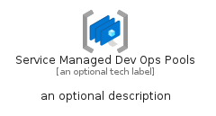
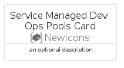

# ServiceManagedDevOpsPools


```text
azure-19/Item/NewIcons/ServiceManagedDevOpsPools
```

```text
include('azure-19/Item/NewIcons/ServiceManagedDevOpsPools')
```


| Illustration | ServiceManagedDevOpsPools | ServiceManagedDevOpsPoolsCard | ServiceManagedDevOpsPoolsGroup |
| :---: | :---: | :---: | :---: |
|  |  |  |  |


## Sprites
The item provides the following sriptes:

- `<$ServiceManagedDevOpsPoolsXs>`
- `<$ServiceManagedDevOpsPoolsSm>`
- `<$ServiceManagedDevOpsPoolsMd>`
- `<$ServiceManagedDevOpsPoolsLg>`


## ServiceManagedDevOpsPools

### Load remotely
```plantuml
@startuml
' configures the library
!global $LIB_BASE_LOCATION="https://raw.githubusercontent.com/tmorin/plantuml-libs/master/distribution"

' loads the library's bootstrap
!include $LIB_BASE_LOCATION/bootstrap.puml

' loads the package bootstrap
include('azure-19/bootstrap')

' loads the Item which embeds the element ServiceManagedDevOpsPools
include('azure-19/Item/NewIcons/ServiceManagedDevOpsPools')

' renders the element
ServiceManagedDevOpsPools('ServiceManagedDevOpsPools', 'Service Managed Dev Ops Pools', 'an optional tech label', 'an optional description')
@enduml
```

### Load locally
```plantuml
@startuml
' configures the library
!global $INCLUSION_MODE="local"
!global $LIB_BASE_LOCATION="../../.."

' loads the library's bootstrap
!include $LIB_BASE_LOCATION/bootstrap.puml

' loads the package bootstrap
include('azure-19/bootstrap')

' loads the Item which embeds the element ServiceManagedDevOpsPools
include('azure-19/Item/NewIcons/ServiceManagedDevOpsPools')

' renders the element
ServiceManagedDevOpsPools('ServiceManagedDevOpsPools', 'Service Managed Dev Ops Pools', 'an optional tech label', 'an optional description')
@enduml
```

## ServiceManagedDevOpsPoolsCard

### Load remotely
```plantuml
@startuml
' configures the library
!global $LIB_BASE_LOCATION="https://raw.githubusercontent.com/tmorin/plantuml-libs/master/distribution"

' loads the library's bootstrap
!include $LIB_BASE_LOCATION/bootstrap.puml

' loads the package bootstrap
include('azure-19/bootstrap')

' loads the Item which embeds the element ServiceManagedDevOpsPoolsCard
include('azure-19/Item/NewIcons/ServiceManagedDevOpsPools')

' renders the element
ServiceManagedDevOpsPoolsCard('ServiceManagedDevOpsPoolsCard', 'Service Managed Dev Ops Pools Card', 'an optional description')
@enduml
```

### Load locally
```plantuml
@startuml
' configures the library
!global $INCLUSION_MODE="local"
!global $LIB_BASE_LOCATION="../../.."

' loads the library's bootstrap
!include $LIB_BASE_LOCATION/bootstrap.puml

' loads the package bootstrap
include('azure-19/bootstrap')

' loads the Item which embeds the element ServiceManagedDevOpsPoolsCard
include('azure-19/Item/NewIcons/ServiceManagedDevOpsPools')

' renders the element
ServiceManagedDevOpsPoolsCard('ServiceManagedDevOpsPoolsCard', 'Service Managed Dev Ops Pools Card', 'an optional description')
@enduml
```

## ServiceManagedDevOpsPoolsGroup

### Load remotely
```plantuml
@startuml
' configures the library
!global $LIB_BASE_LOCATION="https://raw.githubusercontent.com/tmorin/plantuml-libs/master/distribution"

' loads the library's bootstrap
!include $LIB_BASE_LOCATION/bootstrap.puml

' loads the package bootstrap
include('azure-19/bootstrap')

' loads the Item which embeds the element ServiceManagedDevOpsPoolsGroup
include('azure-19/Item/NewIcons/ServiceManagedDevOpsPools')

' renders the element
ServiceManagedDevOpsPoolsGroup('ServiceManagedDevOpsPoolsGroup', 'Service Managed Dev Ops Pools Group', 'an optional tech label') {
    note as note
        the content of the group
    end note
}
@enduml
```

### Load locally
```plantuml
@startuml
' configures the library
!global $INCLUSION_MODE="local"
!global $LIB_BASE_LOCATION="../../.."

' loads the library's bootstrap
!include $LIB_BASE_LOCATION/bootstrap.puml

' loads the package bootstrap
include('azure-19/bootstrap')

' loads the Item which embeds the element ServiceManagedDevOpsPoolsGroup
include('azure-19/Item/NewIcons/ServiceManagedDevOpsPools')

' renders the element
ServiceManagedDevOpsPoolsGroup('ServiceManagedDevOpsPoolsGroup', 'Service Managed Dev Ops Pools Group', 'an optional tech label') {
    note as note
        the content of the group
    end note
}
@enduml
```

