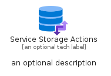
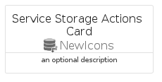
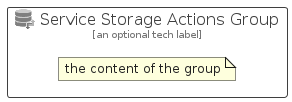

# ServiceStorageActions


```text
azure-19/Item/NewIcons/ServiceStorageActions
```

```text
include('azure-19/Item/NewIcons/ServiceStorageActions')
```


| Illustration | ServiceStorageActions | ServiceStorageActionsCard | ServiceStorageActionsGroup |
| :---: | :---: | :---: | :---: |
|  |  |  |  |


## Sprites
The item provides the following sriptes:

- `<$ServiceStorageActionsXs>`
- `<$ServiceStorageActionsSm>`
- `<$ServiceStorageActionsMd>`
- `<$ServiceStorageActionsLg>`


## ServiceStorageActions

### Load remotely
```plantuml
@startuml
' configures the library
!global $LIB_BASE_LOCATION="https://raw.githubusercontent.com/tmorin/plantuml-libs/master/distribution"

' loads the library's bootstrap
!include $LIB_BASE_LOCATION/bootstrap.puml

' loads the package bootstrap
include('azure-19/bootstrap')

' loads the Item which embeds the element ServiceStorageActions
include('azure-19/Item/NewIcons/ServiceStorageActions')

' renders the element
ServiceStorageActions('ServiceStorageActions', 'Service Storage Actions', 'an optional tech label', 'an optional description')
@enduml
```

### Load locally
```plantuml
@startuml
' configures the library
!global $INCLUSION_MODE="local"
!global $LIB_BASE_LOCATION="../../.."

' loads the library's bootstrap
!include $LIB_BASE_LOCATION/bootstrap.puml

' loads the package bootstrap
include('azure-19/bootstrap')

' loads the Item which embeds the element ServiceStorageActions
include('azure-19/Item/NewIcons/ServiceStorageActions')

' renders the element
ServiceStorageActions('ServiceStorageActions', 'Service Storage Actions', 'an optional tech label', 'an optional description')
@enduml
```

## ServiceStorageActionsCard

### Load remotely
```plantuml
@startuml
' configures the library
!global $LIB_BASE_LOCATION="https://raw.githubusercontent.com/tmorin/plantuml-libs/master/distribution"

' loads the library's bootstrap
!include $LIB_BASE_LOCATION/bootstrap.puml

' loads the package bootstrap
include('azure-19/bootstrap')

' loads the Item which embeds the element ServiceStorageActionsCard
include('azure-19/Item/NewIcons/ServiceStorageActions')

' renders the element
ServiceStorageActionsCard('ServiceStorageActionsCard', 'Service Storage Actions Card', 'an optional description')
@enduml
```

### Load locally
```plantuml
@startuml
' configures the library
!global $INCLUSION_MODE="local"
!global $LIB_BASE_LOCATION="../../.."

' loads the library's bootstrap
!include $LIB_BASE_LOCATION/bootstrap.puml

' loads the package bootstrap
include('azure-19/bootstrap')

' loads the Item which embeds the element ServiceStorageActionsCard
include('azure-19/Item/NewIcons/ServiceStorageActions')

' renders the element
ServiceStorageActionsCard('ServiceStorageActionsCard', 'Service Storage Actions Card', 'an optional description')
@enduml
```

## ServiceStorageActionsGroup

### Load remotely
```plantuml
@startuml
' configures the library
!global $LIB_BASE_LOCATION="https://raw.githubusercontent.com/tmorin/plantuml-libs/master/distribution"

' loads the library's bootstrap
!include $LIB_BASE_LOCATION/bootstrap.puml

' loads the package bootstrap
include('azure-19/bootstrap')

' loads the Item which embeds the element ServiceStorageActionsGroup
include('azure-19/Item/NewIcons/ServiceStorageActions')

' renders the element
ServiceStorageActionsGroup('ServiceStorageActionsGroup', 'Service Storage Actions Group', 'an optional tech label') {
    note as note
        the content of the group
    end note
}
@enduml
```

### Load locally
```plantuml
@startuml
' configures the library
!global $INCLUSION_MODE="local"
!global $LIB_BASE_LOCATION="../../.."

' loads the library's bootstrap
!include $LIB_BASE_LOCATION/bootstrap.puml

' loads the package bootstrap
include('azure-19/bootstrap')

' loads the Item which embeds the element ServiceStorageActionsGroup
include('azure-19/Item/NewIcons/ServiceStorageActions')

' renders the element
ServiceStorageActionsGroup('ServiceStorageActionsGroup', 'Service Storage Actions Group', 'an optional tech label') {
    note as note
        the content of the group
    end note
}
@enduml
```

