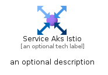

# ServiceAksIstio


```text
azure-19/Item/Other/ServiceAksIstio
```

```text
include('azure-19/Item/Other/ServiceAksIstio')
```


| Illustration | ServiceAksIstio | ServiceAksIstioCard | ServiceAksIstioGroup |
| :---: | :---: | :---: | :---: |
|  |  |  |  |


## Sprites
The item provides the following sriptes:

- `<$ServiceAksIstioXs>`
- `<$ServiceAksIstioSm>`
- `<$ServiceAksIstioMd>`
- `<$ServiceAksIstioLg>`


## ServiceAksIstio

### Load remotely
```plantuml
@startuml
' configures the library
!global $LIB_BASE_LOCATION="https://raw.githubusercontent.com/tmorin/plantuml-libs/master/distribution"

' loads the library's bootstrap
!include $LIB_BASE_LOCATION/bootstrap.puml

' loads the package bootstrap
include('azure-19/bootstrap')

' loads the Item which embeds the element ServiceAksIstio
include('azure-19/Item/Other/ServiceAksIstio')

' renders the element
ServiceAksIstio('ServiceAksIstio', 'Service Aks Istio', 'an optional tech label', 'an optional description')
@enduml
```

### Load locally
```plantuml
@startuml
' configures the library
!global $INCLUSION_MODE="local"
!global $LIB_BASE_LOCATION="../../.."

' loads the library's bootstrap
!include $LIB_BASE_LOCATION/bootstrap.puml

' loads the package bootstrap
include('azure-19/bootstrap')

' loads the Item which embeds the element ServiceAksIstio
include('azure-19/Item/Other/ServiceAksIstio')

' renders the element
ServiceAksIstio('ServiceAksIstio', 'Service Aks Istio', 'an optional tech label', 'an optional description')
@enduml
```

## ServiceAksIstioCard

### Load remotely
```plantuml
@startuml
' configures the library
!global $LIB_BASE_LOCATION="https://raw.githubusercontent.com/tmorin/plantuml-libs/master/distribution"

' loads the library's bootstrap
!include $LIB_BASE_LOCATION/bootstrap.puml

' loads the package bootstrap
include('azure-19/bootstrap')

' loads the Item which embeds the element ServiceAksIstioCard
include('azure-19/Item/Other/ServiceAksIstio')

' renders the element
ServiceAksIstioCard('ServiceAksIstioCard', 'Service Aks Istio Card', 'an optional description')
@enduml
```

### Load locally
```plantuml
@startuml
' configures the library
!global $INCLUSION_MODE="local"
!global $LIB_BASE_LOCATION="../../.."

' loads the library's bootstrap
!include $LIB_BASE_LOCATION/bootstrap.puml

' loads the package bootstrap
include('azure-19/bootstrap')

' loads the Item which embeds the element ServiceAksIstioCard
include('azure-19/Item/Other/ServiceAksIstio')

' renders the element
ServiceAksIstioCard('ServiceAksIstioCard', 'Service Aks Istio Card', 'an optional description')
@enduml
```

## ServiceAksIstioGroup

### Load remotely
```plantuml
@startuml
' configures the library
!global $LIB_BASE_LOCATION="https://raw.githubusercontent.com/tmorin/plantuml-libs/master/distribution"

' loads the library's bootstrap
!include $LIB_BASE_LOCATION/bootstrap.puml

' loads the package bootstrap
include('azure-19/bootstrap')

' loads the Item which embeds the element ServiceAksIstioGroup
include('azure-19/Item/Other/ServiceAksIstio')

' renders the element
ServiceAksIstioGroup('ServiceAksIstioGroup', 'Service Aks Istio Group', 'an optional tech label') {
    note as note
        the content of the group
    end note
}
@enduml
```

### Load locally
```plantuml
@startuml
' configures the library
!global $INCLUSION_MODE="local"
!global $LIB_BASE_LOCATION="../../.."

' loads the library's bootstrap
!include $LIB_BASE_LOCATION/bootstrap.puml

' loads the package bootstrap
include('azure-19/bootstrap')

' loads the Item which embeds the element ServiceAksIstioGroup
include('azure-19/Item/Other/ServiceAksIstio')

' renders the element
ServiceAksIstioGroup('ServiceAksIstioGroup', 'Service Aks Istio Group', 'an optional tech label') {
    note as note
        the content of the group
    end note
}
@enduml
```

