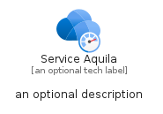
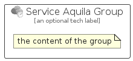

# ServiceAquila


```text
azure-19/Item/Other/ServiceAquila
```

```text
include('azure-19/Item/Other/ServiceAquila')
```


| Illustration | ServiceAquila | ServiceAquilaCard | ServiceAquilaGroup |
| :---: | :---: | :---: | :---: |
|  |  |  |  |


## Sprites
The item provides the following sriptes:

- `<$ServiceAquilaXs>`
- `<$ServiceAquilaSm>`
- `<$ServiceAquilaMd>`
- `<$ServiceAquilaLg>`


## ServiceAquila

### Load remotely
```plantuml
@startuml
' configures the library
!global $LIB_BASE_LOCATION="https://raw.githubusercontent.com/tmorin/plantuml-libs/master/distribution"

' loads the library's bootstrap
!include $LIB_BASE_LOCATION/bootstrap.puml

' loads the package bootstrap
include('azure-19/bootstrap')

' loads the Item which embeds the element ServiceAquila
include('azure-19/Item/Other/ServiceAquila')

' renders the element
ServiceAquila('ServiceAquila', 'Service Aquila', 'an optional tech label', 'an optional description')
@enduml
```

### Load locally
```plantuml
@startuml
' configures the library
!global $INCLUSION_MODE="local"
!global $LIB_BASE_LOCATION="../../.."

' loads the library's bootstrap
!include $LIB_BASE_LOCATION/bootstrap.puml

' loads the package bootstrap
include('azure-19/bootstrap')

' loads the Item which embeds the element ServiceAquila
include('azure-19/Item/Other/ServiceAquila')

' renders the element
ServiceAquila('ServiceAquila', 'Service Aquila', 'an optional tech label', 'an optional description')
@enduml
```

## ServiceAquilaCard

### Load remotely
```plantuml
@startuml
' configures the library
!global $LIB_BASE_LOCATION="https://raw.githubusercontent.com/tmorin/plantuml-libs/master/distribution"

' loads the library's bootstrap
!include $LIB_BASE_LOCATION/bootstrap.puml

' loads the package bootstrap
include('azure-19/bootstrap')

' loads the Item which embeds the element ServiceAquilaCard
include('azure-19/Item/Other/ServiceAquila')

' renders the element
ServiceAquilaCard('ServiceAquilaCard', 'Service Aquila Card', 'an optional description')
@enduml
```

### Load locally
```plantuml
@startuml
' configures the library
!global $INCLUSION_MODE="local"
!global $LIB_BASE_LOCATION="../../.."

' loads the library's bootstrap
!include $LIB_BASE_LOCATION/bootstrap.puml

' loads the package bootstrap
include('azure-19/bootstrap')

' loads the Item which embeds the element ServiceAquilaCard
include('azure-19/Item/Other/ServiceAquila')

' renders the element
ServiceAquilaCard('ServiceAquilaCard', 'Service Aquila Card', 'an optional description')
@enduml
```

## ServiceAquilaGroup

### Load remotely
```plantuml
@startuml
' configures the library
!global $LIB_BASE_LOCATION="https://raw.githubusercontent.com/tmorin/plantuml-libs/master/distribution"

' loads the library's bootstrap
!include $LIB_BASE_LOCATION/bootstrap.puml

' loads the package bootstrap
include('azure-19/bootstrap')

' loads the Item which embeds the element ServiceAquilaGroup
include('azure-19/Item/Other/ServiceAquila')

' renders the element
ServiceAquilaGroup('ServiceAquilaGroup', 'Service Aquila Group', 'an optional tech label') {
    note as note
        the content of the group
    end note
}
@enduml
```

### Load locally
```plantuml
@startuml
' configures the library
!global $INCLUSION_MODE="local"
!global $LIB_BASE_LOCATION="../../.."

' loads the library's bootstrap
!include $LIB_BASE_LOCATION/bootstrap.puml

' loads the package bootstrap
include('azure-19/bootstrap')

' loads the Item which embeds the element ServiceAquilaGroup
include('azure-19/Item/Other/ServiceAquila')

' renders the element
ServiceAquilaGroup('ServiceAquilaGroup', 'Service Aquila Group', 'an optional tech label') {
    note as note
        the content of the group
    end note
}
@enduml
```

