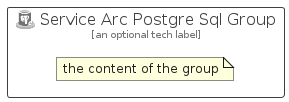

# ServiceArcPostgreSql


```text
azure-19/Item/Other/ServiceArcPostgreSql
```

```text
include('azure-19/Item/Other/ServiceArcPostgreSql')
```


| Illustration | ServiceArcPostgreSql | ServiceArcPostgreSqlCard | ServiceArcPostgreSqlGroup |
| :---: | :---: | :---: | :---: |
|  |  |  |  |


## Sprites
The item provides the following sriptes:

- `<$ServiceArcPostgreSqlXs>`
- `<$ServiceArcPostgreSqlSm>`
- `<$ServiceArcPostgreSqlMd>`
- `<$ServiceArcPostgreSqlLg>`


## ServiceArcPostgreSql

### Load remotely
```plantuml
@startuml
' configures the library
!global $LIB_BASE_LOCATION="https://raw.githubusercontent.com/tmorin/plantuml-libs/master/distribution"

' loads the library's bootstrap
!include $LIB_BASE_LOCATION/bootstrap.puml

' loads the package bootstrap
include('azure-19/bootstrap')

' loads the Item which embeds the element ServiceArcPostgreSql
include('azure-19/Item/Other/ServiceArcPostgreSql')

' renders the element
ServiceArcPostgreSql('ServiceArcPostgreSql', 'Service Arc Postgre Sql', 'an optional tech label', 'an optional description')
@enduml
```

### Load locally
```plantuml
@startuml
' configures the library
!global $INCLUSION_MODE="local"
!global $LIB_BASE_LOCATION="../../.."

' loads the library's bootstrap
!include $LIB_BASE_LOCATION/bootstrap.puml

' loads the package bootstrap
include('azure-19/bootstrap')

' loads the Item which embeds the element ServiceArcPostgreSql
include('azure-19/Item/Other/ServiceArcPostgreSql')

' renders the element
ServiceArcPostgreSql('ServiceArcPostgreSql', 'Service Arc Postgre Sql', 'an optional tech label', 'an optional description')
@enduml
```

## ServiceArcPostgreSqlCard

### Load remotely
```plantuml
@startuml
' configures the library
!global $LIB_BASE_LOCATION="https://raw.githubusercontent.com/tmorin/plantuml-libs/master/distribution"

' loads the library's bootstrap
!include $LIB_BASE_LOCATION/bootstrap.puml

' loads the package bootstrap
include('azure-19/bootstrap')

' loads the Item which embeds the element ServiceArcPostgreSqlCard
include('azure-19/Item/Other/ServiceArcPostgreSql')

' renders the element
ServiceArcPostgreSqlCard('ServiceArcPostgreSqlCard', 'Service Arc Postgre Sql Card', 'an optional description')
@enduml
```

### Load locally
```plantuml
@startuml
' configures the library
!global $INCLUSION_MODE="local"
!global $LIB_BASE_LOCATION="../../.."

' loads the library's bootstrap
!include $LIB_BASE_LOCATION/bootstrap.puml

' loads the package bootstrap
include('azure-19/bootstrap')

' loads the Item which embeds the element ServiceArcPostgreSqlCard
include('azure-19/Item/Other/ServiceArcPostgreSql')

' renders the element
ServiceArcPostgreSqlCard('ServiceArcPostgreSqlCard', 'Service Arc Postgre Sql Card', 'an optional description')
@enduml
```

## ServiceArcPostgreSqlGroup

### Load remotely
```plantuml
@startuml
' configures the library
!global $LIB_BASE_LOCATION="https://raw.githubusercontent.com/tmorin/plantuml-libs/master/distribution"

' loads the library's bootstrap
!include $LIB_BASE_LOCATION/bootstrap.puml

' loads the package bootstrap
include('azure-19/bootstrap')

' loads the Item which embeds the element ServiceArcPostgreSqlGroup
include('azure-19/Item/Other/ServiceArcPostgreSql')

' renders the element
ServiceArcPostgreSqlGroup('ServiceArcPostgreSqlGroup', 'Service Arc Postgre Sql Group', 'an optional tech label') {
    note as note
        the content of the group
    end note
}
@enduml
```

### Load locally
```plantuml
@startuml
' configures the library
!global $INCLUSION_MODE="local"
!global $LIB_BASE_LOCATION="../../.."

' loads the library's bootstrap
!include $LIB_BASE_LOCATION/bootstrap.puml

' loads the package bootstrap
include('azure-19/bootstrap')

' loads the Item which embeds the element ServiceArcPostgreSqlGroup
include('azure-19/Item/Other/ServiceArcPostgreSql')

' renders the element
ServiceArcPostgreSqlGroup('ServiceArcPostgreSqlGroup', 'Service Arc Postgre Sql Group', 'an optional tech label') {
    note as note
        the content of the group
    end note
}
@enduml
```

