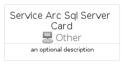
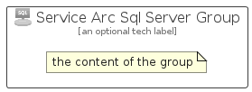

# ServiceArcSqlServer


```text
azure-19/Item/Other/ServiceArcSqlServer
```

```text
include('azure-19/Item/Other/ServiceArcSqlServer')
```


| Illustration | ServiceArcSqlServer | ServiceArcSqlServerCard | ServiceArcSqlServerGroup |
| :---: | :---: | :---: | :---: |
|  |  |  |  |


## Sprites
The item provides the following sriptes:

- `<$ServiceArcSqlServerXs>`
- `<$ServiceArcSqlServerSm>`
- `<$ServiceArcSqlServerMd>`
- `<$ServiceArcSqlServerLg>`


## ServiceArcSqlServer

### Load remotely
```plantuml
@startuml
' configures the library
!global $LIB_BASE_LOCATION="https://raw.githubusercontent.com/tmorin/plantuml-libs/master/distribution"

' loads the library's bootstrap
!include $LIB_BASE_LOCATION/bootstrap.puml

' loads the package bootstrap
include('azure-19/bootstrap')

' loads the Item which embeds the element ServiceArcSqlServer
include('azure-19/Item/Other/ServiceArcSqlServer')

' renders the element
ServiceArcSqlServer('ServiceArcSqlServer', 'Service Arc Sql Server', 'an optional tech label', 'an optional description')
@enduml
```

### Load locally
```plantuml
@startuml
' configures the library
!global $INCLUSION_MODE="local"
!global $LIB_BASE_LOCATION="../../.."

' loads the library's bootstrap
!include $LIB_BASE_LOCATION/bootstrap.puml

' loads the package bootstrap
include('azure-19/bootstrap')

' loads the Item which embeds the element ServiceArcSqlServer
include('azure-19/Item/Other/ServiceArcSqlServer')

' renders the element
ServiceArcSqlServer('ServiceArcSqlServer', 'Service Arc Sql Server', 'an optional tech label', 'an optional description')
@enduml
```

## ServiceArcSqlServerCard

### Load remotely
```plantuml
@startuml
' configures the library
!global $LIB_BASE_LOCATION="https://raw.githubusercontent.com/tmorin/plantuml-libs/master/distribution"

' loads the library's bootstrap
!include $LIB_BASE_LOCATION/bootstrap.puml

' loads the package bootstrap
include('azure-19/bootstrap')

' loads the Item which embeds the element ServiceArcSqlServerCard
include('azure-19/Item/Other/ServiceArcSqlServer')

' renders the element
ServiceArcSqlServerCard('ServiceArcSqlServerCard', 'Service Arc Sql Server Card', 'an optional description')
@enduml
```

### Load locally
```plantuml
@startuml
' configures the library
!global $INCLUSION_MODE="local"
!global $LIB_BASE_LOCATION="../../.."

' loads the library's bootstrap
!include $LIB_BASE_LOCATION/bootstrap.puml

' loads the package bootstrap
include('azure-19/bootstrap')

' loads the Item which embeds the element ServiceArcSqlServerCard
include('azure-19/Item/Other/ServiceArcSqlServer')

' renders the element
ServiceArcSqlServerCard('ServiceArcSqlServerCard', 'Service Arc Sql Server Card', 'an optional description')
@enduml
```

## ServiceArcSqlServerGroup

### Load remotely
```plantuml
@startuml
' configures the library
!global $LIB_BASE_LOCATION="https://raw.githubusercontent.com/tmorin/plantuml-libs/master/distribution"

' loads the library's bootstrap
!include $LIB_BASE_LOCATION/bootstrap.puml

' loads the package bootstrap
include('azure-19/bootstrap')

' loads the Item which embeds the element ServiceArcSqlServerGroup
include('azure-19/Item/Other/ServiceArcSqlServer')

' renders the element
ServiceArcSqlServerGroup('ServiceArcSqlServerGroup', 'Service Arc Sql Server Group', 'an optional tech label') {
    note as note
        the content of the group
    end note
}
@enduml
```

### Load locally
```plantuml
@startuml
' configures the library
!global $INCLUSION_MODE="local"
!global $LIB_BASE_LOCATION="../../.."

' loads the library's bootstrap
!include $LIB_BASE_LOCATION/bootstrap.puml

' loads the package bootstrap
include('azure-19/bootstrap')

' loads the Item which embeds the element ServiceArcSqlServerGroup
include('azure-19/Item/Other/ServiceArcSqlServer')

' renders the element
ServiceArcSqlServerGroup('ServiceArcSqlServerGroup', 'Service Arc Sql Server Group', 'an optional tech label') {
    note as note
        the content of the group
    end note
}
@enduml
```

