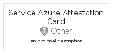

# ServiceAzureAttestation


```text
azure-19/Item/Other/ServiceAzureAttestation
```

```text
include('azure-19/Item/Other/ServiceAzureAttestation')
```


| Illustration | ServiceAzureAttestation | ServiceAzureAttestationCard | ServiceAzureAttestationGroup |
| :---: | :---: | :---: | :---: |
|  |  |  |  |


## Sprites
The item provides the following sriptes:

- `<$ServiceAzureAttestationXs>`
- `<$ServiceAzureAttestationSm>`
- `<$ServiceAzureAttestationMd>`
- `<$ServiceAzureAttestationLg>`


## ServiceAzureAttestation

### Load remotely
```plantuml
@startuml
' configures the library
!global $LIB_BASE_LOCATION="https://raw.githubusercontent.com/tmorin/plantuml-libs/master/distribution"

' loads the library's bootstrap
!include $LIB_BASE_LOCATION/bootstrap.puml

' loads the package bootstrap
include('azure-19/bootstrap')

' loads the Item which embeds the element ServiceAzureAttestation
include('azure-19/Item/Other/ServiceAzureAttestation')

' renders the element
ServiceAzureAttestation('ServiceAzureAttestation', 'Service Azure Attestation', 'an optional tech label', 'an optional description')
@enduml
```

### Load locally
```plantuml
@startuml
' configures the library
!global $INCLUSION_MODE="local"
!global $LIB_BASE_LOCATION="../../.."

' loads the library's bootstrap
!include $LIB_BASE_LOCATION/bootstrap.puml

' loads the package bootstrap
include('azure-19/bootstrap')

' loads the Item which embeds the element ServiceAzureAttestation
include('azure-19/Item/Other/ServiceAzureAttestation')

' renders the element
ServiceAzureAttestation('ServiceAzureAttestation', 'Service Azure Attestation', 'an optional tech label', 'an optional description')
@enduml
```

## ServiceAzureAttestationCard

### Load remotely
```plantuml
@startuml
' configures the library
!global $LIB_BASE_LOCATION="https://raw.githubusercontent.com/tmorin/plantuml-libs/master/distribution"

' loads the library's bootstrap
!include $LIB_BASE_LOCATION/bootstrap.puml

' loads the package bootstrap
include('azure-19/bootstrap')

' loads the Item which embeds the element ServiceAzureAttestationCard
include('azure-19/Item/Other/ServiceAzureAttestation')

' renders the element
ServiceAzureAttestationCard('ServiceAzureAttestationCard', 'Service Azure Attestation Card', 'an optional description')
@enduml
```

### Load locally
```plantuml
@startuml
' configures the library
!global $INCLUSION_MODE="local"
!global $LIB_BASE_LOCATION="../../.."

' loads the library's bootstrap
!include $LIB_BASE_LOCATION/bootstrap.puml

' loads the package bootstrap
include('azure-19/bootstrap')

' loads the Item which embeds the element ServiceAzureAttestationCard
include('azure-19/Item/Other/ServiceAzureAttestation')

' renders the element
ServiceAzureAttestationCard('ServiceAzureAttestationCard', 'Service Azure Attestation Card', 'an optional description')
@enduml
```

## ServiceAzureAttestationGroup

### Load remotely
```plantuml
@startuml
' configures the library
!global $LIB_BASE_LOCATION="https://raw.githubusercontent.com/tmorin/plantuml-libs/master/distribution"

' loads the library's bootstrap
!include $LIB_BASE_LOCATION/bootstrap.puml

' loads the package bootstrap
include('azure-19/bootstrap')

' loads the Item which embeds the element ServiceAzureAttestationGroup
include('azure-19/Item/Other/ServiceAzureAttestation')

' renders the element
ServiceAzureAttestationGroup('ServiceAzureAttestationGroup', 'Service Azure Attestation Group', 'an optional tech label') {
    note as note
        the content of the group
    end note
}
@enduml
```

### Load locally
```plantuml
@startuml
' configures the library
!global $INCLUSION_MODE="local"
!global $LIB_BASE_LOCATION="../../.."

' loads the library's bootstrap
!include $LIB_BASE_LOCATION/bootstrap.puml

' loads the package bootstrap
include('azure-19/bootstrap')

' loads the Item which embeds the element ServiceAzureAttestationGroup
include('azure-19/Item/Other/ServiceAzureAttestation')

' renders the element
ServiceAzureAttestationGroup('ServiceAzureAttestationGroup', 'Service Azure Attestation Group', 'an optional tech label') {
    note as note
        the content of the group
    end note
}
@enduml
```

