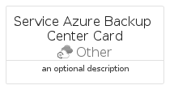

# ServiceAzureBackupCenter


```text
azure-19/Item/Other/ServiceAzureBackupCenter
```

```text
include('azure-19/Item/Other/ServiceAzureBackupCenter')
```


| Illustration | ServiceAzureBackupCenter | ServiceAzureBackupCenterCard | ServiceAzureBackupCenterGroup |
| :---: | :---: | :---: | :---: |
|  |  |  |  |


## Sprites
The item provides the following sriptes:

- `<$ServiceAzureBackupCenterXs>`
- `<$ServiceAzureBackupCenterSm>`
- `<$ServiceAzureBackupCenterMd>`
- `<$ServiceAzureBackupCenterLg>`


## ServiceAzureBackupCenter

### Load remotely
```plantuml
@startuml
' configures the library
!global $LIB_BASE_LOCATION="https://raw.githubusercontent.com/tmorin/plantuml-libs/master/distribution"

' loads the library's bootstrap
!include $LIB_BASE_LOCATION/bootstrap.puml

' loads the package bootstrap
include('azure-19/bootstrap')

' loads the Item which embeds the element ServiceAzureBackupCenter
include('azure-19/Item/Other/ServiceAzureBackupCenter')

' renders the element
ServiceAzureBackupCenter('ServiceAzureBackupCenter', 'Service Azure Backup Center', 'an optional tech label', 'an optional description')
@enduml
```

### Load locally
```plantuml
@startuml
' configures the library
!global $INCLUSION_MODE="local"
!global $LIB_BASE_LOCATION="../../.."

' loads the library's bootstrap
!include $LIB_BASE_LOCATION/bootstrap.puml

' loads the package bootstrap
include('azure-19/bootstrap')

' loads the Item which embeds the element ServiceAzureBackupCenter
include('azure-19/Item/Other/ServiceAzureBackupCenter')

' renders the element
ServiceAzureBackupCenter('ServiceAzureBackupCenter', 'Service Azure Backup Center', 'an optional tech label', 'an optional description')
@enduml
```

## ServiceAzureBackupCenterCard

### Load remotely
```plantuml
@startuml
' configures the library
!global $LIB_BASE_LOCATION="https://raw.githubusercontent.com/tmorin/plantuml-libs/master/distribution"

' loads the library's bootstrap
!include $LIB_BASE_LOCATION/bootstrap.puml

' loads the package bootstrap
include('azure-19/bootstrap')

' loads the Item which embeds the element ServiceAzureBackupCenterCard
include('azure-19/Item/Other/ServiceAzureBackupCenter')

' renders the element
ServiceAzureBackupCenterCard('ServiceAzureBackupCenterCard', 'Service Azure Backup Center Card', 'an optional description')
@enduml
```

### Load locally
```plantuml
@startuml
' configures the library
!global $INCLUSION_MODE="local"
!global $LIB_BASE_LOCATION="../../.."

' loads the library's bootstrap
!include $LIB_BASE_LOCATION/bootstrap.puml

' loads the package bootstrap
include('azure-19/bootstrap')

' loads the Item which embeds the element ServiceAzureBackupCenterCard
include('azure-19/Item/Other/ServiceAzureBackupCenter')

' renders the element
ServiceAzureBackupCenterCard('ServiceAzureBackupCenterCard', 'Service Azure Backup Center Card', 'an optional description')
@enduml
```

## ServiceAzureBackupCenterGroup

### Load remotely
```plantuml
@startuml
' configures the library
!global $LIB_BASE_LOCATION="https://raw.githubusercontent.com/tmorin/plantuml-libs/master/distribution"

' loads the library's bootstrap
!include $LIB_BASE_LOCATION/bootstrap.puml

' loads the package bootstrap
include('azure-19/bootstrap')

' loads the Item which embeds the element ServiceAzureBackupCenterGroup
include('azure-19/Item/Other/ServiceAzureBackupCenter')

' renders the element
ServiceAzureBackupCenterGroup('ServiceAzureBackupCenterGroup', 'Service Azure Backup Center Group', 'an optional tech label') {
    note as note
        the content of the group
    end note
}
@enduml
```

### Load locally
```plantuml
@startuml
' configures the library
!global $INCLUSION_MODE="local"
!global $LIB_BASE_LOCATION="../../.."

' loads the library's bootstrap
!include $LIB_BASE_LOCATION/bootstrap.puml

' loads the package bootstrap
include('azure-19/bootstrap')

' loads the Item which embeds the element ServiceAzureBackupCenterGroup
include('azure-19/Item/Other/ServiceAzureBackupCenter')

' renders the element
ServiceAzureBackupCenterGroup('ServiceAzureBackupCenterGroup', 'Service Azure Backup Center Group', 'an optional tech label') {
    note as note
        the content of the group
    end note
}
@enduml
```

