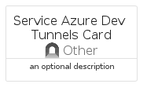
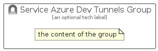

# ServiceAzureDevTunnels


```text
azure-19/Item/Other/ServiceAzureDevTunnels
```

```text
include('azure-19/Item/Other/ServiceAzureDevTunnels')
```


| Illustration | ServiceAzureDevTunnels | ServiceAzureDevTunnelsCard | ServiceAzureDevTunnelsGroup |
| :---: | :---: | :---: | :---: |
|  |  |  |  |


## Sprites
The item provides the following sriptes:

- `<$ServiceAzureDevTunnelsXs>`
- `<$ServiceAzureDevTunnelsSm>`
- `<$ServiceAzureDevTunnelsMd>`
- `<$ServiceAzureDevTunnelsLg>`


## ServiceAzureDevTunnels

### Load remotely
```plantuml
@startuml
' configures the library
!global $LIB_BASE_LOCATION="https://raw.githubusercontent.com/tmorin/plantuml-libs/master/distribution"

' loads the library's bootstrap
!include $LIB_BASE_LOCATION/bootstrap.puml

' loads the package bootstrap
include('azure-19/bootstrap')

' loads the Item which embeds the element ServiceAzureDevTunnels
include('azure-19/Item/Other/ServiceAzureDevTunnels')

' renders the element
ServiceAzureDevTunnels('ServiceAzureDevTunnels', 'Service Azure Dev Tunnels', 'an optional tech label', 'an optional description')
@enduml
```

### Load locally
```plantuml
@startuml
' configures the library
!global $INCLUSION_MODE="local"
!global $LIB_BASE_LOCATION="../../.."

' loads the library's bootstrap
!include $LIB_BASE_LOCATION/bootstrap.puml

' loads the package bootstrap
include('azure-19/bootstrap')

' loads the Item which embeds the element ServiceAzureDevTunnels
include('azure-19/Item/Other/ServiceAzureDevTunnels')

' renders the element
ServiceAzureDevTunnels('ServiceAzureDevTunnels', 'Service Azure Dev Tunnels', 'an optional tech label', 'an optional description')
@enduml
```

## ServiceAzureDevTunnelsCard

### Load remotely
```plantuml
@startuml
' configures the library
!global $LIB_BASE_LOCATION="https://raw.githubusercontent.com/tmorin/plantuml-libs/master/distribution"

' loads the library's bootstrap
!include $LIB_BASE_LOCATION/bootstrap.puml

' loads the package bootstrap
include('azure-19/bootstrap')

' loads the Item which embeds the element ServiceAzureDevTunnelsCard
include('azure-19/Item/Other/ServiceAzureDevTunnels')

' renders the element
ServiceAzureDevTunnelsCard('ServiceAzureDevTunnelsCard', 'Service Azure Dev Tunnels Card', 'an optional description')
@enduml
```

### Load locally
```plantuml
@startuml
' configures the library
!global $INCLUSION_MODE="local"
!global $LIB_BASE_LOCATION="../../.."

' loads the library's bootstrap
!include $LIB_BASE_LOCATION/bootstrap.puml

' loads the package bootstrap
include('azure-19/bootstrap')

' loads the Item which embeds the element ServiceAzureDevTunnelsCard
include('azure-19/Item/Other/ServiceAzureDevTunnels')

' renders the element
ServiceAzureDevTunnelsCard('ServiceAzureDevTunnelsCard', 'Service Azure Dev Tunnels Card', 'an optional description')
@enduml
```

## ServiceAzureDevTunnelsGroup

### Load remotely
```plantuml
@startuml
' configures the library
!global $LIB_BASE_LOCATION="https://raw.githubusercontent.com/tmorin/plantuml-libs/master/distribution"

' loads the library's bootstrap
!include $LIB_BASE_LOCATION/bootstrap.puml

' loads the package bootstrap
include('azure-19/bootstrap')

' loads the Item which embeds the element ServiceAzureDevTunnelsGroup
include('azure-19/Item/Other/ServiceAzureDevTunnels')

' renders the element
ServiceAzureDevTunnelsGroup('ServiceAzureDevTunnelsGroup', 'Service Azure Dev Tunnels Group', 'an optional tech label') {
    note as note
        the content of the group
    end note
}
@enduml
```

### Load locally
```plantuml
@startuml
' configures the library
!global $INCLUSION_MODE="local"
!global $LIB_BASE_LOCATION="../../.."

' loads the library's bootstrap
!include $LIB_BASE_LOCATION/bootstrap.puml

' loads the package bootstrap
include('azure-19/bootstrap')

' loads the Item which embeds the element ServiceAzureDevTunnelsGroup
include('azure-19/Item/Other/ServiceAzureDevTunnels')

' renders the element
ServiceAzureDevTunnelsGroup('ServiceAzureDevTunnelsGroup', 'Service Azure Dev Tunnels Group', 'an optional tech label') {
    note as note
        the content of the group
    end note
}
@enduml
```

