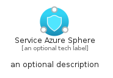

# ServiceAzureSphere


```text
azure-19/Item/Other/ServiceAzureSphere
```

```text
include('azure-19/Item/Other/ServiceAzureSphere')
```


| Illustration | ServiceAzureSphere | ServiceAzureSphereCard | ServiceAzureSphereGroup |
| :---: | :---: | :---: | :---: |
|  |  |  |  |


## Sprites
The item provides the following sriptes:

- `<$ServiceAzureSphereXs>`
- `<$ServiceAzureSphereSm>`
- `<$ServiceAzureSphereMd>`
- `<$ServiceAzureSphereLg>`


## ServiceAzureSphere

### Load remotely
```plantuml
@startuml
' configures the library
!global $LIB_BASE_LOCATION="https://raw.githubusercontent.com/tmorin/plantuml-libs/master/distribution"

' loads the library's bootstrap
!include $LIB_BASE_LOCATION/bootstrap.puml

' loads the package bootstrap
include('azure-19/bootstrap')

' loads the Item which embeds the element ServiceAzureSphere
include('azure-19/Item/Other/ServiceAzureSphere')

' renders the element
ServiceAzureSphere('ServiceAzureSphere', 'Service Azure Sphere', 'an optional tech label', 'an optional description')
@enduml
```

### Load locally
```plantuml
@startuml
' configures the library
!global $INCLUSION_MODE="local"
!global $LIB_BASE_LOCATION="../../.."

' loads the library's bootstrap
!include $LIB_BASE_LOCATION/bootstrap.puml

' loads the package bootstrap
include('azure-19/bootstrap')

' loads the Item which embeds the element ServiceAzureSphere
include('azure-19/Item/Other/ServiceAzureSphere')

' renders the element
ServiceAzureSphere('ServiceAzureSphere', 'Service Azure Sphere', 'an optional tech label', 'an optional description')
@enduml
```

## ServiceAzureSphereCard

### Load remotely
```plantuml
@startuml
' configures the library
!global $LIB_BASE_LOCATION="https://raw.githubusercontent.com/tmorin/plantuml-libs/master/distribution"

' loads the library's bootstrap
!include $LIB_BASE_LOCATION/bootstrap.puml

' loads the package bootstrap
include('azure-19/bootstrap')

' loads the Item which embeds the element ServiceAzureSphereCard
include('azure-19/Item/Other/ServiceAzureSphere')

' renders the element
ServiceAzureSphereCard('ServiceAzureSphereCard', 'Service Azure Sphere Card', 'an optional description')
@enduml
```

### Load locally
```plantuml
@startuml
' configures the library
!global $INCLUSION_MODE="local"
!global $LIB_BASE_LOCATION="../../.."

' loads the library's bootstrap
!include $LIB_BASE_LOCATION/bootstrap.puml

' loads the package bootstrap
include('azure-19/bootstrap')

' loads the Item which embeds the element ServiceAzureSphereCard
include('azure-19/Item/Other/ServiceAzureSphere')

' renders the element
ServiceAzureSphereCard('ServiceAzureSphereCard', 'Service Azure Sphere Card', 'an optional description')
@enduml
```

## ServiceAzureSphereGroup

### Load remotely
```plantuml
@startuml
' configures the library
!global $LIB_BASE_LOCATION="https://raw.githubusercontent.com/tmorin/plantuml-libs/master/distribution"

' loads the library's bootstrap
!include $LIB_BASE_LOCATION/bootstrap.puml

' loads the package bootstrap
include('azure-19/bootstrap')

' loads the Item which embeds the element ServiceAzureSphereGroup
include('azure-19/Item/Other/ServiceAzureSphere')

' renders the element
ServiceAzureSphereGroup('ServiceAzureSphereGroup', 'Service Azure Sphere Group', 'an optional tech label') {
    note as note
        the content of the group
    end note
}
@enduml
```

### Load locally
```plantuml
@startuml
' configures the library
!global $INCLUSION_MODE="local"
!global $LIB_BASE_LOCATION="../../.."

' loads the library's bootstrap
!include $LIB_BASE_LOCATION/bootstrap.puml

' loads the package bootstrap
include('azure-19/bootstrap')

' loads the Item which embeds the element ServiceAzureSphereGroup
include('azure-19/Item/Other/ServiceAzureSphere')

' renders the element
ServiceAzureSphereGroup('ServiceAzureSphereGroup', 'Service Azure Sphere Group', 'an optional tech label') {
    note as note
        the content of the group
    end note
}
@enduml
```

