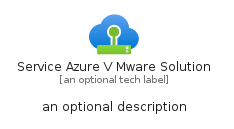
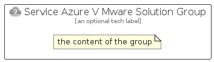

# ServiceAzureVMwareSolution


```text
azure-19/Item/Other/ServiceAzureVMwareSolution
```

```text
include('azure-19/Item/Other/ServiceAzureVMwareSolution')
```


| Illustration | ServiceAzureVMwareSolution | ServiceAzureVMwareSolutionCard | ServiceAzureVMwareSolutionGroup |
| :---: | :---: | :---: | :---: |
|  |  |  |  |


## Sprites
The item provides the following sriptes:

- `<$ServiceAzureVMwareSolutionXs>`
- `<$ServiceAzureVMwareSolutionSm>`
- `<$ServiceAzureVMwareSolutionMd>`
- `<$ServiceAzureVMwareSolutionLg>`


## ServiceAzureVMwareSolution

### Load remotely
```plantuml
@startuml
' configures the library
!global $LIB_BASE_LOCATION="https://raw.githubusercontent.com/tmorin/plantuml-libs/master/distribution"

' loads the library's bootstrap
!include $LIB_BASE_LOCATION/bootstrap.puml

' loads the package bootstrap
include('azure-19/bootstrap')

' loads the Item which embeds the element ServiceAzureVMwareSolution
include('azure-19/Item/Other/ServiceAzureVMwareSolution')

' renders the element
ServiceAzureVMwareSolution('ServiceAzureVMwareSolution', 'Service Azure V Mware Solution', 'an optional tech label', 'an optional description')
@enduml
```

### Load locally
```plantuml
@startuml
' configures the library
!global $INCLUSION_MODE="local"
!global $LIB_BASE_LOCATION="../../.."

' loads the library's bootstrap
!include $LIB_BASE_LOCATION/bootstrap.puml

' loads the package bootstrap
include('azure-19/bootstrap')

' loads the Item which embeds the element ServiceAzureVMwareSolution
include('azure-19/Item/Other/ServiceAzureVMwareSolution')

' renders the element
ServiceAzureVMwareSolution('ServiceAzureVMwareSolution', 'Service Azure V Mware Solution', 'an optional tech label', 'an optional description')
@enduml
```

## ServiceAzureVMwareSolutionCard

### Load remotely
```plantuml
@startuml
' configures the library
!global $LIB_BASE_LOCATION="https://raw.githubusercontent.com/tmorin/plantuml-libs/master/distribution"

' loads the library's bootstrap
!include $LIB_BASE_LOCATION/bootstrap.puml

' loads the package bootstrap
include('azure-19/bootstrap')

' loads the Item which embeds the element ServiceAzureVMwareSolutionCard
include('azure-19/Item/Other/ServiceAzureVMwareSolution')

' renders the element
ServiceAzureVMwareSolutionCard('ServiceAzureVMwareSolutionCard', 'Service Azure V Mware Solution Card', 'an optional description')
@enduml
```

### Load locally
```plantuml
@startuml
' configures the library
!global $INCLUSION_MODE="local"
!global $LIB_BASE_LOCATION="../../.."

' loads the library's bootstrap
!include $LIB_BASE_LOCATION/bootstrap.puml

' loads the package bootstrap
include('azure-19/bootstrap')

' loads the Item which embeds the element ServiceAzureVMwareSolutionCard
include('azure-19/Item/Other/ServiceAzureVMwareSolution')

' renders the element
ServiceAzureVMwareSolutionCard('ServiceAzureVMwareSolutionCard', 'Service Azure V Mware Solution Card', 'an optional description')
@enduml
```

## ServiceAzureVMwareSolutionGroup

### Load remotely
```plantuml
@startuml
' configures the library
!global $LIB_BASE_LOCATION="https://raw.githubusercontent.com/tmorin/plantuml-libs/master/distribution"

' loads the library's bootstrap
!include $LIB_BASE_LOCATION/bootstrap.puml

' loads the package bootstrap
include('azure-19/bootstrap')

' loads the Item which embeds the element ServiceAzureVMwareSolutionGroup
include('azure-19/Item/Other/ServiceAzureVMwareSolution')

' renders the element
ServiceAzureVMwareSolutionGroup('ServiceAzureVMwareSolutionGroup', 'Service Azure V Mware Solution Group', 'an optional tech label') {
    note as note
        the content of the group
    end note
}
@enduml
```

### Load locally
```plantuml
@startuml
' configures the library
!global $INCLUSION_MODE="local"
!global $LIB_BASE_LOCATION="../../.."

' loads the library's bootstrap
!include $LIB_BASE_LOCATION/bootstrap.puml

' loads the package bootstrap
include('azure-19/bootstrap')

' loads the Item which embeds the element ServiceAzureVMwareSolutionGroup
include('azure-19/Item/Other/ServiceAzureVMwareSolution')

' renders the element
ServiceAzureVMwareSolutionGroup('ServiceAzureVMwareSolutionGroup', 'Service Azure V Mware Solution Group', 'an optional tech label') {
    note as note
        the content of the group
    end note
}
@enduml
```

