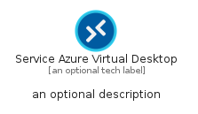
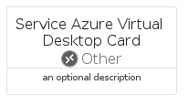

# ServiceAzureVirtualDesktop


```text
azure-19/Item/Other/ServiceAzureVirtualDesktop
```

```text
include('azure-19/Item/Other/ServiceAzureVirtualDesktop')
```


| Illustration | ServiceAzureVirtualDesktop | ServiceAzureVirtualDesktopCard | ServiceAzureVirtualDesktopGroup |
| :---: | :---: | :---: | :---: |
|  |  |  |  |


## Sprites
The item provides the following sriptes:

- `<$ServiceAzureVirtualDesktopXs>`
- `<$ServiceAzureVirtualDesktopSm>`
- `<$ServiceAzureVirtualDesktopMd>`
- `<$ServiceAzureVirtualDesktopLg>`


## ServiceAzureVirtualDesktop

### Load remotely
```plantuml
@startuml
' configures the library
!global $LIB_BASE_LOCATION="https://raw.githubusercontent.com/tmorin/plantuml-libs/master/distribution"

' loads the library's bootstrap
!include $LIB_BASE_LOCATION/bootstrap.puml

' loads the package bootstrap
include('azure-19/bootstrap')

' loads the Item which embeds the element ServiceAzureVirtualDesktop
include('azure-19/Item/Other/ServiceAzureVirtualDesktop')

' renders the element
ServiceAzureVirtualDesktop('ServiceAzureVirtualDesktop', 'Service Azure Virtual Desktop', 'an optional tech label', 'an optional description')
@enduml
```

### Load locally
```plantuml
@startuml
' configures the library
!global $INCLUSION_MODE="local"
!global $LIB_BASE_LOCATION="../../.."

' loads the library's bootstrap
!include $LIB_BASE_LOCATION/bootstrap.puml

' loads the package bootstrap
include('azure-19/bootstrap')

' loads the Item which embeds the element ServiceAzureVirtualDesktop
include('azure-19/Item/Other/ServiceAzureVirtualDesktop')

' renders the element
ServiceAzureVirtualDesktop('ServiceAzureVirtualDesktop', 'Service Azure Virtual Desktop', 'an optional tech label', 'an optional description')
@enduml
```

## ServiceAzureVirtualDesktopCard

### Load remotely
```plantuml
@startuml
' configures the library
!global $LIB_BASE_LOCATION="https://raw.githubusercontent.com/tmorin/plantuml-libs/master/distribution"

' loads the library's bootstrap
!include $LIB_BASE_LOCATION/bootstrap.puml

' loads the package bootstrap
include('azure-19/bootstrap')

' loads the Item which embeds the element ServiceAzureVirtualDesktopCard
include('azure-19/Item/Other/ServiceAzureVirtualDesktop')

' renders the element
ServiceAzureVirtualDesktopCard('ServiceAzureVirtualDesktopCard', 'Service Azure Virtual Desktop Card', 'an optional description')
@enduml
```

### Load locally
```plantuml
@startuml
' configures the library
!global $INCLUSION_MODE="local"
!global $LIB_BASE_LOCATION="../../.."

' loads the library's bootstrap
!include $LIB_BASE_LOCATION/bootstrap.puml

' loads the package bootstrap
include('azure-19/bootstrap')

' loads the Item which embeds the element ServiceAzureVirtualDesktopCard
include('azure-19/Item/Other/ServiceAzureVirtualDesktop')

' renders the element
ServiceAzureVirtualDesktopCard('ServiceAzureVirtualDesktopCard', 'Service Azure Virtual Desktop Card', 'an optional description')
@enduml
```

## ServiceAzureVirtualDesktopGroup

### Load remotely
```plantuml
@startuml
' configures the library
!global $LIB_BASE_LOCATION="https://raw.githubusercontent.com/tmorin/plantuml-libs/master/distribution"

' loads the library's bootstrap
!include $LIB_BASE_LOCATION/bootstrap.puml

' loads the package bootstrap
include('azure-19/bootstrap')

' loads the Item which embeds the element ServiceAzureVirtualDesktopGroup
include('azure-19/Item/Other/ServiceAzureVirtualDesktop')

' renders the element
ServiceAzureVirtualDesktopGroup('ServiceAzureVirtualDesktopGroup', 'Service Azure Virtual Desktop Group', 'an optional tech label') {
    note as note
        the content of the group
    end note
}
@enduml
```

### Load locally
```plantuml
@startuml
' configures the library
!global $INCLUSION_MODE="local"
!global $LIB_BASE_LOCATION="../../.."

' loads the library's bootstrap
!include $LIB_BASE_LOCATION/bootstrap.puml

' loads the package bootstrap
include('azure-19/bootstrap')

' loads the Item which embeds the element ServiceAzureVirtualDesktopGroup
include('azure-19/Item/Other/ServiceAzureVirtualDesktop')

' renders the element
ServiceAzureVirtualDesktopGroup('ServiceAzureVirtualDesktopGroup', 'Service Azure Virtual Desktop Group', 'an optional tech label') {
    note as note
        the content of the group
    end note
}
@enduml
```

