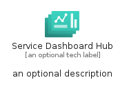
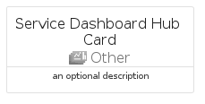

# ServiceDashboardHub


```text
azure-19/Item/Other/ServiceDashboardHub
```

```text
include('azure-19/Item/Other/ServiceDashboardHub')
```


| Illustration | ServiceDashboardHub | ServiceDashboardHubCard | ServiceDashboardHubGroup |
| :---: | :---: | :---: | :---: |
|  |  |  |  |


## Sprites
The item provides the following sriptes:

- `<$ServiceDashboardHubXs>`
- `<$ServiceDashboardHubSm>`
- `<$ServiceDashboardHubMd>`
- `<$ServiceDashboardHubLg>`


## ServiceDashboardHub

### Load remotely
```plantuml
@startuml
' configures the library
!global $LIB_BASE_LOCATION="https://raw.githubusercontent.com/tmorin/plantuml-libs/master/distribution"

' loads the library's bootstrap
!include $LIB_BASE_LOCATION/bootstrap.puml

' loads the package bootstrap
include('azure-19/bootstrap')

' loads the Item which embeds the element ServiceDashboardHub
include('azure-19/Item/Other/ServiceDashboardHub')

' renders the element
ServiceDashboardHub('ServiceDashboardHub', 'Service Dashboard Hub', 'an optional tech label', 'an optional description')
@enduml
```

### Load locally
```plantuml
@startuml
' configures the library
!global $INCLUSION_MODE="local"
!global $LIB_BASE_LOCATION="../../.."

' loads the library's bootstrap
!include $LIB_BASE_LOCATION/bootstrap.puml

' loads the package bootstrap
include('azure-19/bootstrap')

' loads the Item which embeds the element ServiceDashboardHub
include('azure-19/Item/Other/ServiceDashboardHub')

' renders the element
ServiceDashboardHub('ServiceDashboardHub', 'Service Dashboard Hub', 'an optional tech label', 'an optional description')
@enduml
```

## ServiceDashboardHubCard

### Load remotely
```plantuml
@startuml
' configures the library
!global $LIB_BASE_LOCATION="https://raw.githubusercontent.com/tmorin/plantuml-libs/master/distribution"

' loads the library's bootstrap
!include $LIB_BASE_LOCATION/bootstrap.puml

' loads the package bootstrap
include('azure-19/bootstrap')

' loads the Item which embeds the element ServiceDashboardHubCard
include('azure-19/Item/Other/ServiceDashboardHub')

' renders the element
ServiceDashboardHubCard('ServiceDashboardHubCard', 'Service Dashboard Hub Card', 'an optional description')
@enduml
```

### Load locally
```plantuml
@startuml
' configures the library
!global $INCLUSION_MODE="local"
!global $LIB_BASE_LOCATION="../../.."

' loads the library's bootstrap
!include $LIB_BASE_LOCATION/bootstrap.puml

' loads the package bootstrap
include('azure-19/bootstrap')

' loads the Item which embeds the element ServiceDashboardHubCard
include('azure-19/Item/Other/ServiceDashboardHub')

' renders the element
ServiceDashboardHubCard('ServiceDashboardHubCard', 'Service Dashboard Hub Card', 'an optional description')
@enduml
```

## ServiceDashboardHubGroup

### Load remotely
```plantuml
@startuml
' configures the library
!global $LIB_BASE_LOCATION="https://raw.githubusercontent.com/tmorin/plantuml-libs/master/distribution"

' loads the library's bootstrap
!include $LIB_BASE_LOCATION/bootstrap.puml

' loads the package bootstrap
include('azure-19/bootstrap')

' loads the Item which embeds the element ServiceDashboardHubGroup
include('azure-19/Item/Other/ServiceDashboardHub')

' renders the element
ServiceDashboardHubGroup('ServiceDashboardHubGroup', 'Service Dashboard Hub Group', 'an optional tech label') {
    note as note
        the content of the group
    end note
}
@enduml
```

### Load locally
```plantuml
@startuml
' configures the library
!global $INCLUSION_MODE="local"
!global $LIB_BASE_LOCATION="../../.."

' loads the library's bootstrap
!include $LIB_BASE_LOCATION/bootstrap.puml

' loads the package bootstrap
include('azure-19/bootstrap')

' loads the Item which embeds the element ServiceDashboardHubGroup
include('azure-19/Item/Other/ServiceDashboardHub')

' renders the element
ServiceDashboardHubGroup('ServiceDashboardHubGroup', 'Service Dashboard Hub Group', 'an optional tech label') {
    note as note
        the content of the group
    end note
}
@enduml
```

