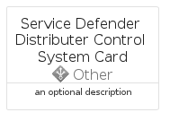

# ServiceDefenderDistributerControlSystem


```text
azure-19/Item/Other/ServiceDefenderDistributerControlSystem
```

```text
include('azure-19/Item/Other/ServiceDefenderDistributerControlSystem')
```


| Illustration | ServiceDefenderDistributerControlSystem | ServiceDefenderDistributerControlSystemCard | ServiceDefenderDistributerControlSystemGroup |
| :---: | :---: | :---: | :---: |
|  |  |  |  |


## Sprites
The item provides the following sriptes:

- `<$ServiceDefenderDistributerControlSystemXs>`
- `<$ServiceDefenderDistributerControlSystemSm>`
- `<$ServiceDefenderDistributerControlSystemMd>`
- `<$ServiceDefenderDistributerControlSystemLg>`


## ServiceDefenderDistributerControlSystem

### Load remotely
```plantuml
@startuml
' configures the library
!global $LIB_BASE_LOCATION="https://raw.githubusercontent.com/tmorin/plantuml-libs/master/distribution"

' loads the library's bootstrap
!include $LIB_BASE_LOCATION/bootstrap.puml

' loads the package bootstrap
include('azure-19/bootstrap')

' loads the Item which embeds the element ServiceDefenderDistributerControlSystem
include('azure-19/Item/Other/ServiceDefenderDistributerControlSystem')

' renders the element
ServiceDefenderDistributerControlSystem('ServiceDefenderDistributerControlSystem', 'Service Defender Distributer Control System', 'an optional tech label', 'an optional description')
@enduml
```

### Load locally
```plantuml
@startuml
' configures the library
!global $INCLUSION_MODE="local"
!global $LIB_BASE_LOCATION="../../.."

' loads the library's bootstrap
!include $LIB_BASE_LOCATION/bootstrap.puml

' loads the package bootstrap
include('azure-19/bootstrap')

' loads the Item which embeds the element ServiceDefenderDistributerControlSystem
include('azure-19/Item/Other/ServiceDefenderDistributerControlSystem')

' renders the element
ServiceDefenderDistributerControlSystem('ServiceDefenderDistributerControlSystem', 'Service Defender Distributer Control System', 'an optional tech label', 'an optional description')
@enduml
```

## ServiceDefenderDistributerControlSystemCard

### Load remotely
```plantuml
@startuml
' configures the library
!global $LIB_BASE_LOCATION="https://raw.githubusercontent.com/tmorin/plantuml-libs/master/distribution"

' loads the library's bootstrap
!include $LIB_BASE_LOCATION/bootstrap.puml

' loads the package bootstrap
include('azure-19/bootstrap')

' loads the Item which embeds the element ServiceDefenderDistributerControlSystemCard
include('azure-19/Item/Other/ServiceDefenderDistributerControlSystem')

' renders the element
ServiceDefenderDistributerControlSystemCard('ServiceDefenderDistributerControlSystemCard', 'Service Defender Distributer Control System Card', 'an optional description')
@enduml
```

### Load locally
```plantuml
@startuml
' configures the library
!global $INCLUSION_MODE="local"
!global $LIB_BASE_LOCATION="../../.."

' loads the library's bootstrap
!include $LIB_BASE_LOCATION/bootstrap.puml

' loads the package bootstrap
include('azure-19/bootstrap')

' loads the Item which embeds the element ServiceDefenderDistributerControlSystemCard
include('azure-19/Item/Other/ServiceDefenderDistributerControlSystem')

' renders the element
ServiceDefenderDistributerControlSystemCard('ServiceDefenderDistributerControlSystemCard', 'Service Defender Distributer Control System Card', 'an optional description')
@enduml
```

## ServiceDefenderDistributerControlSystemGroup

### Load remotely
```plantuml
@startuml
' configures the library
!global $LIB_BASE_LOCATION="https://raw.githubusercontent.com/tmorin/plantuml-libs/master/distribution"

' loads the library's bootstrap
!include $LIB_BASE_LOCATION/bootstrap.puml

' loads the package bootstrap
include('azure-19/bootstrap')

' loads the Item which embeds the element ServiceDefenderDistributerControlSystemGroup
include('azure-19/Item/Other/ServiceDefenderDistributerControlSystem')

' renders the element
ServiceDefenderDistributerControlSystemGroup('ServiceDefenderDistributerControlSystemGroup', 'Service Defender Distributer Control System Group', 'an optional tech label') {
    note as note
        the content of the group
    end note
}
@enduml
```

### Load locally
```plantuml
@startuml
' configures the library
!global $INCLUSION_MODE="local"
!global $LIB_BASE_LOCATION="../../.."

' loads the library's bootstrap
!include $LIB_BASE_LOCATION/bootstrap.puml

' loads the package bootstrap
include('azure-19/bootstrap')

' loads the Item which embeds the element ServiceDefenderDistributerControlSystemGroup
include('azure-19/Item/Other/ServiceDefenderDistributerControlSystem')

' renders the element
ServiceDefenderDistributerControlSystemGroup('ServiceDefenderDistributerControlSystemGroup', 'Service Defender Distributer Control System Group', 'an optional tech label') {
    note as note
        the content of the group
    end note
}
@enduml
```

