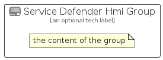

# ServiceDefenderHmi


```text
azure-19/Item/Other/ServiceDefenderHmi
```

```text
include('azure-19/Item/Other/ServiceDefenderHmi')
```


| Illustration | ServiceDefenderHmi | ServiceDefenderHmiCard | ServiceDefenderHmiGroup |
| :---: | :---: | :---: | :---: |
|  |  |  |  |


## Sprites
The item provides the following sriptes:

- `<$ServiceDefenderHmiXs>`
- `<$ServiceDefenderHmiSm>`
- `<$ServiceDefenderHmiMd>`
- `<$ServiceDefenderHmiLg>`


## ServiceDefenderHmi

### Load remotely
```plantuml
@startuml
' configures the library
!global $LIB_BASE_LOCATION="https://raw.githubusercontent.com/tmorin/plantuml-libs/master/distribution"

' loads the library's bootstrap
!include $LIB_BASE_LOCATION/bootstrap.puml

' loads the package bootstrap
include('azure-19/bootstrap')

' loads the Item which embeds the element ServiceDefenderHmi
include('azure-19/Item/Other/ServiceDefenderHmi')

' renders the element
ServiceDefenderHmi('ServiceDefenderHmi', 'Service Defender Hmi', 'an optional tech label', 'an optional description')
@enduml
```

### Load locally
```plantuml
@startuml
' configures the library
!global $INCLUSION_MODE="local"
!global $LIB_BASE_LOCATION="../../.."

' loads the library's bootstrap
!include $LIB_BASE_LOCATION/bootstrap.puml

' loads the package bootstrap
include('azure-19/bootstrap')

' loads the Item which embeds the element ServiceDefenderHmi
include('azure-19/Item/Other/ServiceDefenderHmi')

' renders the element
ServiceDefenderHmi('ServiceDefenderHmi', 'Service Defender Hmi', 'an optional tech label', 'an optional description')
@enduml
```

## ServiceDefenderHmiCard

### Load remotely
```plantuml
@startuml
' configures the library
!global $LIB_BASE_LOCATION="https://raw.githubusercontent.com/tmorin/plantuml-libs/master/distribution"

' loads the library's bootstrap
!include $LIB_BASE_LOCATION/bootstrap.puml

' loads the package bootstrap
include('azure-19/bootstrap')

' loads the Item which embeds the element ServiceDefenderHmiCard
include('azure-19/Item/Other/ServiceDefenderHmi')

' renders the element
ServiceDefenderHmiCard('ServiceDefenderHmiCard', 'Service Defender Hmi Card', 'an optional description')
@enduml
```

### Load locally
```plantuml
@startuml
' configures the library
!global $INCLUSION_MODE="local"
!global $LIB_BASE_LOCATION="../../.."

' loads the library's bootstrap
!include $LIB_BASE_LOCATION/bootstrap.puml

' loads the package bootstrap
include('azure-19/bootstrap')

' loads the Item which embeds the element ServiceDefenderHmiCard
include('azure-19/Item/Other/ServiceDefenderHmi')

' renders the element
ServiceDefenderHmiCard('ServiceDefenderHmiCard', 'Service Defender Hmi Card', 'an optional description')
@enduml
```

## ServiceDefenderHmiGroup

### Load remotely
```plantuml
@startuml
' configures the library
!global $LIB_BASE_LOCATION="https://raw.githubusercontent.com/tmorin/plantuml-libs/master/distribution"

' loads the library's bootstrap
!include $LIB_BASE_LOCATION/bootstrap.puml

' loads the package bootstrap
include('azure-19/bootstrap')

' loads the Item which embeds the element ServiceDefenderHmiGroup
include('azure-19/Item/Other/ServiceDefenderHmi')

' renders the element
ServiceDefenderHmiGroup('ServiceDefenderHmiGroup', 'Service Defender Hmi Group', 'an optional tech label') {
    note as note
        the content of the group
    end note
}
@enduml
```

### Load locally
```plantuml
@startuml
' configures the library
!global $INCLUSION_MODE="local"
!global $LIB_BASE_LOCATION="../../.."

' loads the library's bootstrap
!include $LIB_BASE_LOCATION/bootstrap.puml

' loads the package bootstrap
include('azure-19/bootstrap')

' loads the Item which embeds the element ServiceDefenderHmiGroup
include('azure-19/Item/Other/ServiceDefenderHmi')

' renders the element
ServiceDefenderHmiGroup('ServiceDefenderHmiGroup', 'Service Defender Hmi Group', 'an optional tech label') {
    note as note
        the content of the group
    end note
}
@enduml
```

