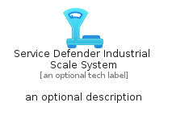
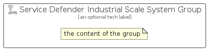

# ServiceDefenderIndustrialScaleSystem


```text
azure-19/Item/Other/ServiceDefenderIndustrialScaleSystem
```

```text
include('azure-19/Item/Other/ServiceDefenderIndustrialScaleSystem')
```


| Illustration | ServiceDefenderIndustrialScaleSystem | ServiceDefenderIndustrialScaleSystemCard | ServiceDefenderIndustrialScaleSystemGroup |
| :---: | :---: | :---: | :---: |
|  |  |  |  |


## Sprites
The item provides the following sriptes:

- `<$ServiceDefenderIndustrialScaleSystemXs>`
- `<$ServiceDefenderIndustrialScaleSystemSm>`
- `<$ServiceDefenderIndustrialScaleSystemMd>`
- `<$ServiceDefenderIndustrialScaleSystemLg>`


## ServiceDefenderIndustrialScaleSystem

### Load remotely
```plantuml
@startuml
' configures the library
!global $LIB_BASE_LOCATION="https://raw.githubusercontent.com/tmorin/plantuml-libs/master/distribution"

' loads the library's bootstrap
!include $LIB_BASE_LOCATION/bootstrap.puml

' loads the package bootstrap
include('azure-19/bootstrap')

' loads the Item which embeds the element ServiceDefenderIndustrialScaleSystem
include('azure-19/Item/Other/ServiceDefenderIndustrialScaleSystem')

' renders the element
ServiceDefenderIndustrialScaleSystem('ServiceDefenderIndustrialScaleSystem', 'Service Defender Industrial Scale System', 'an optional tech label', 'an optional description')
@enduml
```

### Load locally
```plantuml
@startuml
' configures the library
!global $INCLUSION_MODE="local"
!global $LIB_BASE_LOCATION="../../.."

' loads the library's bootstrap
!include $LIB_BASE_LOCATION/bootstrap.puml

' loads the package bootstrap
include('azure-19/bootstrap')

' loads the Item which embeds the element ServiceDefenderIndustrialScaleSystem
include('azure-19/Item/Other/ServiceDefenderIndustrialScaleSystem')

' renders the element
ServiceDefenderIndustrialScaleSystem('ServiceDefenderIndustrialScaleSystem', 'Service Defender Industrial Scale System', 'an optional tech label', 'an optional description')
@enduml
```

## ServiceDefenderIndustrialScaleSystemCard

### Load remotely
```plantuml
@startuml
' configures the library
!global $LIB_BASE_LOCATION="https://raw.githubusercontent.com/tmorin/plantuml-libs/master/distribution"

' loads the library's bootstrap
!include $LIB_BASE_LOCATION/bootstrap.puml

' loads the package bootstrap
include('azure-19/bootstrap')

' loads the Item which embeds the element ServiceDefenderIndustrialScaleSystemCard
include('azure-19/Item/Other/ServiceDefenderIndustrialScaleSystem')

' renders the element
ServiceDefenderIndustrialScaleSystemCard('ServiceDefenderIndustrialScaleSystemCard', 'Service Defender Industrial Scale System Card', 'an optional description')
@enduml
```

### Load locally
```plantuml
@startuml
' configures the library
!global $INCLUSION_MODE="local"
!global $LIB_BASE_LOCATION="../../.."

' loads the library's bootstrap
!include $LIB_BASE_LOCATION/bootstrap.puml

' loads the package bootstrap
include('azure-19/bootstrap')

' loads the Item which embeds the element ServiceDefenderIndustrialScaleSystemCard
include('azure-19/Item/Other/ServiceDefenderIndustrialScaleSystem')

' renders the element
ServiceDefenderIndustrialScaleSystemCard('ServiceDefenderIndustrialScaleSystemCard', 'Service Defender Industrial Scale System Card', 'an optional description')
@enduml
```

## ServiceDefenderIndustrialScaleSystemGroup

### Load remotely
```plantuml
@startuml
' configures the library
!global $LIB_BASE_LOCATION="https://raw.githubusercontent.com/tmorin/plantuml-libs/master/distribution"

' loads the library's bootstrap
!include $LIB_BASE_LOCATION/bootstrap.puml

' loads the package bootstrap
include('azure-19/bootstrap')

' loads the Item which embeds the element ServiceDefenderIndustrialScaleSystemGroup
include('azure-19/Item/Other/ServiceDefenderIndustrialScaleSystem')

' renders the element
ServiceDefenderIndustrialScaleSystemGroup('ServiceDefenderIndustrialScaleSystemGroup', 'Service Defender Industrial Scale System Group', 'an optional tech label') {
    note as note
        the content of the group
    end note
}
@enduml
```

### Load locally
```plantuml
@startuml
' configures the library
!global $INCLUSION_MODE="local"
!global $LIB_BASE_LOCATION="../../.."

' loads the library's bootstrap
!include $LIB_BASE_LOCATION/bootstrap.puml

' loads the package bootstrap
include('azure-19/bootstrap')

' loads the Item which embeds the element ServiceDefenderIndustrialScaleSystemGroup
include('azure-19/Item/Other/ServiceDefenderIndustrialScaleSystem')

' renders the element
ServiceDefenderIndustrialScaleSystemGroup('ServiceDefenderIndustrialScaleSystemGroup', 'Service Defender Industrial Scale System Group', 'an optional tech label') {
    note as note
        the content of the group
    end note
}
@enduml
```

