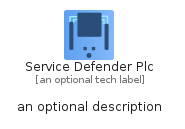
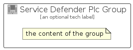

# ServiceDefenderPlc


```text
azure-19/Item/Other/ServiceDefenderPlc
```

```text
include('azure-19/Item/Other/ServiceDefenderPlc')
```


| Illustration | ServiceDefenderPlc | ServiceDefenderPlcCard | ServiceDefenderPlcGroup |
| :---: | :---: | :---: | :---: |
|  |  |  |  |


## Sprites
The item provides the following sriptes:

- `<$ServiceDefenderPlcXs>`
- `<$ServiceDefenderPlcSm>`
- `<$ServiceDefenderPlcMd>`
- `<$ServiceDefenderPlcLg>`


## ServiceDefenderPlc

### Load remotely
```plantuml
@startuml
' configures the library
!global $LIB_BASE_LOCATION="https://raw.githubusercontent.com/tmorin/plantuml-libs/master/distribution"

' loads the library's bootstrap
!include $LIB_BASE_LOCATION/bootstrap.puml

' loads the package bootstrap
include('azure-19/bootstrap')

' loads the Item which embeds the element ServiceDefenderPlc
include('azure-19/Item/Other/ServiceDefenderPlc')

' renders the element
ServiceDefenderPlc('ServiceDefenderPlc', 'Service Defender Plc', 'an optional tech label', 'an optional description')
@enduml
```

### Load locally
```plantuml
@startuml
' configures the library
!global $INCLUSION_MODE="local"
!global $LIB_BASE_LOCATION="../../.."

' loads the library's bootstrap
!include $LIB_BASE_LOCATION/bootstrap.puml

' loads the package bootstrap
include('azure-19/bootstrap')

' loads the Item which embeds the element ServiceDefenderPlc
include('azure-19/Item/Other/ServiceDefenderPlc')

' renders the element
ServiceDefenderPlc('ServiceDefenderPlc', 'Service Defender Plc', 'an optional tech label', 'an optional description')
@enduml
```

## ServiceDefenderPlcCard

### Load remotely
```plantuml
@startuml
' configures the library
!global $LIB_BASE_LOCATION="https://raw.githubusercontent.com/tmorin/plantuml-libs/master/distribution"

' loads the library's bootstrap
!include $LIB_BASE_LOCATION/bootstrap.puml

' loads the package bootstrap
include('azure-19/bootstrap')

' loads the Item which embeds the element ServiceDefenderPlcCard
include('azure-19/Item/Other/ServiceDefenderPlc')

' renders the element
ServiceDefenderPlcCard('ServiceDefenderPlcCard', 'Service Defender Plc Card', 'an optional description')
@enduml
```

### Load locally
```plantuml
@startuml
' configures the library
!global $INCLUSION_MODE="local"
!global $LIB_BASE_LOCATION="../../.."

' loads the library's bootstrap
!include $LIB_BASE_LOCATION/bootstrap.puml

' loads the package bootstrap
include('azure-19/bootstrap')

' loads the Item which embeds the element ServiceDefenderPlcCard
include('azure-19/Item/Other/ServiceDefenderPlc')

' renders the element
ServiceDefenderPlcCard('ServiceDefenderPlcCard', 'Service Defender Plc Card', 'an optional description')
@enduml
```

## ServiceDefenderPlcGroup

### Load remotely
```plantuml
@startuml
' configures the library
!global $LIB_BASE_LOCATION="https://raw.githubusercontent.com/tmorin/plantuml-libs/master/distribution"

' loads the library's bootstrap
!include $LIB_BASE_LOCATION/bootstrap.puml

' loads the package bootstrap
include('azure-19/bootstrap')

' loads the Item which embeds the element ServiceDefenderPlcGroup
include('azure-19/Item/Other/ServiceDefenderPlc')

' renders the element
ServiceDefenderPlcGroup('ServiceDefenderPlcGroup', 'Service Defender Plc Group', 'an optional tech label') {
    note as note
        the content of the group
    end note
}
@enduml
```

### Load locally
```plantuml
@startuml
' configures the library
!global $INCLUSION_MODE="local"
!global $LIB_BASE_LOCATION="../../.."

' loads the library's bootstrap
!include $LIB_BASE_LOCATION/bootstrap.puml

' loads the package bootstrap
include('azure-19/bootstrap')

' loads the Item which embeds the element ServiceDefenderPlcGroup
include('azure-19/Item/Other/ServiceDefenderPlc')

' renders the element
ServiceDefenderPlcGroup('ServiceDefenderPlcGroup', 'Service Defender Plc Group', 'an optional tech label') {
    note as note
        the content of the group
    end note
}
@enduml
```

