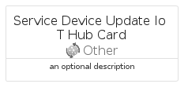

# ServiceDeviceUpdateIoTHub


```text
azure-19/Item/Other/ServiceDeviceUpdateIoTHub
```

```text
include('azure-19/Item/Other/ServiceDeviceUpdateIoTHub')
```


| Illustration | ServiceDeviceUpdateIoTHub | ServiceDeviceUpdateIoTHubCard | ServiceDeviceUpdateIoTHubGroup |
| :---: | :---: | :---: | :---: |
|  |  |  |  |


## Sprites
The item provides the following sriptes:

- `<$ServiceDeviceUpdateIoTHubXs>`
- `<$ServiceDeviceUpdateIoTHubSm>`
- `<$ServiceDeviceUpdateIoTHubMd>`
- `<$ServiceDeviceUpdateIoTHubLg>`


## ServiceDeviceUpdateIoTHub

### Load remotely
```plantuml
@startuml
' configures the library
!global $LIB_BASE_LOCATION="https://raw.githubusercontent.com/tmorin/plantuml-libs/master/distribution"

' loads the library's bootstrap
!include $LIB_BASE_LOCATION/bootstrap.puml

' loads the package bootstrap
include('azure-19/bootstrap')

' loads the Item which embeds the element ServiceDeviceUpdateIoTHub
include('azure-19/Item/Other/ServiceDeviceUpdateIoTHub')

' renders the element
ServiceDeviceUpdateIoTHub('ServiceDeviceUpdateIoTHub', 'Service Device Update Io T Hub', 'an optional tech label', 'an optional description')
@enduml
```

### Load locally
```plantuml
@startuml
' configures the library
!global $INCLUSION_MODE="local"
!global $LIB_BASE_LOCATION="../../.."

' loads the library's bootstrap
!include $LIB_BASE_LOCATION/bootstrap.puml

' loads the package bootstrap
include('azure-19/bootstrap')

' loads the Item which embeds the element ServiceDeviceUpdateIoTHub
include('azure-19/Item/Other/ServiceDeviceUpdateIoTHub')

' renders the element
ServiceDeviceUpdateIoTHub('ServiceDeviceUpdateIoTHub', 'Service Device Update Io T Hub', 'an optional tech label', 'an optional description')
@enduml
```

## ServiceDeviceUpdateIoTHubCard

### Load remotely
```plantuml
@startuml
' configures the library
!global $LIB_BASE_LOCATION="https://raw.githubusercontent.com/tmorin/plantuml-libs/master/distribution"

' loads the library's bootstrap
!include $LIB_BASE_LOCATION/bootstrap.puml

' loads the package bootstrap
include('azure-19/bootstrap')

' loads the Item which embeds the element ServiceDeviceUpdateIoTHubCard
include('azure-19/Item/Other/ServiceDeviceUpdateIoTHub')

' renders the element
ServiceDeviceUpdateIoTHubCard('ServiceDeviceUpdateIoTHubCard', 'Service Device Update Io T Hub Card', 'an optional description')
@enduml
```

### Load locally
```plantuml
@startuml
' configures the library
!global $INCLUSION_MODE="local"
!global $LIB_BASE_LOCATION="../../.."

' loads the library's bootstrap
!include $LIB_BASE_LOCATION/bootstrap.puml

' loads the package bootstrap
include('azure-19/bootstrap')

' loads the Item which embeds the element ServiceDeviceUpdateIoTHubCard
include('azure-19/Item/Other/ServiceDeviceUpdateIoTHub')

' renders the element
ServiceDeviceUpdateIoTHubCard('ServiceDeviceUpdateIoTHubCard', 'Service Device Update Io T Hub Card', 'an optional description')
@enduml
```

## ServiceDeviceUpdateIoTHubGroup

### Load remotely
```plantuml
@startuml
' configures the library
!global $LIB_BASE_LOCATION="https://raw.githubusercontent.com/tmorin/plantuml-libs/master/distribution"

' loads the library's bootstrap
!include $LIB_BASE_LOCATION/bootstrap.puml

' loads the package bootstrap
include('azure-19/bootstrap')

' loads the Item which embeds the element ServiceDeviceUpdateIoTHubGroup
include('azure-19/Item/Other/ServiceDeviceUpdateIoTHub')

' renders the element
ServiceDeviceUpdateIoTHubGroup('ServiceDeviceUpdateIoTHubGroup', 'Service Device Update Io T Hub Group', 'an optional tech label') {
    note as note
        the content of the group
    end note
}
@enduml
```

### Load locally
```plantuml
@startuml
' configures the library
!global $INCLUSION_MODE="local"
!global $LIB_BASE_LOCATION="../../.."

' loads the library's bootstrap
!include $LIB_BASE_LOCATION/bootstrap.puml

' loads the package bootstrap
include('azure-19/bootstrap')

' loads the Item which embeds the element ServiceDeviceUpdateIoTHubGroup
include('azure-19/Item/Other/ServiceDeviceUpdateIoTHub')

' renders the element
ServiceDeviceUpdateIoTHubGroup('ServiceDeviceUpdateIoTHubGroup', 'Service Device Update Io T Hub Group', 'an optional tech label') {
    note as note
        the content of the group
    end note
}
@enduml
```

