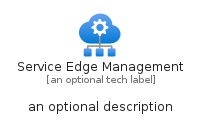
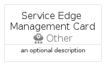

# ServiceEdgeManagement


```text
azure-19/Item/Other/ServiceEdgeManagement
```

```text
include('azure-19/Item/Other/ServiceEdgeManagement')
```


| Illustration | ServiceEdgeManagement | ServiceEdgeManagementCard | ServiceEdgeManagementGroup |
| :---: | :---: | :---: | :---: |
|  |  |  |  |


## Sprites
The item provides the following sriptes:

- `<$ServiceEdgeManagementXs>`
- `<$ServiceEdgeManagementSm>`
- `<$ServiceEdgeManagementMd>`
- `<$ServiceEdgeManagementLg>`


## ServiceEdgeManagement

### Load remotely
```plantuml
@startuml
' configures the library
!global $LIB_BASE_LOCATION="https://raw.githubusercontent.com/tmorin/plantuml-libs/master/distribution"

' loads the library's bootstrap
!include $LIB_BASE_LOCATION/bootstrap.puml

' loads the package bootstrap
include('azure-19/bootstrap')

' loads the Item which embeds the element ServiceEdgeManagement
include('azure-19/Item/Other/ServiceEdgeManagement')

' renders the element
ServiceEdgeManagement('ServiceEdgeManagement', 'Service Edge Management', 'an optional tech label', 'an optional description')
@enduml
```

### Load locally
```plantuml
@startuml
' configures the library
!global $INCLUSION_MODE="local"
!global $LIB_BASE_LOCATION="../../.."

' loads the library's bootstrap
!include $LIB_BASE_LOCATION/bootstrap.puml

' loads the package bootstrap
include('azure-19/bootstrap')

' loads the Item which embeds the element ServiceEdgeManagement
include('azure-19/Item/Other/ServiceEdgeManagement')

' renders the element
ServiceEdgeManagement('ServiceEdgeManagement', 'Service Edge Management', 'an optional tech label', 'an optional description')
@enduml
```

## ServiceEdgeManagementCard

### Load remotely
```plantuml
@startuml
' configures the library
!global $LIB_BASE_LOCATION="https://raw.githubusercontent.com/tmorin/plantuml-libs/master/distribution"

' loads the library's bootstrap
!include $LIB_BASE_LOCATION/bootstrap.puml

' loads the package bootstrap
include('azure-19/bootstrap')

' loads the Item which embeds the element ServiceEdgeManagementCard
include('azure-19/Item/Other/ServiceEdgeManagement')

' renders the element
ServiceEdgeManagementCard('ServiceEdgeManagementCard', 'Service Edge Management Card', 'an optional description')
@enduml
```

### Load locally
```plantuml
@startuml
' configures the library
!global $INCLUSION_MODE="local"
!global $LIB_BASE_LOCATION="../../.."

' loads the library's bootstrap
!include $LIB_BASE_LOCATION/bootstrap.puml

' loads the package bootstrap
include('azure-19/bootstrap')

' loads the Item which embeds the element ServiceEdgeManagementCard
include('azure-19/Item/Other/ServiceEdgeManagement')

' renders the element
ServiceEdgeManagementCard('ServiceEdgeManagementCard', 'Service Edge Management Card', 'an optional description')
@enduml
```

## ServiceEdgeManagementGroup

### Load remotely
```plantuml
@startuml
' configures the library
!global $LIB_BASE_LOCATION="https://raw.githubusercontent.com/tmorin/plantuml-libs/master/distribution"

' loads the library's bootstrap
!include $LIB_BASE_LOCATION/bootstrap.puml

' loads the package bootstrap
include('azure-19/bootstrap')

' loads the Item which embeds the element ServiceEdgeManagementGroup
include('azure-19/Item/Other/ServiceEdgeManagement')

' renders the element
ServiceEdgeManagementGroup('ServiceEdgeManagementGroup', 'Service Edge Management Group', 'an optional tech label') {
    note as note
        the content of the group
    end note
}
@enduml
```

### Load locally
```plantuml
@startuml
' configures the library
!global $INCLUSION_MODE="local"
!global $LIB_BASE_LOCATION="../../.."

' loads the library's bootstrap
!include $LIB_BASE_LOCATION/bootstrap.puml

' loads the package bootstrap
include('azure-19/bootstrap')

' loads the Item which embeds the element ServiceEdgeManagementGroup
include('azure-19/Item/Other/ServiceEdgeManagement')

' renders the element
ServiceEdgeManagementGroup('ServiceEdgeManagementGroup', 'Service Edge Management Group', 'an optional tech label') {
    note as note
        the content of the group
    end note
}
@enduml
```

