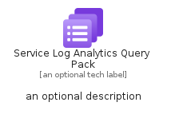

# ServiceLogAnalyticsQueryPack


```text
azure-19/Item/Other/ServiceLogAnalyticsQueryPack
```

```text
include('azure-19/Item/Other/ServiceLogAnalyticsQueryPack')
```


| Illustration | ServiceLogAnalyticsQueryPack | ServiceLogAnalyticsQueryPackCard | ServiceLogAnalyticsQueryPackGroup |
| :---: | :---: | :---: | :---: |
|  |  |  |  |


## Sprites
The item provides the following sriptes:

- `<$ServiceLogAnalyticsQueryPackXs>`
- `<$ServiceLogAnalyticsQueryPackSm>`
- `<$ServiceLogAnalyticsQueryPackMd>`
- `<$ServiceLogAnalyticsQueryPackLg>`


## ServiceLogAnalyticsQueryPack

### Load remotely
```plantuml
@startuml
' configures the library
!global $LIB_BASE_LOCATION="https://raw.githubusercontent.com/tmorin/plantuml-libs/master/distribution"

' loads the library's bootstrap
!include $LIB_BASE_LOCATION/bootstrap.puml

' loads the package bootstrap
include('azure-19/bootstrap')

' loads the Item which embeds the element ServiceLogAnalyticsQueryPack
include('azure-19/Item/Other/ServiceLogAnalyticsQueryPack')

' renders the element
ServiceLogAnalyticsQueryPack('ServiceLogAnalyticsQueryPack', 'Service Log Analytics Query Pack', 'an optional tech label', 'an optional description')
@enduml
```

### Load locally
```plantuml
@startuml
' configures the library
!global $INCLUSION_MODE="local"
!global $LIB_BASE_LOCATION="../../.."

' loads the library's bootstrap
!include $LIB_BASE_LOCATION/bootstrap.puml

' loads the package bootstrap
include('azure-19/bootstrap')

' loads the Item which embeds the element ServiceLogAnalyticsQueryPack
include('azure-19/Item/Other/ServiceLogAnalyticsQueryPack')

' renders the element
ServiceLogAnalyticsQueryPack('ServiceLogAnalyticsQueryPack', 'Service Log Analytics Query Pack', 'an optional tech label', 'an optional description')
@enduml
```

## ServiceLogAnalyticsQueryPackCard

### Load remotely
```plantuml
@startuml
' configures the library
!global $LIB_BASE_LOCATION="https://raw.githubusercontent.com/tmorin/plantuml-libs/master/distribution"

' loads the library's bootstrap
!include $LIB_BASE_LOCATION/bootstrap.puml

' loads the package bootstrap
include('azure-19/bootstrap')

' loads the Item which embeds the element ServiceLogAnalyticsQueryPackCard
include('azure-19/Item/Other/ServiceLogAnalyticsQueryPack')

' renders the element
ServiceLogAnalyticsQueryPackCard('ServiceLogAnalyticsQueryPackCard', 'Service Log Analytics Query Pack Card', 'an optional description')
@enduml
```

### Load locally
```plantuml
@startuml
' configures the library
!global $INCLUSION_MODE="local"
!global $LIB_BASE_LOCATION="../../.."

' loads the library's bootstrap
!include $LIB_BASE_LOCATION/bootstrap.puml

' loads the package bootstrap
include('azure-19/bootstrap')

' loads the Item which embeds the element ServiceLogAnalyticsQueryPackCard
include('azure-19/Item/Other/ServiceLogAnalyticsQueryPack')

' renders the element
ServiceLogAnalyticsQueryPackCard('ServiceLogAnalyticsQueryPackCard', 'Service Log Analytics Query Pack Card', 'an optional description')
@enduml
```

## ServiceLogAnalyticsQueryPackGroup

### Load remotely
```plantuml
@startuml
' configures the library
!global $LIB_BASE_LOCATION="https://raw.githubusercontent.com/tmorin/plantuml-libs/master/distribution"

' loads the library's bootstrap
!include $LIB_BASE_LOCATION/bootstrap.puml

' loads the package bootstrap
include('azure-19/bootstrap')

' loads the Item which embeds the element ServiceLogAnalyticsQueryPackGroup
include('azure-19/Item/Other/ServiceLogAnalyticsQueryPack')

' renders the element
ServiceLogAnalyticsQueryPackGroup('ServiceLogAnalyticsQueryPackGroup', 'Service Log Analytics Query Pack Group', 'an optional tech label') {
    note as note
        the content of the group
    end note
}
@enduml
```

### Load locally
```plantuml
@startuml
' configures the library
!global $INCLUSION_MODE="local"
!global $LIB_BASE_LOCATION="../../.."

' loads the library's bootstrap
!include $LIB_BASE_LOCATION/bootstrap.puml

' loads the package bootstrap
include('azure-19/bootstrap')

' loads the Item which embeds the element ServiceLogAnalyticsQueryPackGroup
include('azure-19/Item/Other/ServiceLogAnalyticsQueryPack')

' renders the element
ServiceLogAnalyticsQueryPackGroup('ServiceLogAnalyticsQueryPackGroup', 'Service Log Analytics Query Pack Group', 'an optional tech label') {
    note as note
        the content of the group
    end note
}
@enduml
```

