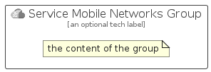

# ServiceMobileNetworks


```text
azure-19/Item/Other/ServiceMobileNetworks
```

```text
include('azure-19/Item/Other/ServiceMobileNetworks')
```


| Illustration | ServiceMobileNetworks | ServiceMobileNetworksCard | ServiceMobileNetworksGroup |
| :---: | :---: | :---: | :---: |
|  |  |  |  |


## Sprites
The item provides the following sriptes:

- `<$ServiceMobileNetworksXs>`
- `<$ServiceMobileNetworksSm>`
- `<$ServiceMobileNetworksMd>`
- `<$ServiceMobileNetworksLg>`


## ServiceMobileNetworks

### Load remotely
```plantuml
@startuml
' configures the library
!global $LIB_BASE_LOCATION="https://raw.githubusercontent.com/tmorin/plantuml-libs/master/distribution"

' loads the library's bootstrap
!include $LIB_BASE_LOCATION/bootstrap.puml

' loads the package bootstrap
include('azure-19/bootstrap')

' loads the Item which embeds the element ServiceMobileNetworks
include('azure-19/Item/Other/ServiceMobileNetworks')

' renders the element
ServiceMobileNetworks('ServiceMobileNetworks', 'Service Mobile Networks', 'an optional tech label', 'an optional description')
@enduml
```

### Load locally
```plantuml
@startuml
' configures the library
!global $INCLUSION_MODE="local"
!global $LIB_BASE_LOCATION="../../.."

' loads the library's bootstrap
!include $LIB_BASE_LOCATION/bootstrap.puml

' loads the package bootstrap
include('azure-19/bootstrap')

' loads the Item which embeds the element ServiceMobileNetworks
include('azure-19/Item/Other/ServiceMobileNetworks')

' renders the element
ServiceMobileNetworks('ServiceMobileNetworks', 'Service Mobile Networks', 'an optional tech label', 'an optional description')
@enduml
```

## ServiceMobileNetworksCard

### Load remotely
```plantuml
@startuml
' configures the library
!global $LIB_BASE_LOCATION="https://raw.githubusercontent.com/tmorin/plantuml-libs/master/distribution"

' loads the library's bootstrap
!include $LIB_BASE_LOCATION/bootstrap.puml

' loads the package bootstrap
include('azure-19/bootstrap')

' loads the Item which embeds the element ServiceMobileNetworksCard
include('azure-19/Item/Other/ServiceMobileNetworks')

' renders the element
ServiceMobileNetworksCard('ServiceMobileNetworksCard', 'Service Mobile Networks Card', 'an optional description')
@enduml
```

### Load locally
```plantuml
@startuml
' configures the library
!global $INCLUSION_MODE="local"
!global $LIB_BASE_LOCATION="../../.."

' loads the library's bootstrap
!include $LIB_BASE_LOCATION/bootstrap.puml

' loads the package bootstrap
include('azure-19/bootstrap')

' loads the Item which embeds the element ServiceMobileNetworksCard
include('azure-19/Item/Other/ServiceMobileNetworks')

' renders the element
ServiceMobileNetworksCard('ServiceMobileNetworksCard', 'Service Mobile Networks Card', 'an optional description')
@enduml
```

## ServiceMobileNetworksGroup

### Load remotely
```plantuml
@startuml
' configures the library
!global $LIB_BASE_LOCATION="https://raw.githubusercontent.com/tmorin/plantuml-libs/master/distribution"

' loads the library's bootstrap
!include $LIB_BASE_LOCATION/bootstrap.puml

' loads the package bootstrap
include('azure-19/bootstrap')

' loads the Item which embeds the element ServiceMobileNetworksGroup
include('azure-19/Item/Other/ServiceMobileNetworks')

' renders the element
ServiceMobileNetworksGroup('ServiceMobileNetworksGroup', 'Service Mobile Networks Group', 'an optional tech label') {
    note as note
        the content of the group
    end note
}
@enduml
```

### Load locally
```plantuml
@startuml
' configures the library
!global $INCLUSION_MODE="local"
!global $LIB_BASE_LOCATION="../../.."

' loads the library's bootstrap
!include $LIB_BASE_LOCATION/bootstrap.puml

' loads the package bootstrap
include('azure-19/bootstrap')

' loads the Item which embeds the element ServiceMobileNetworksGroup
include('azure-19/Item/Other/ServiceMobileNetworks')

' renders the element
ServiceMobileNetworksGroup('ServiceMobileNetworksGroup', 'Service Mobile Networks Group', 'an optional tech label') {
    note as note
        the content of the group
    end note
}
@enduml
```

